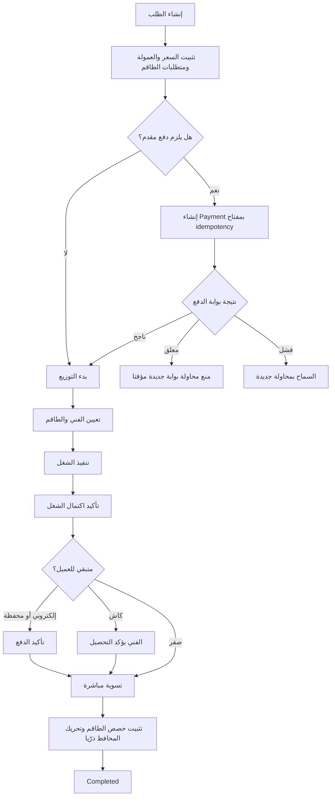
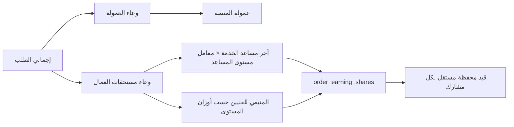
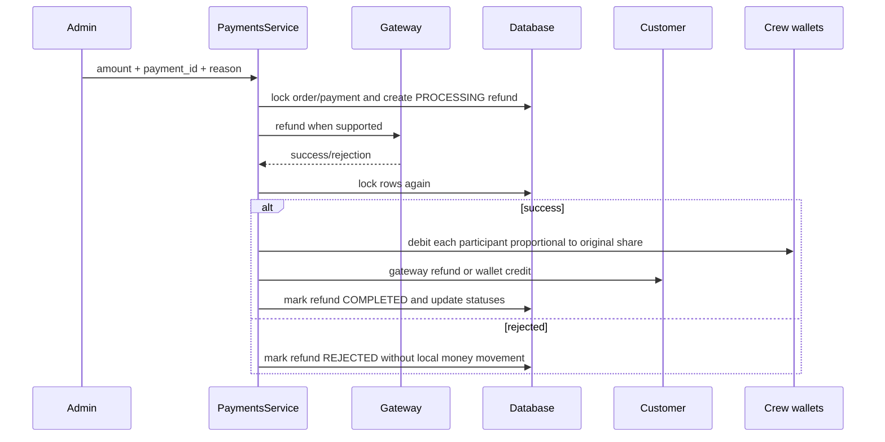
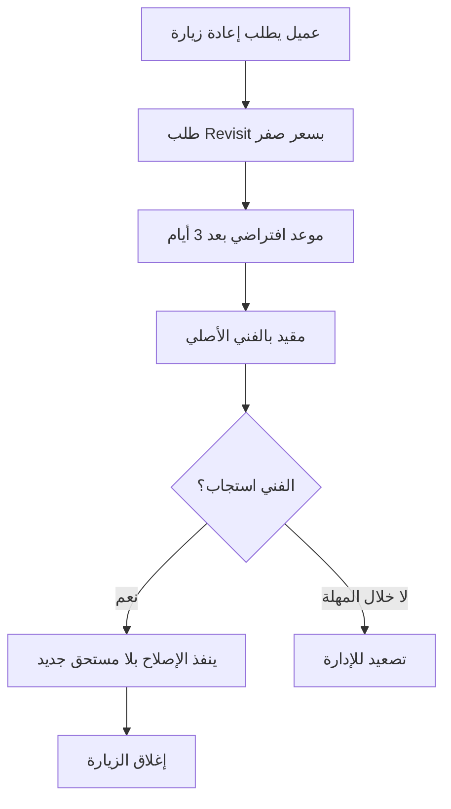

# Payment Flow BPMN and Financial Controls

هذا المستند هو المرجع التشغيلي والمالي الموحد للطلبات، الدفع، توزيع مستحقات الطاقم، الاسترداد،
إعادة الزيارة، والمحافظ. الرسومات بصيغة Mermaid قابلة للعرض مباشرة على GitHub.

## 1. مصادر الحقيقة

| السؤال | مصدر الحقيقة | ممنوع الاعتماد على |
|---|---|---|
| سعر الطلب عند التنفيذ | snapshots المالية على `orders` | سعر الخدمة الحالي في الكتالوج |
| من شارك وكم استحق | `order_earning_shares` | `orders.technician_id` وحده |
| الرصيد الحالي | `wallets.balance_cents` مطابقًا لدفتر `wallet_transactions` | جمع الطلبات في الواجهة |
| ما دفعه العميل | `payments` الناجحة ناقص `refunds` المكتملة | `payment_status` وحده |
| من تحمل Refund | قيود `refund` المدينة على محافظ أفراد الطاقم | افتراض أن القائد يتحمل الجميع |
| KPI الدخل | حصص الطاقم ناقص عكس الاسترداد الفعلي | تحويلات `order_earning` الموجبة فقط |

كل مبلغ يُخزن بالقرش. `wallet_transactions` دفتر append-only، وكل حركة مالية محلية لازم تكون قيدًا
مزدوجًا متزنًا: مجموع الخصم والإضافة للعملية الواحدة يساوي صفرًا.

## 2. دورة الطلب والدفع



## 3. قواعد كل وسيلة دفع

| الوسيلة | من يمسك المال | حركة التسوية |
|---|---|---|
| Card / Fawry / InstaPay | المنصة أو البوابة | المنصة تدفع صافي حصص الطاقم |
| Wallet | محفظة العميل ثم المنصة | قيد مزدوج، ثم المنصة تدفع الطاقم |
| Cash | قائد الطلب | القائد يُقاصص بالكاش الذي حصله؛ لو معه أكثر من حصته يصبح مدينًا للمنصة |
| Mixed / Deposit | جزء لدى المنصة وجزء لدى القائد | نفس معادلة المقاصة على مجموع الدفعات، لا على آخر دفعة فقط |
| Installments | المنصة تمول الطلب وتحصّل الأقساط لاحقًا | الطاقم لا ينتظر انتهاء الأقساط إذا تم اعتماد التمويل |

لا يجوز أن تتحول عبارة العرض إلى «مدفوع أونلاين بالكامل» بعد تسجيل الكاش. العرض يفصل دائمًا بين:

- المدفوع غير النقدي.
- الكاش المطلوب تحصيله.
- الكاش الذي تم تحصيله.
- نصيب الفني الشخصي.

## 4. تسوية الطاقم



القواعد:

1. مجموع الحصص يساوي وعاء مستحقات العمال بالضبط.
2. المساعد ذو أجر خدمة محدد يحصل على الأجر المثبت وقت الحجز مضروبًا في معامل مستواه.
3. إذا تجاوز مجموع أجور المساعدين الوعاء، يرجع النظام للتوزيع النسبي الآمن ولا يخلق مالًا.
4. الكاش يُقاصص على القائد فقط لأنه من استلمه؛ بقية الأفراد يأخذون تحويلاتهم من المنصة.
5. الحصة وسببها ومستوى صاحبها ودوره محفوظة كـsnapshot لا تتغير بترقية لاحقة.

## 5. Refund كامل أو جزئي



### توزيع عبء الاسترداد

الاسترداد لا يُخصم من القائد وحده. لكل فرد:

```text
target_after  = round(original_share × cumulative_refunded_after / order_total)
target_before = round(original_share × cumulative_refunded_before / order_total)
current_debit = target_after - target_before
```

فرق التقريب النهائي يذهب للقائد، ومجموع الخصومات يساوي عكس مستحقات الطلب المطلوب لهذه الدفعة.
الحساب التراكمي يمنع تراكم أخطاء القروش عند عدة Refunds جزئية. عند استرداد 100% يرجع كل فرد 100%
من حصته الأصلية بالضبط.

### من يمول العميل؟

- بوابة تدعم Refund ومعاملة أصلية صالحة: المال يرجع عبر البوابة، بلا Wallet credit إضافي.
- Cash / Wallet / وسيلة لا تدعم Refund حقيقيًا: المنصة تضيف المبلغ لمحفظة العميل بقيد مزدوج.
- عكس مستحقات الطاقم يعيد الجزء المستحق للمنصة، لكنه لا يسبق نجاح مسار الاسترداد.
- صف `PROCESSING` المتروك بعد انقطاع يحتاج reconciliation؛ ممنوع تكرار الاسترداد قبله.

## 6. إعادة الزيارة والضمان



سياسة المساعدين في إعادة الزيارة:

- لا توجد خانة مساعد اختياري في طلب مجاني.
- لا يقدر الفني أو الأدمن إضافة مساعد على طلب Revisit المجاني، لأن ذلك يلزم شخصًا آخر بعمل بلا أجر.
- لو الإصلاح يحتاج قوة عمل إضافية، ينشئ الأدمن دعمًا مدفوعًا مستقلًا بسبب موثق، بدل إخفاء التكلفة
  داخل طلب ضمان صفر.
- العميل يرى أن التواصل والتنفيذ المتوقع خلال 3 أيام إلى أسبوع، وليس طوارئ لحظية.

## 7. KPI والإنتاجية

KPI ليس دفتر أموال بديلًا. هو snapshot شهري مشتق من المصادر التشغيلية:

- العروض والقبول من `order_assignments`.
- المكتمل وقيمة العمل من `orders`.
- التقييمات والشكاوى وإعادة الزيارة من جداولها.
- دخل الفني من `order_earning_shares` ناقص قيود Refund الفعلية لنفس طلبات الشهر.

شغل الكاش يدخل KPI بحصته الإجمالية حتى لو أثره على المحفظة كان مديونية عمولة؛ فالمال موجود فعليًا
مع الفني خارج المحفظة. أعضاء الطاقم والمساعدون يدخلون بقيم حصصهم الشخصية.

الحالات:

| الحالة | من يراها | قابلة لإعادة الحساب؟ |
|---|---|---|
| calculated | الإدارة فقط | نعم |
| approved | الإدارة والفني | لا |
| paid | الإدارة والفني | لا، والمكافأة قيد محفظة |
| rejected | الإدارة والفني | لا |

«الأداء الشهري» في تطبيق الفني يعرض snapshots التي راجعتها الإدارة فقط. عدم وجود تقرير يعني أنه لم
يُحسب ويُراجع بعد، وليس أن التطبيق ينتظر توقيتًا سريًا في نهاية الشهر.

## 8. المطابقة اليومية

يجب أن تتحقق المطابقة والتجنيد من:

- تأهيل الفئة والخدمة.
- النطاق والموقع.
- الحظر الصريح لليوم.
- تعارض وقت حقيقي مع طلب آخر.
- عدد الفنيين والمساعدين المطلوب والمتبقي.

«الطلب لم يُعرض عليه من قبل» ليس شرط أهلية عام. هو معلومة تخص دورة العرض التنافسية فقط، ولا يمنع
الإدارة من فحص أو تعيين شخص مناسب في إعادة توزيع أو طلب ناتج عن Refund.

## 9. Invariants لا تقبل الاستثناء

1. `wallet.balance_cents = SUM(credits) - SUM(debits)` لكل محفظة.
2. مجموع طرفي كل قيد مزدوج يساوي صفرًا.
3. مجموع `order_earning_shares.share_cents = orders.technician_earning_cents` للطلب المدفوع.
4. مجموع Refunds المكتملة لكل Payment لا يتجاوز `payment.amount_cents`.
5. Refund كامل للطلب يعني كل دفعاته المالية استُردت، لا دفعة واحدة فقط.
6. زر الدفع أو الاسترداد المتكرر بنفس idempotency key لا يحرك المال مرتين.
7. تعديل السعر بعد الدفع لا يتم بتعديل رقم خام؛ يتم بتحصيل إضافي أو Refund موثق.
8. لا يُحذف أو يُعدل قيد محفظة قديم؛ التصحيح قيد عكسي أو Adjustment بسبب وأدمن معروف.

## 10. إجراءات المراجعة اليومية

1. فحص Refunds في `PROCESSING` الأقدم من نافذة البوابة.
2. تشغيل مطابقة أرصدة المحافظ مع دفتر الحركات، وفتح تنبيه لأي فرق غير صفر.
3. مراجعة طلبات Completed التي لا تحمل `order_earning_shares` إلا لو كانت تاريخية قبل النظام.
4. مراجعة Payments المعلقة القديمة وwebhooks الفاشلة قبل السماح بمحاولة جديدة.
5. مراجعة KPI للشهر قبل الاعتماد: عدد المكتمل، دخل حصص الطاقم، Refunds، والشكاوى.
6. عدم استخدام Wallet Adjustment لتسوية طلب عادي؛ هو استثناء مالي موثق فقط.

## 11. مصفوفة مسؤولية مختصرة

| الحدث | العميل | الفني/الطاقم | المنصة | الأدمن |
|---|---|---|---|---|
| دفع إلكتروني ناجح | يُخصم منه | ينتظر التسوية | تستلم وتوزع | يراجع الاستثناء |
| كاش | يدفع للقائد | القائد يحصّل ويُقاصص | تستحق العمولة | يحسم النزاع فقط |
| Refund | يستلم عبر البوابة/المحفظة | كل فرد يعيد نسبة حصته | تمول الفرق وفق الوسيلة | يحدد المبلغ والسبب |
| Revisit | لا يدفع | الفني الأصلي يصلح | تتحمل التشغيل | تتابع التصعيد |
| KPI bonus | لا أثر | يستلم بعد الاعتماد | تمول المكافأة | يحسب ويراجع ويعتمد |

## 12. بوابات الاختبار قبل الإنتاج

- اختبارات unit للتقسيم والتقريب والاسترداد التراكمي.
- اختبار integration: طلب طاقم، دفع مختلط، تسوية، Refund جزئي ثم كامل.
- إثبات تطابق «محفظتي» مع «مستحقاتي» لكل قائد وعضو ومساعد.
- اختبار ضغط متزامن للدفع والاسترداد والتحصيل.
- اختبار بوابة حقيقية في بيئة sandbox لكل Provider مع webhook retries.
- تنبيه آلي على ledger mismatch وRefund/Payment عالق.

