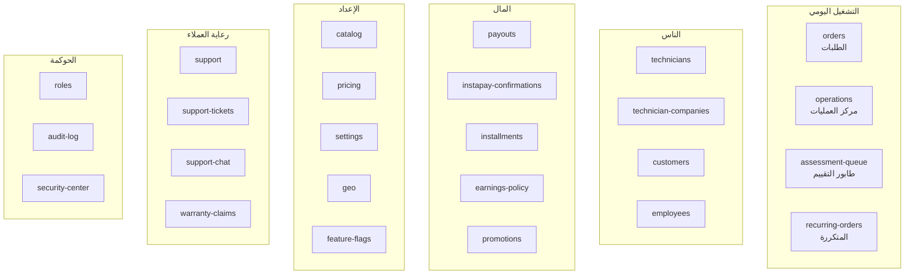

# 01 — دليل العمليات للأدمن (Admin Operations Handbook)

> دليل عملي: **مين بيعمل إيه، وأي تغيير بيوصل لمين**. مبني على الشاشات الموجودة فعلًا في
> `apps/admin` (61 صفحة، كلها متحقَّق منها بصريًا: 44/44 لينك في القائمة بلا أخطاء).
>
> مستندات مرتبطة: [02 — دورة حياة الطلب](./02-ORDER-LIFECYCLE.md) ·
> [12 — كتالوج الإعدادات](./12-SETTINGS-CATALOG.md) ·
> [20 — الأمان والصلاحيات](./20-SECURITY-PERMISSIONS.md)

---

## 1. الأدوار — مين بيقدر يعمل إيه

| الدور | صلاحيات | نطاق العمل |
|-------|---------|-------------|
| `super_admin` | 60 | كل حاجة |
| `ops_manager` | 34 | التشغيل اليومي: الطلبات، الفنيون، التوزيع |
| `finance` | 27 | المال: الاسترداد، الصرف، العمولات، الأقساط |
| `support_agent` | 3 | الشكاوى والتذاكر — **ضيّق عمدًا** |
| `recruiter` | 2 | التوظيف واعتماد الفنيين — **ضيّق عمدًا** |

**قاعدة**: الأدوار الضيّقة مقصودة. `support_agent` بيتعامل مع بيانات عملاء حسّاسة يوميًا،
فسطحه مقلَّص لأقل قدر ممكن.

### الأفعال اللي محتاجة MFA

أي موظف عنده **أي** صلاحية من دي **مُلزَم** بتفعيل MFA (مش اختياري):

`refunds.issue` · `payouts.approve` · `wallets.adjust` · `payments.confirm_manual` ·
`orders.adjust_price` · `orders.approve_price_increase` · `orders.waive_fees` ·
`roles.manage` · `roles.grant_unrestricted` · `settings.manage` · `branding.manage`

### الأفعال اللي محتاجة تأكيد Passkey لحظي (Step-Up)

فوق تسجيل الدخول، 51 مسارًا بيطلب `X-Step-Up-Token` — **صالح دقيقتين ويُستهلَك مرة واحدة**.
لو ظهرت رسالة «العملية دي محتاجة تأكيد Passkey حديث»، ده مش خطأ: أكّد وأعِد المحاولة.

---

## 2. خريطة الشاشات



---

## 3. المهام اليومية — إزاي تتعمل

### أ) طلب واقف على «جاري البحث عن فني»

> **مهم**: الطلب ده **مايتلغيش تلقائيًا خالص**، مهما طال. قرار مالك صريح. الأدمن هو اللي
> بيتصرّف.

1. `operations` → تبويب «تتبّع الطلبات» — بيوريك جولات المطابقة الفعلية.
2. `orders/[id]` → قسم الجولات: **مين اتعرض عليه العرض ومين رفض ومين انتهت مهلته**.
3. لو مفيش مرشّحين: افحص السبب — الخدمة مش مربوطة بالفني؟ المنطقة؟ الاعتماد؟ السقف اليومي؟
   خدمة `MatchingExplainabilityService` بتقول **أنهي بوابة** رفضت كل فني بالظبط.
4. القرار: **تعيين قسري** لفني، أو **إلغاء إداري**.

📄 [04](./04-MATCHING-ENGINE.md)

### ب) طابور التقييم بالصور

`assessment-queue` — طلبات العميل رفع فيها صور والإدارة بتسعّر.

| القرار | النتيجة |
|--------|---------|
| سعّر من الصور | الطلب ⇒ `awaiting_initial_quote_approval` (العميل يوافق) |
| الصور مش كفاية | الطلب ⇒ `searching_technician` (معاينة موقعية) |

> رسم التقييم اللي اتدفع هو **رسم تقييم مش سعر شغل** — مفيش حاجة تتوزّع على فني في المرحلة
> دي. توزيعه كان هيبعت فنيًا لشغل لسه مالوش سعر.

### ج) تأكيد دفعة InstaPay

`instapay-confirmations` — تحكّم **مباشر** في فلوس حقيقية: التأكيد بيسوّي الدفعة `SUCCEEDED`
**ويبدأ التوزيع**.

- محتاج `payments.confirm_manual` (⇒ MFA إلزامي).
- نافذة التأكيد: `payments.instapay_confirmation_window_hours` = **24 ساعة**.

### د) صرف مستحقات فني

`payouts`:

| المبلغ | المسار |
|--------|--------|
| ≤ `payouts.auto_approve_limit_cents` (١٠٠٠ ج) | موافقة تلقائية |
| أكبر | مراجعة بشرية |
| < `payouts.min_amount_cents` (٢٠٠ ج) | مرفوض |

**فني رصيده سالب مايقدرش يطلب صرف.** الرصيد السالب طبيعي بعد طلبات كاش — الفني ماسك الفلوس
والعمولة دَين عليه، بيتسوّى من الأرباح الجاية.

📄 [10 §7](./10-FINANCE-MONEY-FLOW.md)

### هـ) استرداد

من صفحة الطلب. محتاج `refunds.issue` (⇒ MFA).

**افهم قبل ما تنفّذ**: الاسترداد بيعكس أرباح الفني **متناسبًا مع إجمالي الطلب**، مش مع
الدفعة اللي اخترتها. ده مقصود عشان يفضل متسقًا مع التسوية المركّبة.

**مثال**: طلب ١٠٠٠ ج، استرداد ٣٠٠ ⇒ عكس ٢٤٠ من أرباح الفني (٨٠٠ × ٣٠٪).

### و) زيارة فاشلة

الفني وصل والعميل مش موجود ⇒ الطلب `disputed` وبيستنى **قرار أدمن**:

| القرار | النتيجة |
|--------|---------|
| العميل عايز يكمّل | ⇒ `accepted` — نفس السعر، بلا تحصيل تاني |
| إلغاء وطلب كاش | ⇒ إلغاء مباشر بلا استرداد (المنصّة بتمتص تكلفة الفني) |
| إلغاء برسم زيارة | رسم افتراضي `orders.no_show_visit_fee_cents` = **٥٠ ج** + استرداد الباقي |

### ز) شكوى

`support` / `support-tickets` / `support-chat`.

⚠️ شكوى **حرجة (critical) مثبتة** بتصفّر KPI الفني الشهري **بالكامل** تلقائيًا
(`kpi.serious_complaint_zero_score = true`). وكل شكوى مثبتة بتخصم
`kpi.penalty_points_per_upheld_complaint` = **20 نقطة**.

---

## 4. الإعداد — والأثر المباشر لكل تغيير

### أ) إضافة/تعديل خدمة

`catalog` → `catalog/services/[id]` (workspace بمراحل مبنية على الاعتماديات الفعلية).

**التركيبة الممنوعة** — الأدمن كان يقدر يعملها ومايعرفش:

```
formula + assessment_required + remote_only  ⇒  خدمة مستحيل حجزها بأي طريق
```

اتقفلت على **٣ طبقات**: تحقّق الأدمن (برسالة بتقول الحل) + ٣ قيود `CHECK` في قاعدة البيانات
+ تعطيل في الواجهة.

### ب) بناء معادلة تسعير

`pricing` → محرر الشجرة البصري (No-Code).

**اتّبع الترتيب ده حرفيًا:**

1. عرّف الحقول (`service_pricing_fields`).
2. عرّف الثوابت وجداول البحث.
3. ابنِ معادلة `final_price` في المحرر.
4. **«احسب السعر»** — بيعاين **المسوّدة الحالية** مش المحفوظ، وبصفر كتابة.
5. **«شغّل كل الحالات ضد المسوّدة»** — بيتأكد إن تعديلك ما كسرش سيناريو معروف.
6. احفظ.

> ⚠️ **الحفظ بيسري فورًا على كل عميل حقيقي.** الخطوتان 4 و5 موجودتان بالظبط عشان تعاين
> **قبل** ما تنشر. للتغيير المجدول: استخدم تاريخ سريان مستقبلي — بيقفل الصف الحالي ويفتح
> صفًا جديدًا **بلا مساس بالسعر الساري دلوقتي**.

**الطلبات المؤكَّدة محميّة**: كل طلب مربوط بلقطة تقييم ثابتة، فتعديل القواعد **مايغيّرش**
السعر المتفق عليه.

📄 [03 §8](./03-PRICING-ENGINE.md)

### ج) تعديل إعداد

`settings` — محتاج `settings.manage` (⇒ MFA).

**تلات فخاخ موثّقة:**

| الفخّ | الحقيقة |
|-------|---------|
| `orders.auto_cancel_after_minutes` = 20 | **مفيش كود بيقراه.** الإعداد باقٍ لكنه بلا أثر |
| أوزان المطابقة (مسافة/عدالة/موثوقية) = 0 | الترتيب فعليًا **وزن المستوى ناقص الحمل** بس |
| `payments.paymob.*` فاضية | الكارت **مش هيشتغل** رغم إنه مفعّل |

📄 [12 §3](./12-SETTINGS-CATALOG.md)

### د) تسعير منطقة

`geo` → تسعير المناطق. **نسبة مئوية فقط** — الاستبدال المطلق (`OVERRIDE`) مرفوض دايمًا
بعد ADR-0060.

### هـ) الحملات التسويقية

`campaigns`. حواجز مكافحة السبام مركّبة بترتيب:

| الحاجز | القيمة |
|--------|--------|
| `campaigns.max_per_customer_per_week` | **2** — فوق كل الحملات مجتمعة |
| `campaigns.quiet_hours_start/end` | 21:00 → 06:00 UTC |
| `campaigns.inactive_customer_days` | 90 — حساب ميت، الإرسال له بيضر سمعة المُرسِل |
| `campaigns.sweep_batch_size` | 200 — يمنع أي دفعة ضخمة مفاجئة |

> السقف الأسبوعي هو **أهم** حاجز: مهما فعّل الأدمن حملات، بيحكمهم كلهم.

---

## 5. الحوكمة

| الشاشة | بتستخدمها لـ |
|--------|--------------|
| `roles` / `roles/[id]` | إسناد الصلاحيات — محتاج `roles.manage` (⇒ MFA) |
| `audit-log` | كل فعل إداري: مين، إمتى، إيه |
| `security-center` | الأحداث الأمنية: رفض متكرر، محاولات تصعيد امتيازات |
| `employees/workforce` | نشاط الموظفين اليومي |

**كشف تلقائي**: النظام بيميّز صراحةً بين تعديل RBAC عادي ومحاولة موظف **يرفّع نفسه** —
الأخيرة ليها وزن مختلف في التسجيل.

---

## 6. أخطاء شائعة وحلولها

| العَرَض | السبب المرجّح | الحل |
|---------|----------------|------|
| «مفيش فنيين متاحين» رغم وجود فنيين | تعارض على مستوى **اليوم**، أو السقف اليومي (12 ساعة)، أو إجازة صريحة | `orders/[id]` → الجولات؛ أو استخدم خدمة التفسير |
| فني مش ظاهر في المطابقة | الخدمة مش `verification_status='approved'` في `technician_services` | صفحة الفني → الخدمات |
| «مينفعش تحفظ الخدمة» | تركيبة تقييم مستحيلة (§4-أ) | الرسالة نفسها بتقول الحل |
| سعر بصفر | خدمة `formula` بلا `field_values` | ممنوع دلوقتي — بيترفض بوضوح بدل ما يمرّ بصفر |
| رصيد فني سالب | طبيعي بعد طلبات كاش — دَين العمولة | بيتسوّى من الأرباح الجاية |
| عمولة المنصّة سالبة | **بتصميم** — خصم كبير، المنصّة بتتحمله (ADR-0038) | مش خطأ بيانات |
| الكارت مش شغّال | مفاتيح Paymob فاضية | `docs/03-external-integrations.md` |

---

## 7. جرد الشاشات (61)

| المجال | الشاشات |
|--------|---------|
| **التشغيل** | `orders` · `orders/[id]` · `orders/create-for-customer` · `operations` · `assessment-queue` · `recurring-orders` |
| **الفنيون** | `technicians` · `technicians/[id]` · `technicians/category-declarations` · `technician-levels` · `technician-companies` · `technician-progression` · `technician-kpi` · `technician-referrals` |
| **العملاء** | `customers` · `customers/[userId]` · `buildings` |
| **الموظفون** | `employees` · `employees/new` · `employees/[userId]` · `employees/workforce` |
| **المال** | `payouts` · `instapay-confirmations` · `installments` · `earnings-policy` · `promotions` |
| **الكتالوج والتسعير** | `catalog` · `catalog/services/[id]` · `pricing` · `warranty-plans` · `warranty-claims` |
| **الرعاية** | `support` · `support/[id]` · `support-tickets` · `support-chat` · `internal-chat` |
| **الإعداد** | `settings` · `geo` · `feature-flags` · `branding` · `homepage-content` · `cancellation-reasons` · `notification-routing` · `notification-type-configs` |
| **الحوكمة** | `roles` · `roles/[id]` · `audit-log` · `security` · `security-center` |
| **أخرى** | `academy` · `campaigns` · `projects` · `reports` |

---

## 8. الحفاظ على صحّة الواجهة

`node scripts/sweep-admin.js` — بيعمل دخول أدمن حقيقي (OTP + Passkey بمصادق افتراضي)، بيزحف
على **كل** لينك في القائمة، وبيرصد:

أخطاء الكونسول · الطلبات ≥400 · التجاوز الأفقي · الصفحات الفاضية · لقطة لكل صفحة.

**آخر تشغيل: 44/44 نظيفة.**

> الأداة دي هي اللي مسكت أن `warranty-plans` كانت بترجع **401 على كل تحميل** — الجدول
> فاضي والرسالة الوحيدة «خطأ» بلا تفسير. `jest` مابيمسكش ده لأنه بيختبر المنطق مش الرندر.
