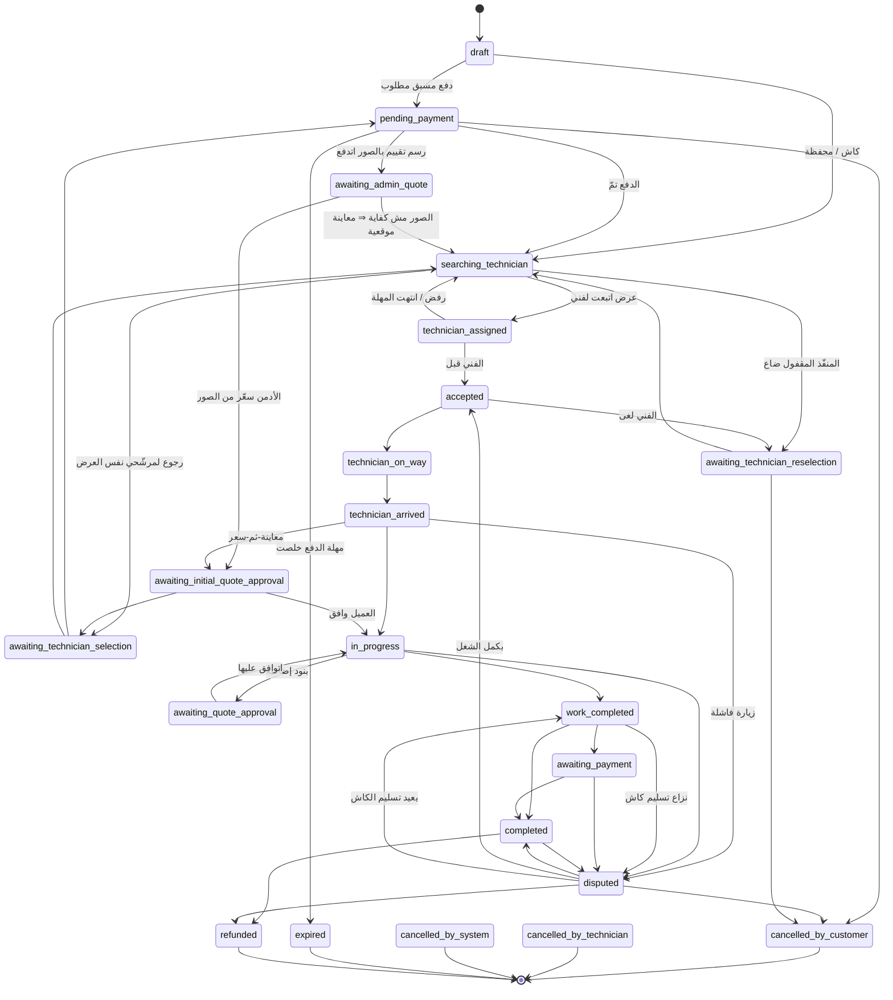
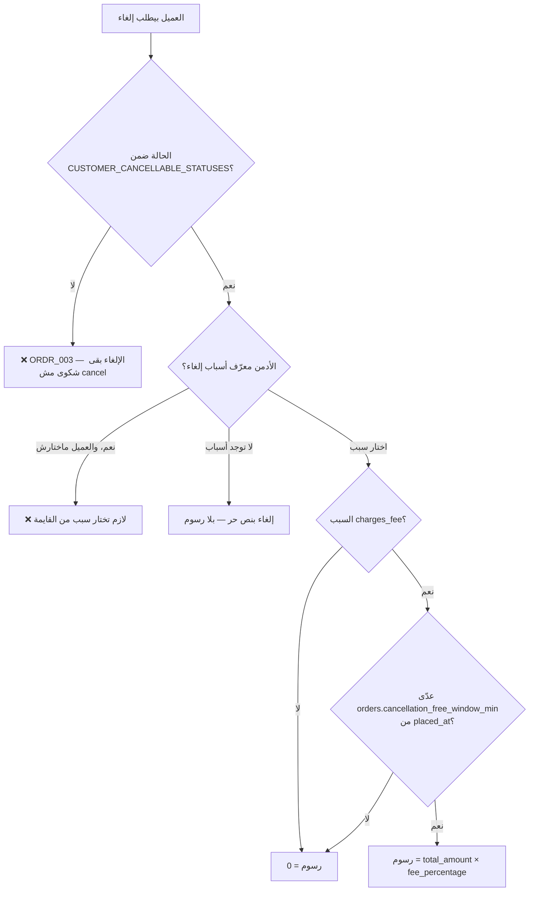

# 02 — دورة حياة الطلب (Order Lifecycle)

> **مصدر هذا المستند**: `apps/api/src/modules/orders/order-state-machine.ts` (مصدر الحقيقة
> الوحيد لكل انتقال)، `orders.service.ts`، و`settings` الحيّة في `baytak_main`.
>
> مستندات مرتبطة: [04 — محرك المطابقة](./04-MATCHING-ENGINE.md) ·
> [05 — الجدولة والإتاحة](./05-SCHEDULING-AVAILABILITY.md) ·
> [06 — الطلبات العاجلة](./06-SAME-DAY-URGENT-ORDERS.md)

---

## 1. المبدأ الحاكم: state machine واحدة مقفولة

كل انتقال حالة في المنصّة بيعدّي من `canTransition(from, to)`. **أي انتقال مش مذكور صراحة في
`ORDER_TRANSITIONS` ممنوع** وبيرمي `ORDR_003`. مفيش مسار بيغيّر `order_status` من غير الجدول ده.

عشان كده أي تغيير في دورة الحياة بيتعمل في مكان واحد بالظبط —
`apps/api/src/modules/orders/order-state-machine.ts`.

### حالتان منفصلتان لكل طلب

في **محورين مستقلين** بيوصفوا الطلب، وخلطهم مصدر شائع للّبس:

| المحور | العمود | بيجاوب على |
|--------|--------|-----------|
| حالة التنفيذ | `order_status` (21 قيمة) | فين الطلب في رحلته؟ |
| حالة السعر | `price_status` (6 قيم) | السعر نهائي ولا لأ؟ |

`price_status`: `confirmed` · `provisional` · `waiting_assessment` · `waiting_quote` ·
`waiting_customer_approval` · `locked`.

طلب ممكن يكون `searching_technician` وسعره `confirmed` (كتالوج/معادلة)، أو `searching_technician`
وسعره `provisional` (هيتحدد بعد المعاينة). المحورين بيتحركوا مستقلين.

---

## 2. الخريطة الكاملة

*(الرسم بيوضّح المسارات الأساسية؛ الجدول الكامل بكل الانتقالات في `ORDER_TRANSITIONS`.)*

---

## 3. الحالات بمعانيها التشغيلية

### 3.1 مرحلة ما قبل التنفيذ

| الحالة | المعنى | إزاي بتخرج منها |
|--------|--------|------------------|
| `draft` | الطلب اتعمل ولسه ماتبعتش | دفع مسبق ⇒ `pending_payment`، غير كده ⇒ `searching_technician` |
| `pending_payment` | دفع إلكتروني اتبدأ ومخلّصش | الدفع تمّ، أو إلغاء تلقائي بعد `orders.payment_timeout_minutes` |
| `awaiting_admin_quote` | العميل رفع صور والإدارة بتسعّر | تسعير ⇒ `awaiting_initial_quote_approval`، أو تحويل لمعاينة موقعية |
| `searching_technician` | جاري البحث/التوزيع | فني اتعيّن، أو تدخّل أدمن |
| `technician_assigned` | عرض اتبعت لفني بعينه | قبول ⇒ `accepted`، رفض/مهلة ⇒ رجوع للبحث |

### 3.2 مرحلة التنفيذ

`accepted` → `technician_on_way` → `technician_arrived` → `in_progress` → `work_completed`

مع فرعين مهمين من `technician_arrived`:
- **`awaiting_initial_quote_approval`** — نموذج «معاينة-ثم-سعر» (ADR-0044): الفني عاين وحدّد
  أول سعر لطلب كان `work_price_cents = 0` وقت الحجز.
- **`disputed`** — زيارة فاشلة (العميل مش موجود/رافض يفتح). ده **مش** إلغاء من الفني: بيروح
  لمراجعة أدمن حقيقية قبل أي قرار نهائي على الطلب أو الفلوس.

### 3.3 مرحلة الإقفال

| الحالة | متى |
|--------|-----|
| `work_completed` | الشغل خلص، الدفع لسه |
| `awaiting_payment` | كاش لسه ما اتسلّمش |
| `completed` | خلص واتدفع |
| `refunded` | اترد كليًا |
| `disputed` | نزاع مفتوح (من أي مرحلة تقريبًا) |

### 3.4 فرق دقيق: ثلاث أنواع إلغاء

| الحالة | مين | ملاحظة |
|--------|-----|--------|
| `cancelled_by_customer` | العميل | ممكن يترتب عليها رسوم (§5) |
| `cancelled_by_technician` | الفني | قرار نهائي بلا مراجعة |
| `cancelled_by_system` | النظام/الأدمن | مهلة دفع، أو قرار إداري |

كلها **نهائية** — مفيش انتقال بيخرج منها.

---

## 4. الحالتان الخاصتان بإلغاء الفني

`awaiting_technician_reselection` و`awaiting_technician_selection` بيبانوا متشابهين لكن معناهم
مختلف تمامًا:

| | `awaiting_technician_reselection` | `awaiting_technician_selection` |
|---|---|---|
| **السبب** | الفني اللي العميل اختاره بنفسه لغى/ضاع | عرض سعر عن بُعد اتقبل، المنفّذ لسه | 
| **الطلب بيرجع لفين** | العميل يختار بديل من الصفر | قايمة مرشّحي **نفس العرض** |
| **ADR** | 0065 §2 | 0066 §2 |

الفكرة المشتركة: **الطلب محفوظ مش بيتلغي**. لو العميل مختار فني بعينه (`requested_technician_id`)
مفيش fallback تلقائي لفني تاني — الاختيار قرار العميل.

---

## 5. الإلغاء والرسوم

### الحالات اللي العميل يقدر يلغي فيها بنفسه

`draft` · `pending_payment` · `searching_technician` · `technician_assigned` · `accepted` ·
`technician_on_way` · `awaiting_quote_approval` · `awaiting_admin_quote` ·
`awaiting_technician_reselection` · `awaiting_initial_quote_approval` ·
`awaiting_technician_selection`

**بعد `technician_arrived` الإلغاء بيبقى شكوى مش cancel** — الفني اتحرّك فعلاً.

استثناء متعمّد: `awaiting_quote_approval` مسموح فيها الإلغاء، لأن العميل ممكن يكون رافض عرض
السعر تمامًا وعايز يلغي الطلب كله (مش بس البنود الإضافية) — والشغل الفعلي لسه ما بدأش.

### ضمانات ذرّية

الإلغاء كله جوّه transaction واحدة مع `pessimistic_write` lock على الطلب:

1. قفل الصف + إعادة التحقق إن الحالة **ما اتغيرتش** (وإلا `ORDR_003` — «حالة الطلب اتغيّرت»)
2. تحديث الحالة + `cancelled_at` + `cancelled_by_user_id` + `cancellation_fee_cents`
3. صف في `order_status_history`
4. تحرير استخدام كود الخصم (`releaseUsage`)
5. تحصيل رسوم الإلغاء من محفظة العميل

الخطوة ٥ **جوّه نفس الـtransaction** عمدًا — «الطلب اتلغى بس الرسوم متحصلتش» مايحصلش.
`allowNegativeBalance: true` لأنها عقوبة مش دفع اختياري.

بالإضافة: مستمع `ScheduleSlotReleaseListener` بيحرّر سلوت الفني تلقائيًا
(راجع [05 §2.4](./05-SCHEDULING-AVAILABILITY.md)).

---

## 6. الإلغاء التلقائي — قرار عمل صريح

هنا **قرار مالك صريح غيّر السلوك الافتراضي**، مهم جدًا لأي حد بيقرا الإعدادات:

| المسار | السلوك |
|--------|--------|
| `pending_payment` قديم | ✅ **بيتلغي تلقائيًا** بعد `orders.payment_timeout_minutes` (١٥ دقيقة) |
| `searching_technician` قديم | ❌ **مابيتلغيش تلقائيًا خالص**، مهما طالت المدة |

الفرق منطقي: `pending_payment` معناه **دفع فعليًا ماتمّش** — مفيش فلوس اتاخدت عشان ترجع (الفني
مابيتوزّعش أصلاً قبل الدفع، ADR-0013). أما `searching_technician` فمعناه **مفيش فني متاح
دلوقتي** — وده مش سبب لإلغاء طلب عميل بصمت. الطلب يفضل «جاري البحث» والأدمن يتصرف يدويًا
(تعيين قسري أو إلغاء إداري).

> ⚠️ الإعداد `orders.auto_cancel_after_minutes` (٢٠ دقيقة) **موجود في `settings` لكن مش
> مستخدَم** في مسار `searching_technician` بعد القرار ده. أي حد بيقرا الإعدادات لوحدها هيستنتج
> سلوك غلط. اتوثّق هنا وفي `order-auto-cancel.service.ts` صراحة.

الـsweep بيشتغل كل دورة بحد `SWEEP_BATCH_SIZE` صف، مع `pessimistic_write` وإعادة تحقق من الحالة
قبل كل إلغاء.

---

## 7. الإعدادات الحاكمة (قيم حيّة من `baytak_main`)

| المفتاح | القيمة | الأثر |
|---------|--------|-------|
| `orders.payment_timeout_minutes` | `15` | مهلة إتمام الدفع الإلكتروني |
| `orders.cancellation_free_window_min` | `5` | نافذة إلغاء بلا رسوم من `placed_at` |
| `orders.no_show_visit_fee_cents` | `5000` | رسم زيارة افتراضي (٥٠ ج) عند زيارة فاشلة |
| `orders.auto_cancel_after_minutes` | `20` | **غير مستخدَم** — §6 |
| `orders.max_work_sessions_per_order` | `3` | حد جلسات العمل |
| `orders.technician_reschedule_max_requests` | `2` | حد طلبات إعادة الجدولة من الفني |
| `orders.crew_shortage_escalation_hours_before` | `24` | تصعيد نقص الطاقم قبل الموعد |

---

## 8. قوائم الحالات المشتقّة

بجانب جدول الانتقالات، فيه أربع مجموعات بتُشتق منه وبتتحكم في سلوكيات مختلفة:

| المجموعة | تشمل | تُستخدم في |
|----------|------|-----------|
| `CUSTOMER_CANCELLABLE_STATUSES` | ١١ حالة (§5) | بوابة الإلغاء |
| `ACTIVE_TECHNICIAN_ORDER_STATUSES` | `accepted` + ٥ | تعارض اليوم + حساب الحمل |
| `ENGAGED_TECHNICIAN_ORDER_STATUSES` | نفسها **بدون** `accepted` | الطوارئ + «منشغل النهاردة» |
| `TECHNICIAN_CONTACT_VISIBLE_STATUSES` | من `accepted` لـ`completed` | إظهار تليفون الفني للعميل |

**تفصيلة عملية**: تليفون الفني بيظهر من `accepted` مش من `technician_assigned` — «تأكيد حجز
حقيقي» معناه الفني وافق فعلاً، مش إنه اتعيّن وقاعد يفكّر.

**فرق `accepted`**: بيظهر في `ACTIVE` مش في `ENGAGED`. فني قَبِل شغل الساعة ٦ المسا لسه ما
تحرّكش ليه **مش** منشغل جسديًا — يقدر ياخد طوارئ دلوقتي. التفصيل في
[05 §3.1](./05-SCHEDULING-AVAILABILITY.md).

---

## 9. نقاط الدخول (API)

كل مسارات العميل تحت `orders.controller.ts`:

| المسار | الوظيفة |
|--------|---------|
| `POST /orders` | إنشاء طلب |
| `POST /orders/preview` | معاينة سعر قبل الحجز |
| `POST /orders/match-preview` | معاينة المطابقة |
| `POST /orders/:id/cancel` | إلغاء (§5) |
| `POST /orders/:id/reschedule` | إعادة جدولة |
| `GET /orders/:id/reschedule-options` | المواعيد المتاحة |
| `POST /orders/:id/reschedule-requests/:rid/approve\|reject` | رد على طلب الفني |
| `POST /orders/:id/request-rematch` | إعادة بحث |
| `GET /orders/:id/quote-items` + `approve` / `decline` | البنود الإضافية |
| `POST /orders/:id/approve-initial-quote` | موافقة على سعر المعاينة |
| `GET /orders/:id/provider-candidates` + `POST select-provider` | اختيار المنفّذ |
| `POST /orders/:id/confirm-cash-handover` | تأكيد تسليم الكاش |
| `GET /orders/:id/media` · `team-members` · `current-quote` | قراءة |

مسارات أخرى: `technician-order-execution.controller.ts` (تنفيذ الفني) ·
`admin-orders.controller.ts` (تدخّل الأدمن) · `recurring-orders.controller.ts` (المتكررة) ·
`cancellation-reasons.controller.ts` + نسخة الأدمن.

---

## 10. مراجع الكود

| الموضوع | الملف |
|---------|-------|
| جدول الانتقالات (مصدر الحقيقة) | `apps/api/src/modules/orders/order-state-machine.ts` |
| تعريف الحالات والأعمدة | `apps/api/src/modules/orders/entities/order.entity.ts` |
| منطق الإنشاء/الإلغاء | `apps/api/src/modules/orders/orders.service.ts` |
| الإلغاء التلقائي | `apps/api/src/modules/orders/order-auto-cancel.service.ts` |
| معاينة-ثم-سعر | `apps/api/src/modules/orders/inspection-quote.service.ts` |
| سجل الانتقالات | جدول `order_status_history` |

**قرارات معمارية**: ADR-0013 (الدفع قبل التوزيع) · ADR-0044 (معاينة-ثم-سعر) ·
ADR-0065/0066 (حالتا إعادة الاختيار).
