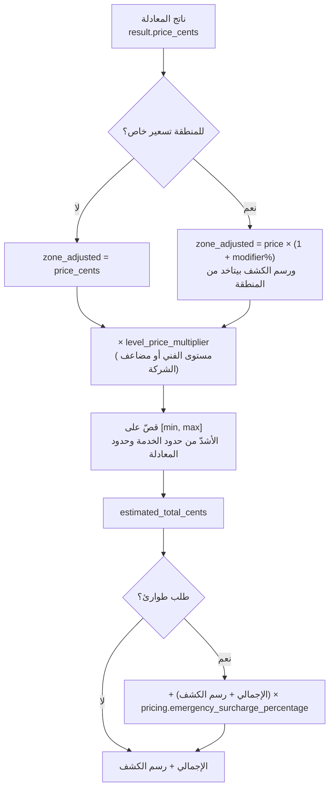
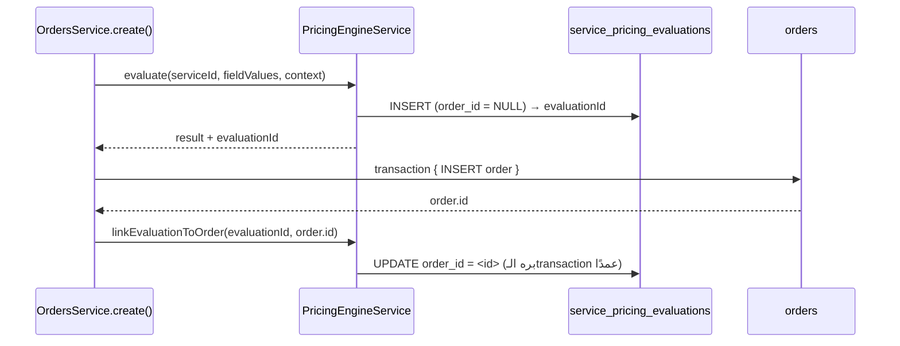

# 03 — محرك التسعير (Pricing Engine)

> **مصدر هذا المستند**: `apps/api/src/modules/pricing/` + `catalog.service.ts` (تركيب السعر
> النهائي) + جدول `settings` الحيّ في `baytak_main`. تحقّق: 216 اختبار في 25 suite
> (`pricing/` + `catalog/`) كلها ناجحة على Postgres حقيقي.
>
> مستندات مرتبطة: [02 — دورة حياة الطلب](./02-ORDER-LIFECYCLE.md) ·
> [10 — تدفّق الأموال](./10-FINANCE-MONEY-FLOW.md)

---

## 1. المبدأ الحاكم: نموذجان بس

بعد ADR-0060، كل خدمة في المنصّة بتنتمي لواحد من **اتنين** فقط:

| النموذج | متى يُستخدم | السعر وقت الحجز |
|---------|-------------|------------------|
| `formula` | السعر محسوب من مدخلات العميل | محسوب فعليًا |
| `inspection_then_quote` | السعر مستحيل يتحدد قبل المعاينة | `0` + رسم كشف بس |

النماذج القديمة (`fixed` / `hourly` / `per_unit`) **اتشالت**. سعر ثابت = معادلة
`literal(N)`؛ سعر بالساعة = `multiply(field_ref(hours), literal(rate))`. مسار حساب واحد
بس (ADR-0060 §1) — مفيش فرعين للنفس السؤال.

### محور تاني مستقل: يقين السعر

`price_certainty_mode` بيوصف **إزاي يتعرض السعر للعميل**، مش إزاي يتحسب:

| القيمة | العميل بيشوف |
|--------|--------------|
| `confirmed_price` | رقم نهائي |
| `estimated_range` | نطاق «من … إلى» |
| `assessment_required` | «محتاج تقييم» — مفيش رقم قبل التقييم |

و`assessment_route_policy` بيحدد **إزاي التقييم بيتم**: `admin_triage` · `remote_only` ·
`onsite_only` · `customer_choice`.

> ⚠️ التوليفة `assessment_required` بلا أي مسار تقييم مفعّل بتنتج خدمة **مستحيل حجزها بأي
> طريق**. اتقفلت على تلات طبقات: تحقّق خدمة الأدمن، تلات `CHECK` constraints في قاعدة
> البيانات، وتعطيل في واجهة الأدمن.

---

## 2. المعادلة — شجرة JSON، مش نص يتفسّر

### القرار الأمني (ADR-0001)

`eval()` و`new Function()` **ممنوعين تمامًا** — ثغرة تنفيذ كود عن بُعد مباشرة. المعادلة
**شجرة عمليات JSON** (`FormulaNode`)، و`formula-evaluator.ts` بيفهم بس قائمة عمليات معروفة
سلفًا (whitelist صريح).

أي عقدة برّه القائمة **بتترفض وقت الحفظ** (`validateFormulaNode()`) — قبل ما توصل قاعدة
البيانات خالص. اتأكد حيًا: محاولة حفظ `{"type":"eval","code":"..."}` اترفضت بـ`VAL_001` من
غير ما تمسّ القاعدة الصحيحة الموجودة.

### العمليات المسموحة

| المجموعة | العمليات |
|----------|----------|
| مراجع | `literal` · `field_ref` · `constant_ref` · `lookup_ref` |
| حساب | `add` · `subtract` · `multiply` · `divide` (رفض واضح لقسمة على صفر) · `percentage` |
| تقريب | `round` · `ceil` · `floor` |
| اختيار | `min` · `max` · `if`/`else` بشروط (`equals`, `not_equals`, `gt`, `gte`, `lt`, `lte`) |
| زمن/مكان | `date_diff` · `distance` |

### الحدود (مصدر واحد مشترك: `formula-limits.ts`)

| الحد | القيمة | السبب |
|------|--------|-------|
| `MAX_DEPTH` | 48 | طلب صريح من المالك |
| `MAX_NODE_COUNT` | 1500 | العمق لوحده مش حماية — شجرة عريضة ممكن تكون مليون عقدة بعمق 2 |
| `MAX_PAYLOAD_JSON_BYTES` | 128 KB | JSON أكبر من كده مش معادلة |

الملف ده **مشترك بين الباك-إند وواجهة الأدمن** عمدًا — عشان مايبقاش فيه رقمان مختلفان
(«المحرر يبني 48 والـAPI يرفض 12»).

### تفصيلة عملية في المقارنات

`equals`/`not_equals` بيقارنوا **رقميًا** لو الطرفين قابلين للتحويل لرقم صالح، وإلا بيرجعوا
لمقارنة نصية. السبب: حقول `dropdown` قيمتها دايمًا نص حتى لو شكلها رقمي — مقارنة نصية صارمة
كانت هتفشل مطابقة `"3"` مع `3`.

---

## 3. مخرجات المعادلة

المعادلة مش بترجّع سعر بس — بترجّع **حزمة تشغيلية كاملة**:

| المخرج | إلزامي | يُستهلك في |
|--------|--------|-----------|
| `price_cents` | ✅ | السعر |
| `min_price_cents` / `max_price_cents` | ❌ | حدود القصّ |
| `duration_minutes` | ❌ | فحص التعارض + السقف اليومي |
| `estimated_duration_days` | ❌ | الحجز متعدد الأيام |
| `required_technicians` | ❌ | تكوين الطاقم |
| `required_assistants` | ❌ | تكوين الطاقم |
| `suitable_for_emergency` | ❌ | بوابة رفض الطوارئ غير المناسبة |

**ADR-0061 §5**: `requires_assistant` **مشتق** من `required_assistants > 0`، مش مخرج مستقل.
قبل كده كان ممكن تكتب `requires_assistant=1` مع `required_assistants=0` والنظام يصدّق
الاتنين في مكانين مختلفين.

### حراسة السعر الناتج

قبل ما أي رقم يوصل لمكان بيحدد مبلغ حقيقي يتحصّل:

```
!Number.isSafeInteger(priceCents) || priceCents < 0 || priceCents > 2_147_483_647
  ⇒ VAL_001 «معادلة التسعير أنتجت سعرًا غير صالح لهذه المدخلات»
```

ده حماية إضافية ضد أي مسار حسابي (lookup بقيمة متطرفة، قسمة على رقم قريب من صفر) ممكن ينتج
`Infinity` أو سعرًا سالبًا — بدل ما Postgres يرمي `invalid input syntax for type integer` خام.

نفس الحراسة على كل مخرج اختياري: مبالغ غير سالبة، أعداد طاقم صحيحة (حد ١٠٠٠)، مدة موجبة
(حد ٣٦٦٠ يوم — «معادلة غلط ماتحجزش الفني سنين»). `duration_minutes` بتتقرّب **لأعلى**
(`Math.ceil`) — نص دقيقة زيادة أأمن من نص دقيقة ناقصة في فحص التعارض.

---

## 4. تركيب السعر النهائي

المعادلة بترجّع رقمًا واحدًا؛ السعر اللي العميل بيدفعه بيتركّب فوقه بترتيب محدد:



### ملاحظات دقيقة

- **الاستبدال المطلق لسعر المنطقة (`OVERRIDE`) مرفوض دايمًا**. بعد ADR-0060 مفيش نماذج
  «سعر وحدة» أصلاً، فالنسبة المئوية هي طريقة تسعير المناطق الوحيدة. محاولة استخدامه بترمي
  `VAL_001` صراحة.
- **حدود القصّ بتتجمّع من مصدرين**: `services.min_price_cents` وناتج المعادلة —
  الحد الأدنى الفعلي = **الأكبر** فيهم، والأقصى = **الأصغر**. لو الأدنى بقى أكبر من الأقصى ⇒
  رفض واضح («حدود سعر الخدمة متعارضة وتحتاج مراجعة من الإدارة») بدل سعر عبثي.
- **رسوم الطوارئ بتتحسب على (الإجمالي + رسم الكشف)** مش على الإجمالي لوحده.
- **رسوم الطوارئ مش بند بيتعرض للعميل** — الواجهات بتستهلكها داخل الإجمالي.
- **`surge_multiplier` دايمًا `1`** حاليًا — العمود موجود في العقد لكن مفيش تسعير ديناميكي
  حسب الطلب/العرض مفعّل.
- **نطاق العرض ≠ حدود القصّ**. `display_price_min/max_cents` (ADR-0063) هو اللي بيتعرض
  لخدمات `estimated_range`، ومصدره دالة واحدة (`estimatedDisplayRange`) مش حساب موازي.
  الخلط بينهم كان بَقّة حقيقية في `customer-app`.

### الإعدادات الحيّة

| المفتاح | القيمة |
|---------|--------|
| `pricing.emergency_surcharge_percentage` | `20` |
| `pricing.default_commission_percent` | `15` |
| `pricing.auto_match_level_premium` | `"charge"` |

---

## 5. سياق التسعير (`PricingContext`)

المعادلة مش بتشوف مدخلات العميل بس — بتشوف **سياق الطلب** كمان. `buildPricingContext()`
بيجمّعه ويقدّمه للمعادلة كحقول محجوزة:

`quantity` · `duration_minutes` · `duration_hours` · `scheduled_at_epoch_ms` ·
`scheduled_end_at_epoch_ms` · `is_emergency`

بالإضافة لمصادر `date_diff` و`distance`، ومتغيرات العمل (`businessVariables`)، والمنطقة،
ومستوى الفني، ووضع الحجز، والإضافات، وبيانات الطلب المتكرر.

**تمييز متعمّد**: `scheduledAt/scheduledEndAt` هما موعد **الزيارة**، بينما
`periodStart/periodEnd` هما مدى **التعاقد** (ADR-0050 §4). اشتراك ٣ شهور بيتنفّذ بزيارة
واحدة — خلطهم كان هيخلي زيارة ساعتين لاشتراك سنة تتحسب ساعتين.

---

## 6. أخطر بَقّة تسعير في تاريخ المشروع (موثّقة، مصلّحة)

مهمة لأي حد بيضيف نقطة تسعير جديدة:

**البَقّة**: `CatalogService.estimate()` — نقطة التسعير الوحيدة اللي `OrdersService.create()`
و`promotions.previewForOrder()` و`GET /services/:id/estimate` الثلاثة بينادوها — **ماكانتش
عارفة `pricing_model=formula` خالص**. أي خدمة formula كانت بتاخد المسار الثابت
(`service.basePriceCents`)، واللي بيتسجّل `0` عمدًا لخدمات formula.

**النتيجة**: **أي طلب حقيقي لخدمة formula كان بيتحجز مجانًا بالكامل** —
`estimated_price_cents = 0`, `total_amount_cents = 0` — من غير أي خطأ ولا تحذير. بينما
`POST /services/:id/evaluate-price` (المسار اللي التطبيق بيستخدمه لعرض السعر الحي) كان شغال
صح تمامًا. العميل يشوف ٢١.١٠ ج في المعاينة، والطلب يتحجز بصفر.

**الدرس البنيوي**: نقطة تسعير واحدة مش كفاية لو مش **كل** المسارات بتعدّي منها بنفس
المعاملات. القاعدة دلوقتي: أي مسار بيحسب مبلغ بيتحصّل لازم يعدّي من `estimate()` بنفس
`field_values`، ولو حقل مطلوب ناقص يترفض **قبل** أي كتابة في transaction الطلب — مفيش صف
orphan.

### بَقّة تانية مصلّحة: `default_value` كانت بتتجاوز الفحص

`resolveDefaultValue()` كانت بتحط القيمة الافتراضية وتعمل `continue` **فورًا** — تتخطى
عضوية `options` وحدود `min/max` اللي أي قيمة من العميل بتتعرض لها.

**الاستغلال المؤكد**: حقل `NUMBER` بحدود `[1,100]` لكن `default_value='99999'` (أدمن نسي
يحدّث الحد الأقصى) ⇒ السعر اتحسب بـ`99999 × 100` بدل رفض واضح — **سعر خاطئ بصمت لأي عميل ما
لمسش الحقل ده**.

---

## 7. تتبّع السعر التاريخي

طلب مالك صريح: «السعر النهائي للطلب لازم يفضل قابل للتتبّع حتى لو الأدمن غيّر قواعد التسعير
بعدين».



**قراران متعمّدان (مش سهو)**:
1. `evaluate()` بتتنادى **قبل** الـtransaction، فالصف بيتسجّل بـ`order_id = NULL` أولًا —
   تجنّبًا لنداء تانٍ للمعادلة جوّه الـtransaction (ممكن يدّي نتيجة مختلفة لو القواعد اتغيّرت
   بين اللحظتين).
2. `linkEvaluationToOrder()` **بره** الـtransaction — تدقيق مهم بس مش أهم من إنشاء الطلب
   نفسه. فشله بيتلقّط بصمت (نفس فلسفة `AuditLogService.record()`).

نفس الفلسفة على كتابة `service_pricing_evaluations` نفسها: فشلها **معطّل بأمان** — مايأثرش
على رجوع السعر للعميل.

---

## 8. أدوات الأدمن

### محرر الشجرة البصري (No-Code)

`formula-tree-editor.tsx` — محرر شجري recursive، كل عقدة بكارت فيه اختيار نوع + عناصر تحكم
مناسبة لنوعها. **مفيش drag & drop** — قرار تصميم متعمّد (تعقيد framework كامل غير مبرر لعدد
العمليات المتاح).

وضع «عرض/تحرير JSON» موجود كـtoggle اختياري للمراجعة أو النسخ السريع — مش الطريق الافتراضي،
ومصدر الحقيقة واحد (الـpayload state، مش نصّان منفصلان).

### معاينة المسوّدة قبل النشر

`POST /admin/services/:id/pricing/evaluate-draft` — **نفس محرك الحساب بالحرف**
(`computeResult()` مشترك)، بس `formula_payload` بيتبعت كـoverride، و**صفر كتابة** (لا تقييم
ولا تدقيق).

قبل ده كان الأدمن مضطر **يحفظ** المعادلة (تبقى سارية لأي عميل حقيقي فورًا) قبل ما يقدر يشوف
نتيجتها.

### حالات اختبار محفوظة

`service_pricing_rule_tests` — «المدخلات دي لازم تنتج السعر ده بالظبط». زرار «شغّل كل الحالات
ضد المسوّدة الحالية» بيخلي الأدمن يتأكد إن تعديله (اللي لسه مش محفوظ) ما كسرش أي سيناريو معروف
**قبل** ما يحفظ.

فشل حالة واحدة مابيوقفش باقي الحالات.

### السريان الزمني

`valid_from` / `valid_until` — نفس فلسفة `service_zone_pricing` بالحرف: تعديل فوري بيحدّث
الصف الحالي في مكانه، وتعديل مستقبلي بيقفل الصف الحالي ويفتح صف جديد **من غير ما يمسّ السعر
الساري دلوقتي**.

> قرار موثّق: جدول «draft/published» منفصل **اتقرر عدم بناؤه** — الآلية دي بتحل نفس المشكلة
> فعليًا، وشرط «الطلبات المؤكدة تحتفظ بلقطة سعرها» متحقق من `service_pricing_evaluations`.

### الصلاحيات

| العملية | الصلاحية |
|---------|----------|
| قراءة الحقول/القواعد/حالات الاختبار | مفتوحة لأي أدمن |
| تعديل + `evaluate-draft` + تشغيل الحالات | `catalog.manage` |

مفيش صلاحية «نشر» منفصلة لأن مفيش «draft» منفصل عن «published».

---

## 9. مثال متحقَّق منه حيًا

خدمة محارة، ٤ حقول (`wall_type` dropdown، `area` رقمي، `thickness_cm` dropdown، `floor`)،
جدول بحث لسعر المتر، وثابت لرسوم الدور:

```
final_price = area × price_per_meter[wall_type]
            + 15% لو thickness_cm = 3
            + 500 قرش لو floor > 5
```

| المدخلات | الحساب اليدوي | ناتج المحرك |
|----------|----------------|--------------|
| `area:10, wall_type:internal, thickness:"3", floor:6` | 10×140 + 15% + 500 | **2110** ✓ |
| `area:120, wall_type:external, thickness:"3", floor:7` | (120×165×1.15)+500 | **23270** ✓ |
| `area:150, wall_type:internal, thickness:"2", floor:2` | 150×140 | **21000** ✓ |

وعلى مسار الطلب الحقيقي:

| الحالة | النتيجة |
|--------|---------|
| `POST /orders` بنفس المدخلات | `total_amount_cents: 2110` ✓ |
| نفسها بـ`booking_mode: emergency` | `surge_amount_cents: 422` (20%)، `total: 2532` ✓ |
| `POST /orders` بلا `field_values` | ❌ 400 واضح، **صفر صف orphan** ✓ |
| قيمة `dropdown` غير مسموحة | ❌ 400 واضح ✓ |
| معادلة خبيثة `{"type":"eval"}` | ❌ `VAL_001` بلا مساس بالقاعدة الصحيحة ✓ |

---

## 10. مراجع الكود

| الموضوع | الملف |
|---------|-------|
| المحرك | `apps/api/src/modules/pricing/pricing-engine.service.ts` |
| مُقيّم المعادلة (whitelist) | `apps/api/src/modules/pricing/formula-evaluator.ts` |
| أنواع العقد | `apps/api/src/modules/pricing/pricing-formula.types.ts` |
| الحدود (مشتركة مع الأدمن) | `apps/api/src/modules/pricing/formula-limits.ts` |
| سياق التسعير | `apps/api/src/modules/pricing/pricing-context.ts` |
| تركيب السعر النهائي | `apps/api/src/modules/catalog/catalog.service.ts` (`estimate()`) |
| علاوة المستوى | `apps/api/src/modules/pricing/level-premium.service.ts` |
| وعاء العمولة | `apps/api/src/modules/pricing/commission-base.ts` |
| محرر الشجرة | `apps/admin/.../formula-tree-editor.tsx` |

**قرارات معمارية**: ADR-0001 (شجرة JSON بدل eval) · ADR-0050 (الزمن والمسافة) ·
ADR-0060 (نموذجان بس) · ADR-0061 (المدة والطاقم كمخرجات) · ADR-0063 (نطاق العرض).
