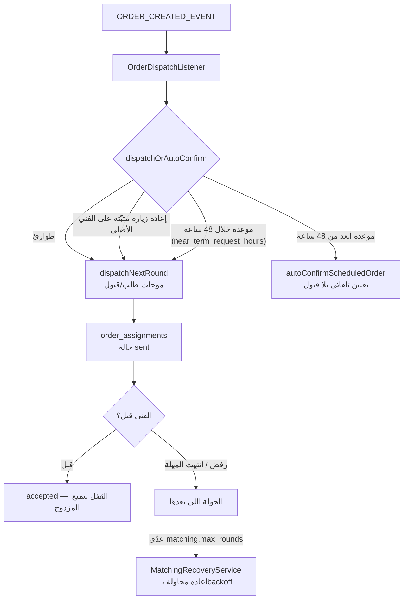
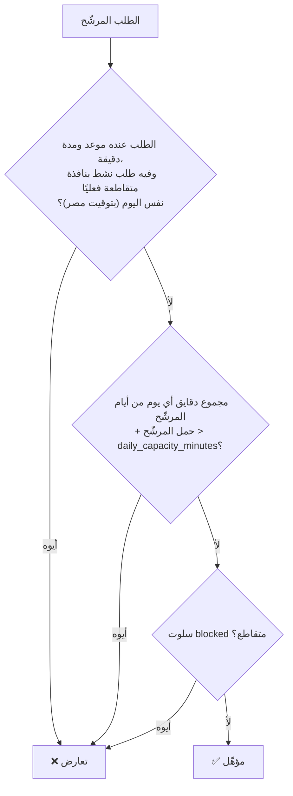

# 04 — محرك المطابقة (Matching Engine)

> **حالة التحقق**: كل رقم وقاعدة في الملف ده اتأكدت **بتشغيل حي** على Postgres حقيقي عبر
> `apps/api/src/modules/matching/scheduling-scenarios.spec.ts` و`matching-accept-concurrency.spec.ts`
> (١٨ سويتة / ٩٩ اختبار في موديول المطابقة). أي حاجة لسه مش متأكد منها مكتوب جنبها صراحة.

**الكود**: `apps/api/src/modules/matching/matching.service.ts` (المحرك) ·
`apps/api/src/modules/technicians/technician-eligibility.sql.ts` (**مصدر الحقيقة الوحيد** للأهلية) ·
`apps/api/src/modules/matching/matching-explainability.service.ts` (بيقول ليه فني اترفض)

---

## 1. نقطة الدخول — إزاي الطلب بيتوزّع أصلاً

كل طلب بيدخل من دالة واحدة: `dispatchOrAutoConfirm(orderId)`.



**القاعدة الحاسمة** (`matching.service.ts:683-694`, `isNearTermOrder()`):

| نوع الطلب | المسار | الفني لازم يوافق؟ |
|---|---|---|
| طوارئ (`booking_mode = emergency`) | `dispatchNextRound` | ✅ أيوه |
| إعادة زيارة بفني مثبّت | `dispatchNextRound` | ✅ أيوه |
| **موعده خلال ٤٨ ساعة** | `dispatchNextRound` | ✅ أيوه |
| موعده أبعد من ٤٨ ساعة | `autoConfirmScheduledOrder` | ❌ لأ — بيتعيّن تلقائي |
| بلا `scheduled_at` (ASAP) | `dispatchNextRound` | ✅ أيوه (قريب بالتعريف) |

> **ليه**: ADR-0035 — «الفني مايتفاجأش بشغل بكرة اتعيّنله وهو مش عارف». الحد ده إعداد
> (`matching.near_term_request_hours = 48`)، و`0` بيلغيه تمامًا (كل غير الطوارئ يتعيّن تلقائي).

---

## 2. الأهلية — الفلاتر (مين يدخل القايمة أصلاً)

كلها في `WHERE` واحد. الفني **لازم** يعدّي كل واحد:

| الفلتر | المصدر | ملاحظة |
|---|---|---|
| `verification_status = 'approved'` | `technician_profiles` | |
| مؤهّل للخدمة | `technician_services` (`is_active` + `verification_status='approved'`) **أو** `technician_categories` للفئة كلها | ADR-0018 §8 — LEFT JOIN + EXISTS |
| مغطّي المنطقة | `technician_zones` (`is_active`) | JOIN إجباري |
| `current_location IS NOT NULL` | `technician_profiles` | فني بلا موقع مايترشّحش |
| `deleted_at IS NULL` | | |
| مش متعرض عليه الطلب ده قبل كده | `order_assignments` / `technician_work_opportunities` | منع التكرار |
| حد القرار يكفي قيمة الطلب | `technician_level_config.decision_limit_cents` | جديد=٢٠٠ ج، موثّق=٥٠٠ ج، محترف=١٥٠٠ ج، مميّز/قائد=بلا حد |
| مؤهّل لقيادة فريق (لطلبات الاعتماد بس) | `technician_level_config.eligible_for_team_booking` | محترف فأعلى |
| **مفيش تعارض جدولي** | `technicianAvailabilityCondition()` | ↓ القسم ٣ |
| **مفيش استثناء `blocked` صريح** | `technician_schedule_slots` | الفني حدد بنفسه إنه مش متاح |

**نطاق البحث**: `matching.radius_km_initial = 5` كم، بيتوسّع لحد `matching.radius_km_max = 15` كم.

---

## 3. قاعدة التعارض الجدولي — القلب اللي بيلخبط الناس

**دي مش «الفني عنده شغل نشط؟» — دي شرطان مستقلان + الاستثناء الصريح، وقاعدة واحدة لكل أوضاع
الحجز بلا استثناء للطوارئ (ADR-0070).**



> **⚠️ اتغيّر في ADR-0070 (2026-09-04)**: كان فيه فرع تالت — «الفني منشغل جسديًا دلوقتي
> (`ENGAGED`)» — بيستبعده من الطوارئ ومن طلبات نفس اليوم. **اتشال بالكامل** بطلب مالك صريح.
> راجع [06 §3](./06-SAME-DAY-URGENT-ORDERS.md) للحكاية كاملة.

### الحالات المستخدمة

```
ACTIVE_TECHNICIAN_ORDER_STATUSES  = accepted, technician_on_way, technician_arrived,
                                    in_progress, awaiting_quote_approval,
                                    awaiting_initial_quote_approval
ENGAGED_TECHNICIAN_ORDER_STATUSES = نفسها **ناقص `accepted`**
```

`ACTIVE` هي اللي بتحكم التقاطع وحساب الحمل. `ENGAGED` **مابقتش تحكم أي استبعاد** بعد
ADR-0070 — الـparameter بتاعها فاضل مربوط بتعبير دايمًا صحيح عشان مايتعادش ترقيم كل الـ`$N`
في أربع استعلامات كبيرة مقابل صفر مكسب سلوكي.

### التزام الشخص = قيادة **أو** عضوية طاقم

`technicianCommittedOrdersSource()` بيعمل `UNION` بين:
- `orders.technician_id = X` (الشخص قائد الطلب)
- `order_team_members.technician_id = X` (الشخص عضو طاقم عند حد تاني)

> **بلاغ مالك حقيقي أدّى للقاعدة دي (ADR-0057)**: «مساعد اتضاف في نفس اليوم لتلات شغلانات
> كبار، والسيستم ما جابش إن هو شغول». السبب: كل فحوص التعارض كانت بتبص على
> `orders.technician_id` بس، والمساعد بطبيعته **دايمًا** عضو طاقم مش قائد — يعني التزامه
> كان شفاف تمامًا لمحرك الجدولة.

---

## 4. السيناريوهات — نتايج التشغيل الحي

كلها من `scheduling-scenarios.spec.ts` (**١٧/١٧** عدّوا):

| # | الوضع القائم | الطلب الجديد | النتيجة | ليه |
|---|---|---|---|---|
| **خط أساس** | فني فاضي | بكرة ١٦:٠٠ | ✅ مؤهّل | لا تعارض |
| **A** | **شغّال دلوقتي** ١١:٠٠–١٤:٠٠ | **بكرة ١٦:٠٠** | ✅ **مؤهّل** | يوم مختلف — الشغل النشط مالوش أثر |
| **A2** | شغّال دلوقتي ١١:٠٠–١٤:٠٠ | نفس اليوم ٢٠:٠٠ | ✅ **مؤهّل** | ADR-0070 — مفيش تقاطع و٣٠٠ د < ٧٢٠ |
| **A3** | شغّال دلوقتي ١١:٠٠–١٤:٠٠ | نفس اليوم ١٣:٠٠ | ❌ مرفوض | تقاطع نافذة حقيقي |
| **A4** | شغّال دلوقتي | نفس مدخلات A2 | ✅ التصنيف = المحرك | حارس ضد انحراف القاعدتين |
| **B** | بكرة ١٤:٠٠–١٦:٠٠ | بكرة ١٥:٠٠–١٧:٠٠ | ❌ مرفوض | تقاطع نافذة حقيقي |
| **C** | بكرة ١٤:٠٠–١٦:٠٠ | بكرة ١٧:٠٠–١٩:٠٠ | ✅ مسموح | مفيش تقاطع، والسقف اليومي بعيد |
| **C2** | بكرة ١٤:٠٠–١٦:٠٠ | بكرة **١٦:٠٠**–١٨:٠٠ | ✅ مسموح | نطاق **نصف مفتوح** — التلامس مش تقاطع |
| **D** | `accepted` النهاردة ١٨:٠٠ | طوارئ دلوقتي | ✅ مؤهّل | `accepted` مش ENGAGED |
| **D2** | `in_progress` دلوقتي (٣ ساعات) | طوارئ دلوقتي | ✅ **مؤهّل** | ADR-0070 — اليوم مش مليان |
| **D4** | يوم كامل محجوز | طوارئ دلوقتي | ❌ مرفوض | السقف اليومي بقى يسري على الطوارئ |
| **السقف** | ١١ ساعة محجوزة يوم ٣ | ساعتين نفس اليوم | ❌ مرفوض | ١٣ ساعة > ١٢ (`daily_capacity_minutes=720`) |

> **إجابة سؤال المالك المباشر**: «الفني عنده شغل نشط دلوقتي — يقدر يقبل حجز بكرة ٤ عصرًا؟»
> **أيوه، يقدر.** وبعد ADR-0070 يقدر كمان يقبل شغلانة **نفس اليوم** طالما مفيش تقاطع نافذة
> واليوم مش مليان.

### إجابة أمثلة المالك بالظبط

فني عنده: `09:00–11:00` طلب ١، `13:00–15:00` طلب ٢ (كلهم النهاردة):

| الطلب الجديد | مسموح؟ | السبب |
|---|---|---|
| النهاردة ١٠:٠٠ | ❌ | تقاطع مع ٠٩:٠٠–١١:٠٠ |
| النهاردة ١١:٣٠ | ✅ | بين الاتنين، مفيش تقاطع |
| النهاردة ١٤:٠٠ | ❌ | تقاطع مع ١٣:٠٠–١٥:٠٠ |
| النهاردة ١٦:٠٠ | ✅ | بعد الاتنين + إجمالي اليوم ٤+٢ = ٦ ساعات < ١٢ |
| بكرة ١٤:٠٠ | ✅ | يوم مختلف تمامًا |

> ✅ **الجدول ده صحيح سواء الفني شغّال دلوقتي أو لأ** (ADR-0070). قبل التغيير، لو كان
> `in_progress`، كل طلبات النهاردة كانت بتترفض — حتى ١٦:٠٠ اللي يومه فاضي فيها تمامًا.

---

## 5. الترتيب — الصيغة الحقيقية

بعد الفلترة، المرشّحين بيترتّبوا بـ`rank_score DESC, distance_km ASC`:

```
rank_score =   order_priority_weight(مستوى الفني)
             − active_count × workload_balance_weight
             − recent_effective_workload × fairness_weight
             − distance_km × distance_weight(حسب سياق الطلب)
             + (average_rating − reliability_baseline) × reliability_weight   [لو عدد التقييمات كافي]
             + company_large_job_boost                                        [لو طلب فريق كبير + شركة مسجّلة]
```

### أوزان المستوى (`technician_level_config`)

| المستوى | الوزن | حد القرار | يقود فريق؟ |
|---|---|---|---|
| `team_leader` | 40 | بلا حد | ✅ |
| `premium` | 30 | بلا حد | ✅ |
| `professional` | 20 | ١٥٠٠ ج | ✅ |
| `verified` | 10 | ٥٠٠ ج | ❌ |
| `new` | 0 | ٢٠٠ ج | ❌ |

### الأوزان المفعّلة فعلاً مقابل المخزّنة بس

| المكوّن | الإعداد | الافتراضي | **مفعّل؟** |
|---|---|---|---|
| مستوى الفني | `technician_level_config.order_priority_weight` | 0–40 | ✅ **أيوه** |
| موازنة الحِمل | `matching.workload_balance_weight` | **2** | ✅ **أيوه** |
| المسافة | `matching.distance_weight` | **0** | ⚠️ **لأ** — كاسر تعادل بس |
| العدالة | `matching.fairness_weight` | **0** | ⚠️ **لأ** — معطّل |
| الموثوقية (التقييم) | `matching.reliability_weight` | **0** | ⚠️ **لأ** — معطّل |
| أفضلية الشركة | `matching.company_large_job_boost` | 3 | ✅ أيوه (لطلبات ٤ أفراد+) |
| كسر التعادل العشوائي | `matching.tie_break_threshold` | **0** | ⚠️ **لأ** — ترتيب حتمي |

> **خلاصة مهمة للمالك**: الترتيب الفعلي النهاردة = **مستوى الفني − (٢ × عدد طلباته النشطة)**،
> وبعدين الأقرب مسافة بيكسر التعادل. المسافة والتقييم والعدالة **مخزّنين ومحسوبين وجاهزين
> بالكامل** بس أوزانهم صفر — تشغيلهم قرار إعداد من لوحة الأدمن، مش شغل كود.

### أوزان المسافة حسب السياق (ADR-0062)

`resolveDistanceWeight()` بيختار من أربع إعدادات حسب الطلب:

| السياق | الإعداد | الافتراضي |
|---|---|---|
| عادي | `matching.distance_weight` | 0 |
| طوارئ | `matching.distance_weight_emergency` | 0 (ولو أقل من الأساسي، الأساسي بيسري) |
| موعد قريب (≤٤٨ س) | `matching.distance_weight_near_term` | 0 |
| شغل رخيص (≤ `low_value_order_cents` = ١٥٠ ج) | `matching.distance_weight_low_value` | 0 |

---

## 6. الموجات (Rounds) والتوسيع

- `matching.batch_size = 5` — عدد الفنيين في كل موجة (مش بث لكل المؤهّلين مرة واحدة).
- `matching.max_rounds` — بعدها الطلب بيروح لـ`MatchingRecoveryService`.
- **مهلة الموجة للشغل القريب**: `matching.near_term_round_timeouts_minutes = "5,15,30"` — الموجة
  الأولى ٥ دقايق، التانية ١٥، التالتة ٣٠، وأي موجة بعدها بتاخد آخر قيمة.
- **التوسيع للمشغولين**: `matching.broaden_to_busy_after_round = 4` — بعد الموجة الرابعة،
  `ignoreActiveOrderConflict = true` فالفنيين المشغولين بيدخلوا القايمة.
  ⚠️ **استثناء `blocked` الصريح مايتجاهلش أبدًا** حتى في التوسيع.
- **فرص الشغل الاختيارية**: `matching.offer_heavy_workload_technicians = true` — الفني المصنّف
  HEAVY (يوم كامل/متعدد الأيام) بياخد **فرصة اختيارية** بدل ما يتستبعد تمامًا.
  `matching.work_opportunity_exclusive_seconds = 7200` (ساعتين حصرية قبل التوسيع بالتوازي).

---

## 7. التزامن — Scenario E

مغطّى بـ٩ اختبارات حية في `matching-accept-concurrency.spec.ts`:

| الحالة | السلوك المؤكَّد |
|---|---|
| فنيين بيقبلوا **نفس** الطلب في نفس اللحظة | واحد بس يفوز، التاني `CONFLICT` |
| نفس الفني يقبل **طلبين** بالتوازي | مورد الفني بيسمح بواحد بس |
| طلبين بوقت دقيق متداخل لنفس الفني | القفل بيعيد الفحص، واحد بس ينجح |
| موعدين متجاورين (١٠–١٢ ثم ١٢–١٤) | **الاتنين ينجحوا** |
| قبول فني × إعادة تعيين أدمن في نفس اللحظة | المؤشر والعرض بينتموا لفائز واحد |
| الأدمن بيحاول يتجاوز الأهلية | بيترفض |
| عرض فات معاده (`expires_at`) | **لسه قابل للقبول** طالما محدش أخده (ADR-0018 §5) |

**آلية المنع**: `dataSource.transaction` + `lockTechnician()` (قفل صف الفني) + إعادة فحص حالة
الطلب **جوّه** القفل + `UPDATE ... WHERE assignment_status IN (sent, viewed)`. أي خاسر بيلاقي
الحالة اتغيّرت وبيترفض بـ`ORDR_003`.

---

## 8. لما فني يترفض — إزاي تعرف ليه

`MatchingExplainabilityService.explainTechnicianForOrder(order, technicianId)` بيرجّع **أنهي
بوابة بالظبط** رفضت الفني، وبيستخدم **نفس** `technicianAvailabilityCondition()` — مش صيغة
موازية. متاح للأدمن من صفحة تتبّع الطلب.

> **ملاحظة تشغيلية اتعلمتها في التدقيق ده**: الخدمة دي هي أسرع طريقة لتشخيص «ليه الطلب ده
> مش لاقي فني». استخدمتها بنفسي وكشفت إن مِنصّة اختباري كانت غلط مش المحرك.

---

## 9. اللي المحرك **مش** بيستخدمه (مخزّن بس / مستقبلي)

عشان مفيش لبس بين الموجود والمُستخدَم:

| العامل | الحالة |
|---|---|
| `is_available` / `is_on_duty` | ⚠️ **اتشالوا من الأهلية بالكامل** (ADR-0017) — نموذج Opt-out: الفني متاح افتراضيًا |
| تقييم الفني | محسوب ومخزّن، **وزنه صفر** افتراضيًا |
| العدالة (توزيع الشغل الحديث) | محسوبة بالكامل، **وزنها صفر** |
| المسافة | محسوبة، **وزنها صفر** (كاسر تعادل بس) |
| علاقات محظورة بين عميل وفني | ❓ **لسه محتاج تحقق** — مش متأكد إنها في مسار المطابقة |
| متطلبات معدات | ❓ **لسه محتاج تحقق** |

---

## 10. مراجع الكود

| السلوك | الملف |
|---|---|
| نقطة الدخول والتوجيه | `matching.service.ts:683` (`dispatchOrAutoConfirm`) |
| قاعدة القريب/البعيد | `matching.service.ts:703` (`isNearTermOrder`) |
| استعلام الأهلية + الترتيب | `matching.service.ts:293-500` (`findEligibleTechnicians`) |
| **قاعدة التعارض** | `technician-eligibility.sql.ts` (`technicianAvailabilityCondition`) |
| السقف اليومي | `technician-day-capacity.sql.ts` (`dailyCapacityExceededExpr`) |
| القبول تحت القفل | `matching.service.ts:1487` (`accept`) |
| التفسير | `matching-explainability.service.ts:122` |
| حالات الطلب | `orders/order-state-machine.ts:165-186` |
| **اختبارات السيناريوهات** | `matching/scheduling-scenarios.spec.ts` |
| **اختبارات التزامن** | `matching/matching-accept-concurrency.spec.ts` |
