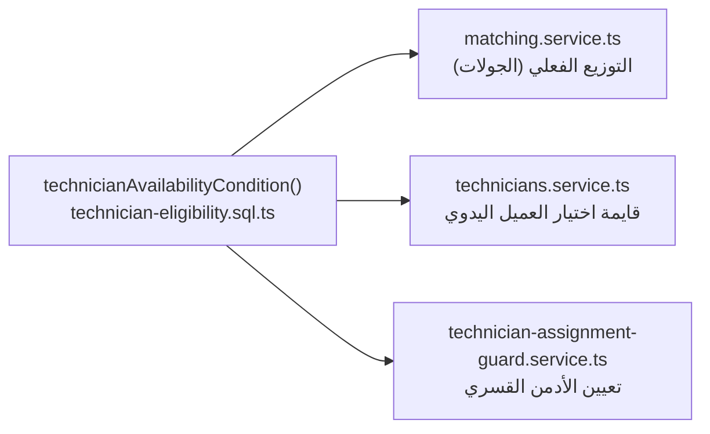
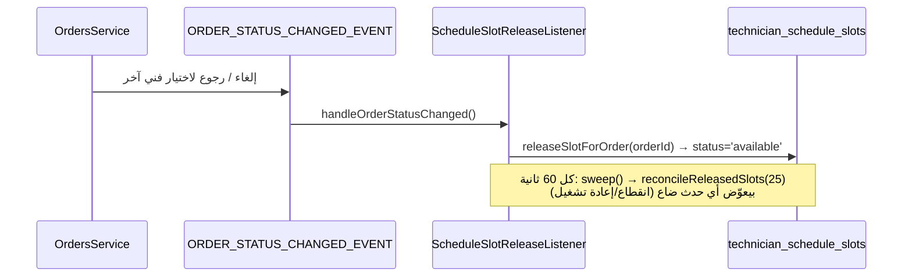
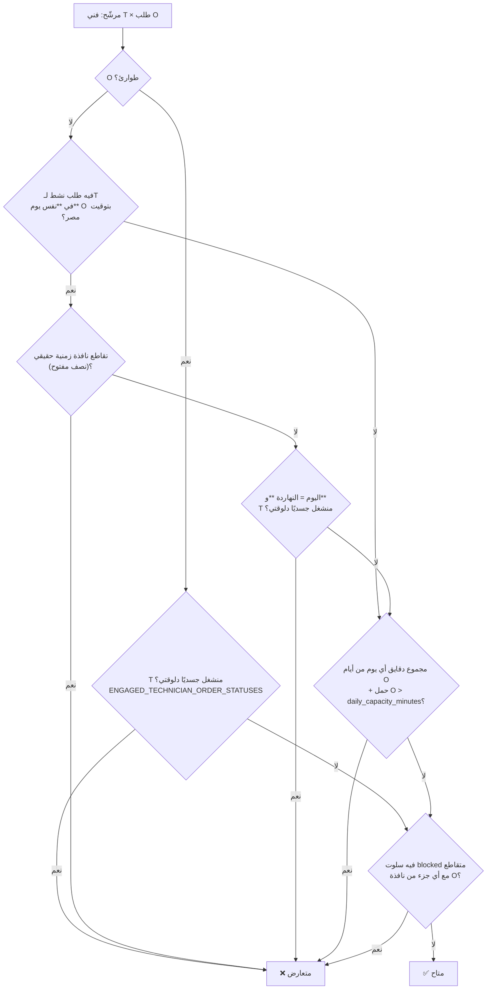

# 05 — الجدولة والإتاحة (Scheduling & Availability)

> **مصدر هذا المستند**: تشغيل حي على Postgres/PostGIS الحقيقي (`baytak_main`) عبر
> `apps/api/src/modules/matching/scheduling-scenarios.spec.ts` (14/14 ناجحة) و51 suite في
> `technicians/` + `matching/` (273 اختبار). كل رقم/قاعدة هنا مقروءة من الكود أو من قاعدة
> البيانات الحيّة، مش من نيّة التصميم.
>
> مستندات مرتبطة: [04 — محرك المطابقة](./04-MATCHING-ENGINE.md) ·
> [06 — الطلبات العاجلة](./06-SAME-DAY-URGENT-ORDERS.md)

---

## 1. الخلاصة التنفيذية

إتاحة الفني في المنصّة **مش جدول دوام أسبوعي متكرر**. هي ثلاث طبقات مستقلة بتتجمّع في سؤال
واحد: «الفني ده يقدر ياخد الطلب ده فعليًا؟»

| # | الطبقة | مصدر الحقيقة | مين بيحدّدها |
|---|--------|--------------|--------------|
| 1 | **الالتزامات الفعلية** (طلبات نشطة) | `orders` + `order_team_members` | النظام (نتيجة الحجز) |
| 2 | **السقف اليومي** (12 ساعة افتراضيًا) | `matching.daily_capacity_minutes` | الأدمن (إعداد) |
| 3 | **الاستثناء الذاتي الصريح** (`blocked`) | `technician_schedule_slots` | الفني بنفسه |

**الافتراضي هو «متاح»**: غياب أي صف في `technician_schedule_slots` معناه الفني متاح — مش العكس.
الجدول ده جدول **استثناءات وحجوزات**، مش جدول دوام.

كل ده مجمّع في دالة واحدة — `technicianAvailabilityCondition()` في
`apps/api/src/modules/technicians/technician-eligibility.sql.ts` — بتُستخدم حرفيًا في **الثلاث
أماكن** اللي بتسأل نفس السؤال:



القرار المعماري ده (ADR-0017/0018) هو اللي بيمنع «الفني ظاهر متاح في الشاشة وبيتّرفض وقت
التعيين» — لأن الثلاثة بيقروا نفس الـSQL بالحرف.

---

## 2. جدول الفني — `technician_schedule_slots`

### 2.1 الشكل

| العمود | النوع | المعنى |
|--------|------|--------|
| `technician_id` | uuid | صاحب السلوت |
| `slot_date` | date | اليوم **بتوقيت مصر** |
| `start_time`, `end_time` | time | النافذة المحلية داخل اليوم |
| `status` | enum | `available` \| `booked` \| `blocked` |
| `order_id` | uuid null | الطلب المرتبط (لـ`booked` فقط) |
| `notes_ar` | varchar(200) | سبب الإجازة مثلاً |

الحالات الثلاث بمعانيها الدقيقة:

- **`available`** — الفني فتح الوقت ده صراحة عشان العميل يختاره في مسار «اختار الفني بنفسك».
  ملاحظة مهمة: **غيابه لا يعني عدم الإتاحة** — بيأثّر بس على مسار اختيار سلوت محدد.
- **`booked`** — سلوت متربط بطلب حقيقي. مش قابل للمسح من الفني.
- **`blocked`** — استثناء ذاتي (إجازة/ظرف). **ده الوحيد اللي بيمنع الأهلية بشكل مطلق**، حتى
  في مسار توسيع النطاق (`ignoreActiveOrderConflict`) اللي بيتجاهل تعارض الطلبات النشطة.

### 2.2 نقاط النهاية (endpoints)

| المسار | الفعل | الملف |
|--------|-------|-------|
| `GET /technicians/schedule?from&to` | قراءة سلوتات الفني | `technicians.controller.ts:301` |
| `POST /technicians/schedule` | إنشاء سلوت | `:308` |
| `DELETE /technicians/schedule/:id` | مسح سلوت (مش `booked`) | `:314` |
| `POST /technicians/schedule/bulk` | حظر/فك حظر مجموعة تواريخ | `:325` |

### 2.3 ضمانات التزامن

| الخطر | الضمان | الموضع |
|-------|--------|--------|
| سلوتان متداخلان لنفس اليوم | `EXCLUDE` constraint (migration 0118) + فحص مسبق لرسالة UX | `createSlot()` |
| حجز مزدوج لنفس السلوت | `UPDATE … WHERE status='available'` **ذرّي** (مش SELECT-ثم-UPDATE) | `bookSlot()` |
| طلب اتعمل بلا سلوت فعلي | الحجز بيتم بـ`EntityManager` بتاع transaction الطلب — لو فشل، الطلب كله بيترول باك | `OrdersService.create()` |
| إعادة جدولة تخسّر الموعد الأصلي | تحرير القديم + حجز الجديد في **نفس** الـtransaction | `rescheduleSlot()` |

### 2.4 التحرير التلقائي (سلوت مايفضلش محجوز للأبد)



الحالات اللي بتحرّر السلوت: `cancelled_by_customer`, `cancelled_by_technician`,
`cancelled_by_system`, `searching_technician`, `awaiting_technician_reselection`.

الـsweep الدوري مش زخرفة — هو الطبقة اللي بتخلّي التحرير **متين ضد ضياع الأحداث**: بيقرا حالة
الطلبات الدائمة من `orders` ويصلّح أي سلوت `booked` لطلب ملغي/متحوّل لفني تاني، بحد 25 صف كل
دورة (مش scan غير محدود).

`releaseSlotForOrder()` نفسها **idempotent** — استدعاؤها لطلب مالوش سلوت أصلاً (الحالة الشائعة)
no-op آمن.

### 2.5 التعديل الجماعي (`bulkSetAvailability`)

- `block` → بيمسح أي سلوتات موجودة لليوم ويحط صف `blocked` واحد `00:00:00–23:59:59`.
- `unblock` → بيمسح أي استثناء موجود (الرجوع للافتراضي «متاح» بغياب أي صف).
- يوم عليه سلوت `booked` بيترجع `skipped_booked` — الفني ميقدرش يفك حظر يوم فيه طلب حقيقي.

---

## 3. قاعدة التعارض — المصدر الوحيد

`technicianAvailabilityCondition()` بترجّع نفي ثلاث حالات تعارض + نفي الاستثناء الصريح:



### 3.1 ثلاث نقاط بتفرّق فعليًا

**(أ) التعارض مقيَّد باليوم، مش بالطلب المفتوح.** ده أهم سوء فهم في المنصّة. فني عنده طلب
`in_progress` النهاردة **يفضل مؤهّل تمامًا** لحجز بكرة. اتأكد حيًا (سيناريو A).

**(ب) `accepted` ≠ منشغل.** فيه قائمتين مختلفتين عمدًا:

| القائمة | تشمل | تُستخدم في |
|---------|------|-----------|
| `ACTIVE_TECHNICIAN_ORDER_STATUSES` | كل التزام حي، **بما فيه** `accepted` | تعارض اليوم + حساب الحمل |
| `ENGAGED_TECHNICIAN_ORDER_STATUSES` | الانشغال الجسدي الفعلي، **بدون** `accepted` | الطوارئ + «النهاردة» |

يعني فني قَبِل شغل الساعة ٦ المسا لسه ما تحرّكش ليه ⇒ **يقدر ياخد طوارئ دلوقتي**
(سيناريو D). لكن فني `in_progress` فعلًا ⇒ **لأ** (سيناريو D2).

**(ج) عضو الطاقم محسوب زي القائد.** `technicianCommittedOrdersSource()` بيعمل `UNION` بين
`orders.technician_id` و`order_team_members.technician_id` — لأن المساعد بطبيعته **دايمًا**
عضو طاقم مش قائد، فقبل ADR-0057 كان التزامه **غير مرئي تمامًا** لكل محرك الجدولة. ده كان بلاغ
مالك حقيقي: «مساعد اتضاف في نفس اليوم لتلات شغلانات كبار، والسيستم ماجابش إنه مشغول».

### 3.2 النطاق نصف المفتوح

التقاطع الزمني `[start, end)`: موعدان متجاوران تمامًا (١٤–١٦ ثم ١٦–١٨) **مسموحان**، والتقاطع
الحقيقي بس هو اللي بيترفض (سيناريو C2).

---

## 4. السقف اليومي (ADR-0059/0061)

القاعدة القديمة كانت بوليان: «الشغل ده شاغل يوم كامل؟» — وده كان بيدّي **إجابات مختلفة حسب مين
بيسأل**. اتبدلت بجمع دقايق حقيقي:

```
لكل يوم d من أيام الطلب المرشّح:
    busy_minutes(d) + candidate_minutes_per_day > daily_capacity_minutes  ⇒ تعارض
```

- **الحمل بيتفرد على أيامه كلها** بـ`generate_series` — شغل ٥ أيام بيقفل الخمسة، مش يوم بدايته.
- **متماثل بالبناء**: `candidatePerDayMinutesExpr()` هي **نفس** `perDayMinutesExpr()` بالحرف،
  بس على أعمدة المرشّح. فمستحيل يتحسب «خفيف وهو مرشّح» و«يوم كامل بعد ما يتعيّن».
- شغلانة `estimated_duration_days >= 1` بتاخد **السقف كله** لكل يوم من أيامها.
- بدون ذلك: `LEAST(COALESCE(duration_minutes, service_default, 60), capacity)`.

### القيم الحيّة (من `settings` في `baytak_main`)

| الإعداد | القيمة | المعنى |
|---------|--------|--------|
| `matching.daily_capacity_minutes` | `720` | ١٢ ساعة/يوم |

**مثال متحقَّق منه حيًا**: شغل ٦٦٠ دقيقة (١١ ساعة) + مرشّح ١٢٠ دقيقة = ٧٨٠ > ٧٢٠ ⇒ الفني
بيختفي من نتائج اليوم ده (سيناريو «السقف اليومي»).

### تصنيف القدرة (`classifyTechnicianCapacity`)

بيرجّع أربع درجات، بتُستخدم من `autoConfirmScheduledOrder()` قبل قرار التأكيد التلقائي:

| الدرجة | المعنى | الأثر |
|--------|--------|-------|
| `BLOCKED` | استثناء صريح بيغطي وقت الطلب | مستبعد |
| `HEAVY` | تعدّى السقف اليومي، أو منشغل جسديًا النهاردة | مستبعد من التأكيد التلقائي |
| `MEANINGFUL` | عنده شغل تاني نفس اليوم لكن تحت السقف | الطلب بيحتاج قبول صريح |
| `LIGHT` | مفيش أي تعارض | تأكيد تلقائي |

بتستعمل **نفس** `dailyCapacityExceededExpr` بالحرف — قبل التوحيد كان هنا منطق تاني، فالتصنيف
والتوزيع كانوا ممكن يختلفوا على نفس الفني.

---

## 5. بَقّتان حقيقيتان اتصلحتا أثناء هذا التدقيق

الاختبارات E2/E3 في `scheduling-scenarios.spec.ts` اتكتبت عشان تسأل سؤالًا ما حدش سأله قبل
كده: **هل الاستثناء الصريح بيتحسب على كل أيام الشغل، وبيعدّي نص الليل صح؟** الإجابة كانت لأ في
الحالتين.

### 5.1 إجازة في نص شغل ممتد كانت **غير مرئية تمامًا**

`blockedExistsExpr()` كانت بتفلتر `tss.slot_date = يوم بداية الطلب` وبس. يعني شغل ٥ أيام
والفني عنده إجازة في اليوم التالت ⇒ **الفني بياخد الشغل والإجازة بتتداس**.

ده انحراف بين قاعدتين المفروض يشوفوا نفس المدة: السقف اليومي (ADR-0059) بيفرد الشغل على أيامه
كلها بـ`generate_series`، بينما الاستثناء الصريح — الطبقة **الأقوى** اللي مابتتجاهلش أبدًا —
فضلت على يوم واحد.

| | قبل | بعد |
|---|-----|-----|
| شغل ٥ أيام + إجازة في اليوم التالت | ✅ مؤهّل (خطأ) | ❌ متعارض |

### 5.2 لفّة نص الليل في مقارنة `::time`

المقارنة كانت `tss.start_time < ((وقت البداية) + المدة)::time`. الكاست لـ`time` **بيلفّ حوالين
٠٠:٠٠**: شغل ٢٢:٠٠ + ٤ ساعات ⇒ الطرف التاني بيبقى `02:00`، فإجازة `23:00–23:59` بتترفض
(`23:00 < 02:00` = false) رغم إنها متقاطعة فعليًا.

| | قبل | بعد |
|---|-----|-----|
| شغل ٢٢:٠٠–٠٢:٠٠ + إجازة ٢٣:٠٠–٢٣:٥٩ | ✅ مؤهّل (خطأ) | ❌ متعارض |

### الإصلاح

تقاطع **timestamps حقيقية** بدل مقارنة `time`:

```sql
EXISTS (
  SELECT 1 FROM technician_schedule_slots tss
  WHERE tss.technician_id = <T> AND tss.status = 'blocked' AND tss.deleted_at IS NULL
    AND (tss.slot_date + tss.start_time) AT TIME ZONE 'Africa/Cairo' < <candidate_end>
    AND (tss.slot_date + tss.end_time)   AT TIME ZONE 'Africa/Cairo' > <candidate_start>
)
-- candidate_end = candidate_start + (spanDays - 1) يوم + مدة اليوم
```

لشغل يوم واحد بترجع للسلوك الصح القديم بالظبط — الاختبار E4 (إجازة صباحية مش متقاطعة مع شغل
بعد الضهر) بيحرس ضد الإفراط في التقييد.

نفس البَقّة كانت متكررة حرفيًا في الـCTE بتاع `classifyTechnicianCapacity` — اتصلحت بنفس
الصيغة، وإلا كان التصنيف ممكن يقول `LIGHT` لفني في إجازة صريحة.

**الأثر التشغيلي**: أي فني حظر أيام في نص حجز ممتد كان ممكن يتوزّع عليه شغل جوّه إجازته
المعتمدة. ده مش خطأ عرض — ده تعيين فعلي.

---

## 6. التوقيت — `Africa/Cairo` صراحة في كل مقارنة

كل مقارنة يوم/ساعة في محرك الأهلية بتعمل `AT TIME ZONE 'Africa/Cairo'` صراحة، مش بتعتمد على
توقيت جلسة Postgres (UTC عادةً).

السبب موثّق ومكلف: `(scheduled_at)::date` من غير التحويل كان بيرجّع **اليوم الغلط** (اليوم اللي
قبل اللي العميل قصده) لأي وقت بين نص الليل و٢ الصبح بتوقيت مصر — ونفس المشكلة لمقارنة
`start_time`/`end_time` (المخزّنة محليًا) ضد وقت UTC خام.

**قاعدة للمطوّرين**: أي استعلام جديد بيلمس `slot_date` أو يقارن يوم طلب **لازم** يعمل التحويل
الصريح. التخزين UTC، المقارنة القاهرة.

---

## 7. سيناريوهات متحقَّق منها حيًا

كلها من `apps/api/src/modules/matching/scheduling-scenarios.spec.ts` — بتنادي
`findEligibleTechnicians()` **الحقيقية** على Postgres حقيقي.

| # | السيناريو | النتيجة |
|---|-----------|---------|
| خط الأساس | فني فاضي تمامًا | ✅ مؤهّل |
| A | شغل `in_progress` النهاردة × حجز بكرة ١٦:٠٠ | ✅ مؤهّل — **الشك الأصلي مردود** |
| A2 | شغل `in_progress` النهاردة × حجز النهاردة ٢٠:٠٠ | ❌ متعارض |
| B | بكرة ١٤–١٦ × مرشّح بكرة ١٥–١٧ | ❌ متعارض (تقاطع حقيقي) |
| C | بكرة ١٤–١٦ × مرشّح بكرة ١٧–١٩ | ✅ مؤهّل |
| C2 | بكرة ١٤–١٦ × مرشّح بكرة ١٦–١٨ | ✅ مؤهّل (نصف مفتوح) |
| D | `accepted` لسه ما بدأش × طوارئ | ✅ مؤهّل |
| D2 | `in_progress` × طوارئ | ❌ متعارض |
| D3 | `accepted` الصبح × طوارئ | ✅ مؤهّل |
| السقف | ٦٦٠ دقيقة محجوزة + ١٢٠ مرشّحة (سقف ٧٢٠) | ❌ متعارض |
| E1 | إجازة يوم كامل في يوم بداية الطلب | ❌ متعارض |
| E2 | شغل ٥ أيام + إجازة في اليوم التالت | ❌ متعارض *(كان ✅ — بَقّة §5.1)* |
| E3 | شغل ٢٢:٠٠–٠٢:٠٠ + إجازة ٢٣:٠٠–٢٣:٥٩ | ❌ متعارض *(كان ✅ — بَقّة §5.2)* |
| E4 | إجازة ٠٦:٠٠–٠٩:٠٠ + شغل ١٤:٠٠–١٦:٠٠ | ✅ مؤهّل (ضد الإفراط) |

### فخّ في كتابة اختبارات الأهلية (موثّق عشان ما يتكررش)

الطلب المرشّح **لازم** يترجّع من الـrepository مش من `RETURNING *`. الأخير بيدّي أعمدة SQL خام
(`snake_case`) والمحرك بيقرا خصائص كيان TypeORM (`camelCase`) — فـ`serviceZoneId`/`scheduledAt`
بيوصلوا `undefined` والاستعلام يفلتر على NULL، فـ**كل** حالة «المفروض ترفض» بتنجح بالباطل.

كمان: `technician_services` **لازم** يكون فيها `verification_status='approved'`، وإلا الفني مش
مؤهّل للخدمة أصلًا لسبب تاني خالص.

الحارس ضد الاتنين: اختبار خط أساس («فني فاضي تمامًا مؤهّل») — لو ده فشل، الخطأ في التجهيز مش
في المحرك. و`MatchingExplainabilityService` بتقول **أنهي بوابة** رفضت الفني بالظبط.

---

## 8. مراجع الكود

| الموضوع | الملف |
|---------|-------|
| شرط الإتاحة الموحّد | `apps/api/src/modules/technicians/technician-eligibility.sql.ts` |
| السقف اليومي والحمل | `apps/api/src/modules/technicians/technician-day-capacity.sql.ts` |
| إدارة السلوتات | `apps/api/src/modules/technicians/technician-schedule.service.ts` |
| تحرير السلوت التلقائي | `apps/api/src/modules/technicians/schedule-slot-release.listener.ts` |
| السيناريوهات الحيّة | `apps/api/src/modules/matching/scheduling-scenarios.spec.ts` |
| تماثل السقف | `apps/api/src/modules/technicians/schedule-capacity-symmetry.spec.ts` |
| الحجز متعدد الأيام | `apps/api/src/modules/technicians/multi-day-booking-availability.spec.ts` |
| إظهار المتعارضين | `apps/api/src/modules/technicians/schedule-conflict-visibility.spec.ts` |

**قرارات معمارية**: ADR-0002 (السلوتات كصفوف صريحة) · ADR-0017/0018 (قاعدة التعارض) ·
ADR-0030 («مؤهّل بس متعارض») · ADR-0057 (عضو الطاقم) · ADR-0059/0061 (السقف اليومي والتماثل) ·
ADR-0064 §3 (الحجز متعدد الأيام).
