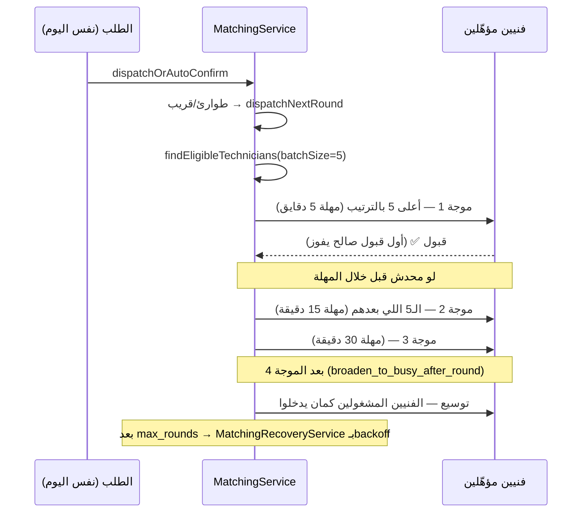

# 06 — الشغل الفوري / نفس اليوم (Same-Day / Urgent)

> **حالة التحقق**: القواعد اتأكدت من الكود + تشغيل حي (`scheduling-scenarios.spec.ts` سيناريوهات
> D/D2/D3، و`matching-accept-concurrency.spec.ts`). الأرقام كلها من جدول `settings` الفعلي.

**الكود**: `apps/api/src/modules/orders/booking-mode-resolver.ts` (اشتقاق الاستعجال) ·
`apps/api/src/modules/matching/matching.service.ts` (التوزيع) ·
`apps/api/src/modules/technicians/technician-eligibility.sql.ts` (الأهلية)

---

## 1. «الطوارئ» في النظام ده = **شغل النهاردة**، مش زرار

ده أهم فرق يفهمه أي حد بيقرا الكود. المالك سأل: هل ده علم؟ تاريخ مطلوب؟ نوع استعجال؟

**الإجابة المؤكَّدة**: الاستعجال **مشتق من التاريخ**، مش مختار من العميل.

```ts
// booking-mode-resolver.ts:55
export function isSameDayUrgent(input: UrgencyInput): boolean {
  if (!input.scheduledAt) return false;
  const today = platformDayOf(input.now ?? new Date());
  return platformDayOf(input.scheduledAt) <= today;   // ← النهاردة أو فات = مستعجل
}
```

```ts
// booking-mode-resolver.ts:83
export function resolveBookingMode(input: BookingModeInput): BookingMode {
  if (input.urgent) return BookingMode.EMERGENCY;     // ← الاستعجال بيكسب دايمًا
  ...
}
```

### النتايج العملية

| الحالة | الوضع الناتج |
|---|---|
| العميل اختار **النهاردة** | `emergency` — **حتى لو الشغل محتاج فريق كامل** |
| العميل اختار **بكرة** | `individual` أو `team` حسب حجم الشغل |
| تاريخ **فات** (حالة شاذة) | `emergency` — معالجته كشغل النهاردة أأمن |
| بلا تاريخ خالص | مش مستعجل بالتعريف ده — لكن بيتعامل كـ«قريب» في التوزيع (قسم ٣) |

> **طلب مالك صريح مُنفَّذ (ADR-0048 §1/§3)**: «حتى لو الشخص مختار فريق ومختار الشغل النهارده،
> بيدخل خانة الطوارئ». الاستعجال بيكسب على الحجم دايمًا.

### بوابة الخدمة

`canAcceptSameDay(service)` = `service.allows_emergency`. لو الأدمن قافل نفس اليوم على الخدمة،
الطلب **بيترفض بوضوح** بدل ما يتسجّل كطلب عادي — «العميل اختار النهاردة وهو متوقّع حد يجي
النهارده، وخدمة قافل عليها نفس اليوم مش هتوفّر ده».

---

## 2. مين بياخد الفرصة — بث ولا موجات؟

**موجات، مش بث لكل حد.** `matching.batch_size = 5`.



| السؤال | الإجابة المؤكَّدة |
|---|---|
| بث لكل المؤهّلين؟ | ❌ لأ — موجات من ٥ |
| المطابقة/الترتيب لسه بيتطبّق؟ | ✅ أيوه — نفس `rank_score` بالحرف |
| أول قبول صالح يفوز؟ | ✅ أيوه — مؤكَّد بـ٩ اختبارات تزامن |
| إزاي بيتمنع السباق؟ | transaction + `lockTechnician()` + إعادة فحص جوّه القفل |
| العرض بينتهي إزاي؟ | مهلة الموجة (٥/١٥/٣٠ دقيقة) — بس ↓ |
| عرض فات معاده يبقى ميت؟ | ❌ **لأ** — لسه قابل للقبول طالما محدش أخده (ADR-0018 §5) |
| الجدول بيتحدّث إمتى؟ | لحظة القبول — الطلب بياخد `technician_id` ويبقى `accepted` |

---

## 3. الشغل الفوري وهو شغّال — سؤال المالك المباشر (Scenario D)

> **السؤال**: فني شغّال دلوقتي وظهرت فرصة نفس اليوم — يشوفها؟ يقدر يقبلها؟

**الإجابة المؤكَّدة بالتشغيل الحي**: النظام **بيفرّق فعلاً** بين «قابل شغل» و«منشغل جسديًا»،
وده بالظبط التمييز اللي المالك طلبه.

```
ACTIVE  = accepted, technician_on_way, technician_arrived, in_progress,
          awaiting_quote_approval, awaiting_initial_quote_approval
ENGAGED = نفسها **ناقص accepted**
```

للطلب المستعجل، الاستبعاد بيستخدم **ENGAGED بس**:

> ⚠️ **اتغيّر في ADR-0070 (2026-09-04)** — القسم ده كان بيوصف قاعدة ENGAGED. المالك شالها
> صراحةً. الجدول تحت بقى كده:

| حالة الفني | فرصة نفس اليوم | نتيجة الاختبار |
|---|---|---|
| `accepted` (قَبِل شغل ٦ مساءً بس ما تحرّكش) | ✅ **مؤهّل** | D ✅ |
| `in_progress` (شغّال فعلاً دلوقتي) بشغلانة قصيرة | ✅ **مؤهّل** (ADR-0070) | D2 ✅ |
| `technician_on_way` بشغلانة قصيرة | ✅ **مؤهّل** (ADR-0070) | ✅ |
| أي حالة، بس **اليوم مليان** (السقف اتخطى) | ❌ مستبعد | D4 ✅ |
| نافذة زمنية متقاطعة فعليًا | ❌ مستبعد | A3 ✅ |
| فاضي | ✅ مؤهّل | خط الأساس ✅ |

> **الحكم**: شكّ المالك إن «عنده شغل نشط = مستبعد» **مش صحيح** للشغل المستعجل. الفني اللي
> قَبِل شغلانة بالليل لسه بياخد فرص النهاردة عادي. الاستبعاد الوحيد لما يكون **فعلاً في
> الشارع/عند العميل** — وده منطقي تشغيليًا.

### والفني المشغول بجد؟ مش بيتحرم تمامًا

`matching.offer_heavy_workload_technicians = true` — الفني المصنّف **HEAVY** (يوم كامل أو شغل
متعدد الأيام) بياخد **فرصة اختيارية** (`technician_work_opportunities`) بدل ما يتستبعد.
يعني: **الرؤية أوسع من القبول التلقائي** — بالظبط التمييز اللي المالك اقترحه.

`matching.work_opportunity_exclusive_seconds = 7200` — ساعتين حصرية قبل ما العرض يتوسّع
بالتوازي لفني تاني.

---

## 4. مجدول مقابل نفس اليوم — جدول المقارنة

| القاعدة | شغل مجدول (>٤٨ ساعة) | نفس اليوم / مستعجل |
|---|---|---|
| **الوضع** | `individual` / `team` حسب الحجم | `emergency` دايمًا |
| **مسار التوزيع** | `autoConfirmScheduledOrder` | `dispatchNextRound` |
| **الفني لازم يوافق؟** | ❌ لأ — تعيين تلقائي | ✅ أيوه |
| **فلترة المرشّحين** | نفس الفلاتر + تعارض اليوم/النافذة/السقف | نفس الفلاتر + **ENGAGED بس** |
| **الشغل النشط بيمنع؟** | بس لو **نفس اليوم** وفيه تقاطع/سقف | بس لو **منشغل جسديًا دلوقتي** |
| **فحص الجدول** | تقاطع نافذة + سقف يومي | ENGAGED دلوقتي (السقف اليومي **مش** بيسري) |
| **بث؟** | ❌ — تعيين مباشر لأعلى مرشّح | موجات من ٥ |
| **الترتيب بيتطبّق؟** | ✅ نفس الصيغة | ✅ نفس الصيغة |
| **القبول** | ضمني (تلقائي) | صريح، أول صالح يفوز |
| **الحجز** | لحظة التعيين | لحظة القبول |
| **انتهاء الصلاحية** | لا يوجد | مهلة الموجة ٥/١٥/٣٠ د — بس العرض يفضل صالح لو محدش أخده |
| **التوسيع للمشغولين** | بعد `broaden_to_busy_after_round = 4` | نفس الحاجة |

> ⚠️ **منطقة رمادية موثّقة**: الطلب اللي معاده **خلال ٤٨ ساعة** (مش النهاردة) بياخد **مسار
> الموجات** (`dispatchNextRound`) لكن وضعه `individual`/`team` مش `emergency`. يعني هو
> «قريب» في التوزيع و«عادي» في الأهلية — بيتفلتر بقاعدة تعارض اليوم/النافذة/السقف، مش بقاعدة
> ENGAGED. ده مقصود (ADR-0035) وشغّال، بس هو **تلات فئات مش اتنين**:
>
> | الفئة | الوضع | التوزيع | الأهلية |
> |---|---|---|---|
> | النهاردة | `emergency` | موجات | ENGAGED بس |
> | خلال ٤٨ ساعة | `individual`/`team` | موجات | تعارض كامل |
> | أبعد من ٤٨ ساعة | `individual`/`team` | تعيين تلقائي | تعارض كامل |

---

## 5. الإعدادات اللي بتحكم الشغل الفوري

| الإعداد | الافتراضي | الأثر |
|---|---|---|
| `matching.near_term_request_hours` | **48** | الطلب خلال المدة دي بياخد موجات بدل تعيين تلقائي. **0 = كل غير الطوارئ يتعيّن تلقائي** |
| `matching.near_term_round_timeouts_minutes` | `"5,15,30"` | مهلة كل موجة |
| `matching.batch_size` | **5** | فنيين لكل موجة |
| `matching.broaden_to_busy_after_round` | **4** | بعدها المشغولين يدخلوا |
| `matching.offer_heavy_workload_technicians` | **true** | الفني المشغول ياخد فرصة اختيارية بدل الاستبعاد |
| `matching.work_opportunity_exclusive_seconds` | **7200** | حصرية العرض الاختياري |
| `matching.distance_weight_emergency` | **0** | وزن القرب للطوارئ — معطّل حاليًا |
| `services.allows_emergency` | لكل خدمة | بوابة قبول نفس اليوم أصلاً |

> **مثال أثر**: لو غيّرت `near_term_request_hours` من `48` لـ`0`، كل طلب مش النهاردة هيتعيّن
> **تلقائيًا** على أعلى مرشّح بلا ما الفني يوافق — الفني هيلاقي شغل بكرة في جدوله وهو مش عارف.
> ده بالظبط السلوك اللي ADR-0035 اتعمل عشان يمنعه.

---

## 6. اللي لسه محتاج قرار عمل

| البند | الوضع | التوصية |
|---|---|---|
| وزن المسافة للطوارئ = صفر | **الآلية متحقَّق منها حيًا** (`matching-distance-weight.spec.ts`): تحويل الإعداد لرقم أكبر من صفر بيقلب **ترتيب الموجات كله** للأقرب، وتصفيره بيرجّعه للمستوى. القيمة الافتراضية لسه صفر | **الزرار في إيد الأدمن** (شاشة الإعدادات → `matching.distance_weight_emergency`). الافتراضي مااتغيّرش من عندنا — تغييره قرار تشغيلي |
| السقف اليومي مش بيسري على الطوارئ | ✅ **اتقفل في ADR-0070** — بقى يسري على كل أوضاع الحجز | — |
| «خلال ٤٨ ساعة» فئة تالتة | شغّالة وموثّقة | مفيش مشكلة، بس محتاجة توضيح في واجهة الأدمن |

---

## 7. مراجع الكود

| السلوك | الملف:السطر |
|---|---|
| اشتقاق الاستعجال من التاريخ | `orders/booking-mode-resolver.ts:55` (`isSameDayUrgent`) |
| الاستعجال بيكسب على الحجم | `orders/booking-mode-resolver.ts:83` (`resolveBookingMode`) |
| بوابة الخدمة | `orders/booking-mode-resolver.ts:100` (`canAcceptSameDay`) |
| التوجيه موجات/تلقائي | `matching/matching.service.ts:683,703` |
| مهلة الموجات | `matching/matching.service.ts:717` |
| ACTIVE مقابل ENGAGED | `orders/order-state-machine.ts:165,180` |
| فرص الشغل الاختيارية | `technicians/technician-work-opportunities.service.ts` |
| اختبارات D/D2/D3 | `matching/scheduling-scenarios.spec.ts` |
| اختبارات التزامن | `matching/matching-accept-concurrency.spec.ts` |
