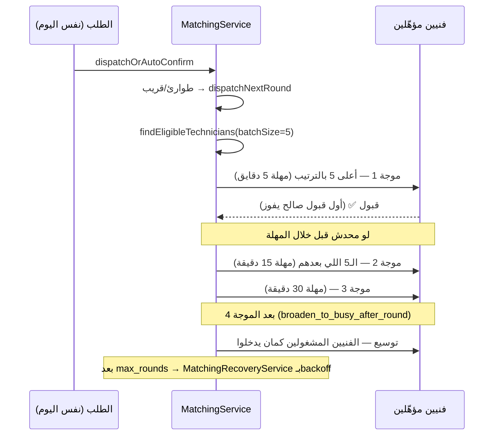
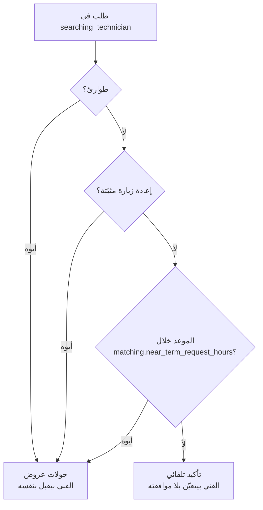

# 06 — الشغل الفوري / نفس اليوم (Same-Day / Urgent)

> **حالة التحقق**: القواعد اتأكدت من الكود + تشغيل حي (`scheduling-scenarios.spec.ts` سيناريوهات
> D/D2/D3، و`matching-accept-concurrency.spec.ts`). الأرقام كلها من جدول `settings` الفعلي.

**الكود**: `apps/api/src/modules/orders/booking-mode-resolver.ts` (اشتقاق الاستعجال) ·
`apps/api/src/modules/matching/matching.service.ts` (التوزيع) ·
`apps/api/src/modules/technicians/technician-eligibility.sql.ts` (الأهلية)

---

## 1. «الطوارئ» في النظام ده = **شغل النهاردة**، مش زرار

ده أهم فرق يفهمه أي حد بيقرا الكود. المالك سأل: هل ده علم؟ تاريخ مطلوب؟ نوع استعجال؟

**الإجابة المؤكَّدة**: الاستعجال **مشتق من التاريخ**، مش مختار من العميل.

```ts
// booking-mode-resolver.ts:55
export function isSameDayUrgent(input: UrgencyInput): boolean {
  if (!input.scheduledAt) return false;
  const today = platformDayOf(input.now ?? new Date());
  return platformDayOf(input.scheduledAt) <= today;   // ← النهاردة أو فات = مستعجل
}
```

```ts
// booking-mode-resolver.ts:83
export function resolveBookingMode(input: BookingModeInput): BookingMode {
  if (input.urgent) return BookingMode.EMERGENCY;     // ← الاستعجال بيكسب دايمًا
  ...
}
```

### النتايج العملية

| الحالة | الوضع الناتج |
|---|---|
| العميل اختار **النهاردة** | `emergency` — **حتى لو الشغل محتاج فريق كامل** |
| العميل اختار **بكرة** | `individual` أو `team` حسب حجم الشغل |
| تاريخ **فات** (حالة شاذة) | `emergency` — معالجته كشغل النهاردة أأمن |
| بلا تاريخ خالص | مش مستعجل بالتعريف ده — لكن بيتعامل كـ«قريب» في التوزيع (قسم ٣) |

> **طلب مالك صريح مُنفَّذ (ADR-0048 §1/§3)**: «حتى لو الشخص مختار فريق ومختار الشغل النهارده،
> بيدخل خانة الطوارئ». الاستعجال بيكسب على الحجم دايمًا.

### بوابة الخدمة

`canAcceptSameDay(service)` = `service.allows_emergency`. لو الأدمن قافل نفس اليوم على الخدمة،
الطلب **بيترفض بوضوح** بدل ما يتسجّل كطلب عادي — «العميل اختار النهاردة وهو متوقّع حد يجي
النهارده، وخدمة قافل عليها نفس اليوم مش هتوفّر ده».

---

## 2. مين بياخد الفرصة — بث ولا موجات؟

**موجات، مش بث لكل حد.** `matching.batch_size = 5`.



| السؤال | الإجابة المؤكَّدة |
|---|---|
| بث لكل المؤهّلين؟ | ❌ لأ — موجات من ٥ |
| المطابقة/الترتيب لسه بيتطبّق؟ | ✅ أيوه — نفس `rank_score` بالحرف |
| أول قبول صالح يفوز؟ | ✅ أيوه — مؤكَّد بـ٩ اختبارات تزامن |
| إزاي بيتمنع السباق؟ | transaction + `lockTechnician()` + إعادة فحص جوّه القفل |
| العرض بينتهي إزاي؟ | مهلة الموجة (٥/١٥/٣٠ دقيقة) — بس ↓ |
| عرض فات معاده يبقى ميت؟ | ❌ **لأ** — لسه قابل للقبول طالما محدش أخده (ADR-0018 §5) |
| الجدول بيتحدّث إمتى؟ | لحظة القبول — الطلب بياخد `technician_id` ويبقى `accepted` |

---

## 3. الشغل الفوري وهو شغّال — سؤال المالك المباشر (Scenario D)

> **السؤال**: فني شغّال دلوقتي وظهرت فرصة نفس اليوم — يشوفها؟ يقدر يقبلها؟

**الإجابة المؤكَّدة بالتشغيل الحي: أيوه — يشوفها ويقدر يقبلها.**

### الحكاية الكاملة، لأنها اتغيّرت

النظام كان بيفرّق بين «قابل شغل» (`ACTIVE`) و«منشغل جسديًا» (`ENGAGED` = نفسها ناقص
`accepted`)، وكان بيستبعد الـ`ENGAGED` من الطوارئ. المالك رفع بلاغًا صريحًا على ده بالذات
(2026-09-04، صوتي):

> «المفروض الصنايعي هو شغال. لو جاله شغلانة تانية ما بتتعارضش مع مواعيده في نفس اليوم، وبرضه
> مجموع الشغل هيبقى أقل من عدد الساعات المسموح أو يساويه، مفيش مشكلة. ولكن أعتقد إن حاليًا
> أصلاً الصنايعي ما ينفعش يقبل وهو في شغلانة… فدي مشكلة. خصوصًا خلينا نركز على الـemergency.»

**ADR-0070 شال القاعدة بالكامل**، وكشف إن القاعدتين كانتا **مقلوبتين** بالظبط:

| | قبل ADR-0070 | بعده |
|---|---|---|
| فني في الشارع دلوقتي | **مخفي تمامًا** عن فرص نفس اليوم — حتى لو باقي يومه فاضي | مؤهّل طالما مفيش تقاطع واليوم مش مليان |
| فني محجوز ١٢ ساعة | **بياخد طوارئ عادي** (السقف مكانش بيسري) | مستبعَد — السقف بقى يسري على الكل |

يعني الحماية كانت مفعّلة في المكان الغلط: بتحجب فني فاضي، وبتسيب فني مليان.

| حالة الفني | فرصة نفس اليوم | نتيجة الاختبار |
|---|---|---|
| `accepted` (قَبِل شغل ٦ مساءً بس ما تحرّكش) | ✅ **مؤهّل** | D ✅ |
| `in_progress` (شغّال فعلاً دلوقتي) بشغلانة قصيرة | ✅ **مؤهّل** (ADR-0070) | D2 ✅ |
| `technician_on_way` بشغلانة قصيرة | ✅ **مؤهّل** (ADR-0070) | ✅ |
| أي حالة، بس **اليوم مليان** (السقف اتخطى) | ❌ مستبعد | D4 ✅ |
| نافذة زمنية متقاطعة فعليًا | ❌ مستبعد | A3 ✅ |
| فاضي | ✅ مؤهّل | خط الأساس ✅ |

> **الحكم**: مفيش أي استبعاد على أساس «شغّال دلوقتي». الحارسان الوحيدان الباقيان هما **تقاطع
> نافذة زمنية حقيقي** و**السقف اليومي** — والاتنين بيقيسوا الطاقة الفعلية مش الحالة اللحظية.
> فوقهم الاستثناء الصريح (`blocked`) اللي الفني بيحدّده بنفسه، وده مايتجاهلش أبدًا.

### والفني المشغول بجد؟ مش بيتحرم تمامًا

`matching.offer_heavy_workload_technicians = true` — الفني المصنّف **HEAVY** (يوم كامل أو شغل
متعدد الأيام) بياخد **فرصة اختيارية** (`technician_work_opportunities`) بدل ما يتستبعد.
يعني: **الرؤية أوسع من القبول التلقائي** — بالظبط التمييز اللي المالك اقترحه.

`matching.work_opportunity_exclusive_seconds = 7200` — ساعتين حصرية قبل ما العرض يتوسّع
بالتوازي لفني تاني.

---

## 4. مجدول مقابل نفس اليوم — جدول المقارنة

| القاعدة | شغل مجدول (>٤٨ ساعة) | نفس اليوم / مستعجل |
|---|---|---|
| **الوضع** | `individual` / `team` حسب الحجم | `emergency` دايمًا |
| **مسار التوزيع** | `autoConfirmScheduledOrder` | `dispatchNextRound` |
| **الفني لازم يوافق؟** | ❌ لأ — تعيين تلقائي | ✅ أيوه |
| **فلترة المرشّحين** | **نفس القاعدة بالحرف** (ADR-0070) | **نفس القاعدة بالحرف** |
| **الشغل النشط بيمنع؟** | بس لو فيه تقاطع نافذة حقيقي أو السقف اتخطى | **نفس الإجابة** |
| **فحص الجدول** | تقاطع نافذة + سقف يومي + `blocked` | **نفس التلاتة** |
| **بث؟** | ❌ — تعيين مباشر لأعلى مرشّح | موجات من ٥ |
| **الترتيب بيتطبّق؟** | ✅ نفس الصيغة | ✅ نفس الصيغة |
| **القبول** | ضمني (تلقائي) | صريح، أول صالح يفوز |
| **الحجز** | لحظة التعيين | لحظة القبول |
| **انتهاء الصلاحية** | لا يوجد | مهلة الموجة ٥/١٥/٣٠ د — بس العرض يفضل صالح لو محدش أخده |
| **التوسيع للمشغولين** | بعد `broaden_to_busy_after_round = 4` | نفس الحاجة |

> ⚠️ **منطقة رمادية موثّقة — بقت أبسط بعد ADR-0070**: الطلب اللي معاده **خلال ٤٨ ساعة** (مش
> النهاردة) بياخد **مسار الموجات** (`dispatchNextRound`) لكن وضعه `individual`/`team` مش
> `emergency`. ده مقصود (ADR-0035).
>
> اللي **اتغيّر**: الفئات التلات بقت كلها بتتفلتر بـ**نفس قاعدة الأهلية بالحرف**، فالاختلاف
> الوحيد الباقي هو **مسار التوزيع** — وده فرق تشغيلي مفهوم، مش قاعدتين مختلفتين لنفس السؤال.
>
> | الفئة | الوضع | التوزيع | الأهلية |
> |---|---|---|---|
> | النهاردة | `emergency` | موجات | **نفس القاعدة** |
> | خلال ٤٨ ساعة | `individual`/`team` | موجات | **نفس القاعدة** |
> | أبعد من ٤٨ ساعة | `individual`/`team` | تعيين تلقائي | **نفس القاعدة** |

---

## 5. الإعدادات اللي بتحكم الشغل الفوري

| الإعداد | الافتراضي | الأثر |
|---|---|---|
| `matching.near_term_request_hours` | **48** | الطلب خلال المدة دي بياخد موجات بدل تعيين تلقائي. **0 = كل غير الطوارئ يتعيّن تلقائي** |
| `matching.near_term_round_timeouts_minutes` | `"5,15,30"` | مهلة كل موجة |
| `matching.batch_size` | **5** | فنيين لكل موجة |
| `matching.broaden_to_busy_after_round` | **4** | بعدها المشغولين يدخلوا |
| `matching.offer_heavy_workload_technicians` | **true** | الفني المشغول ياخد فرصة اختيارية بدل الاستبعاد |
| `matching.work_opportunity_exclusive_seconds` | **7200** | حصرية العرض الاختياري |
| `matching.distance_weight_emergency` | **0** | وزن القرب للطوارئ — معطّل حاليًا |
| `services.allows_emergency` | لكل خدمة | بوابة قبول نفس اليوم أصلاً |

> **مثال أثر**: لو غيّرت `near_term_request_hours` من `48` لـ`0`، كل طلب مش النهاردة هيتعيّن
> **تلقائيًا** على أعلى مرشّح بلا ما الفني يوافق — الفني هيلاقي شغل بكرة في جدوله وهو مش عارف.
> ده بالظبط السلوك اللي ADR-0035 اتعمل عشان يمنعه.

---

## 6. اللي لسه محتاج قرار عمل

| البند | الوضع | التوصية |
|---|---|---|
| وزن المسافة للطوارئ | ✅ **اتفعّل**: `matching.distance_weight_emergency = 2.0` (كل ٥ كم ≈ فرق مستوى فني كامل، فالأقرب بيسبق فعليًا). الآلية نفسها متحقَّق منها حيًا في `matching-distance-weight.spec.ts` | الزرار لسه في إيد الأدمن — الرقم قابل للضبط من شاشة الإعدادات بلا كود |
| السقف اليومي مش بيسري على الطوارئ | ✅ **اتقفل في ADR-0070** — بقى يسري على كل أوضاع الحجز | — |
| «خلال ٤٨ ساعة» فئة تالتة | ✅ **بقت مرئية**: صفحة الطلب في الأدمن بتعرض «مسار التوزيع» بجملة بتقول السبب (طوارئ / إعادة زيارة مثبّتة / خلال ٤٨ ساعة / أبعد من ٤٨ ساعة) | — |

---

## 6-ب. «مسار التوزيع» في واجهة الأدمن — نفس القرار، مش نسخة منه

الفرق اللي كان مخفي: **طلبان بنفس `booking_mode` بالظبط** (`individual`) بياخدوا مسارين
مختلفين جوهريًا حسب بُعد الموعد.



الأدمن كان بيشوف «وضع الحجز: أفراد» على الاتنين ومايعرفش ليه واحد استنى قبول والتاني لأ.

### القاعدة اللي اتفرضت

القرار عايش في **دالة خالصة واحدة** — `matching/dispatch-route.ts`:

| بيستهلكها | بيعمل بيها إيه |
|-----------|----------------|
| `MatchingService.dispatchOrAutoConfirm()` | **بينفّذ** المسار |
| `MatchingExplainabilityService.explainOrderFunnel()` | **بيشرح** المسار للأدمن |

يعني الشرح المعروض **هو نفس القرار المنفَّذ**، مش إعادة تنفيذ للقاعدة في الواجهة. لو حد غيّر
القاعدة في مكان واحد بس، الشرح مايقدرش ينحرف — لأنه مافيش مكانين أصلاً. نفس فلسفة
`technicianAvailabilityCondition()` بالحرف.

### الحارس

`matching/dispatch-route.spec.ts` — لكل حالة (طوارئ · إعادة زيارة مثبّتة · خلال ٤٨ ساعة ·
أبعد من ٤٨ ساعة · مش في التوزيع) بيشغّل `dispatchOrAutoConfirm()` **الحقيقية** على قاعدة
حيّة، وبيقارن **الأثر في القاعدة** بالشرح:

| المسار | الأثر اللي الاختبار بيقيسه |
|--------|---------------------------|
| جولات | صف `order_assignments` حالته `sent` مستني رد، والطلب لسه بلا فني |
| تأكيد تلقائي | `orders.technician_id` اتحطّ، والصف `accepted` مكتوب من النظام نفسه |

> **ليه الأثر مش نية الكود؟** المسارين الاتنين بيكتبوا في `order_assignments` — لو الاختبار
> عدّ الصفوف بس، كان هيقول «جولات» على المسارين. الفارق الحقيقي هو **مين قال أيوه**.

اتأكد إن الحارس بيمسك فعلاً: تغيير `near_term` لـ`auto_confirm` في الدالة الخالصة **بيفشّل**
الاختبار (اتجرّب حيًا، ١ فشل من ٥).

---

## 7. مراجع الكود

| السلوك | الملف:السطر |
|---|---|
| اشتقاق الاستعجال من التاريخ | `orders/booking-mode-resolver.ts:55` (`isSameDayUrgent`) |
| الاستعجال بيكسب على الحجم | `orders/booking-mode-resolver.ts:83` (`resolveBookingMode`) |
| بوابة الخدمة | `orders/booking-mode-resolver.ts:100` (`canAcceptSameDay`) |
| التوجيه موجات/تلقائي | `matching/matching.service.ts:683,703` |
| مهلة الموجات | `matching/matching.service.ts:717` |
| ACTIVE مقابل ENGAGED (ENGAGED مابقتش تحكم استبعاد) | `orders/order-state-machine.ts:165,180` |
| قرار إلغاء قاعدة «منشغل = مستبعد» | `docs/adr/0070-technician-can-accept-while-working.md` |
| فرص الشغل الاختيارية | `technicians/technician-work-opportunities.service.ts` |
| اختبارات D/D2/D3 | `matching/scheduling-scenarios.spec.ts` |
| اختبارات التزامن | `matching/matching-accept-concurrency.spec.ts` |
