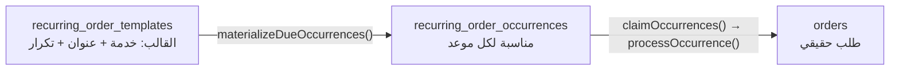

# 07 — الطلبات المتكررة (Recurring Orders)

> **مصدر هذا المستند**: `apps/api/src/modules/orders/recurring-orders.service.ts` (634 سطرًا)
> + جدولا `recurring_order_templates` / `recurring_order_occurrences` + إعدادات `recurring.*`
> **الحيّة**.
>
> مستندات مرتبطة: [02 — دورة حياة الطلب](./02-ORDER-LIFECYCLE.md) ·
> [19 — المهام الخلفية](./19-BACKGROUND-JOBS-EVENTS.md)

---

## 1. المبدأ: قالب + مناسبات، مش طلبات مسبقة

الطلب المتكرر **مش** مجموعة طلبات اتعملت مقدمًا. هو **قالب** بيولّد **مناسبة (occurrence)**
لكل موعد، والمناسبة بتتحوّل لطلب حقيقي **قبل موعدها بفترة محدَّدة** بس.



**ليه الفصل ده مهم**: لو النظام عمل طلبات لسنة مقدمًا، أي تغيير في السعر أو الخدمة أو
العنوان كان هيبقى مستحيل التطبيق بأثر رجعي، وكل الطلبات دي كانت هتدخل استعلامات الحمل
والتعارض **وهي لسه مش حقيقية**.

### التكرارات المدعومة

`weekly` · `monthly` · `yearly`

---

## 2. زمن التحويل — `materialization_lead_time_hours = 96`

المناسبة بتتحوّل لطلب حقيقي قبل موعدها بـ**96 ساعة (4 أيام)**.

**السبب**: التحويل المبكّر بيدّي وقتًا كافيًا لـ:
1. بدء المطابقة والبحث عن فني
2. تحصيل الدفع
3. إشعار العميل وتذكيره

لو التحويل حصل قبل الموعد بساعة، أي فشل (مفيش فني، الدفع ماتمش) كان هيبقى بلا وقت للتعافي.

### تذكيرات الدفع

`recurring.payment_reminder_hours` = `[72, 48, 24]` — تلات تذكيرات قبل التنفيذ.

> **العلاقة بين الرقمين مقصودة**: التحويل عند 96 ساعة، وأول تذكير عند 72 — يعني الطلب بيبقى
> موجود فعلًا قبل أول تذكير بـ24 ساعة. لو الترتيب اتعكس، التذكير كان هيشاور على طلب لسه
> مش موجود.

---

## 3. المسح الدوري — ضمانات التزامن

`sweep()` بتشتغل على ثلاث مراحل:

| المرحلة | الوظيفة | الحد |
|---------|---------|------|
| `materializeDueOccurrences()` | إنشاء المناسبات المستحقة | `SWEEP_BATCH_SIZE` |
| `claimOccurrences()` | **حجز** المناسبات ذرّيًا | `SWEEP_BATCH_SIZE` |
| `processOccurrence()` | تحويلها لطلبات | لكل مناسبة |

### الحجز الذرّي — الجزء المهم

```sql
UPDATE recurring_order_occurrences occurrence
SET attempt_count = CASE
      WHEN candidates.previous_status = 'processing' THEN occurrence.attempt_count
      ELSE occurrence.attempt_count + 1
    END, ...
FROM candidates
WHERE occurrence.id = candidates.id
RETURNING ...
```

`UPDATE … RETURNING` **واحد**، مش `SELECT`-ثم-`UPDATE`. يعني نسختان من الـsweep بتشتغلا
معًا **مايقدروش** يمسكوا نفس المناسبة.

**تفصيلة `attempt_count`**: المناسبة اللي كانت `processing` بالفعل **مابيتزادش** عدّاد
محاولاتها لما تتحجز تاني. السبب: `processing` معناها محاولة سابقة وقعت في النص (إعادة تشغيل)،
مش فشل حقيقي — عدّها كمحاولة كان هيستهلك رصيد المحاولات بلا سبب.

---

## 4. الدفع والإلغاء التلقائي

طلب متكرر بدفع إلكتروني بيتبع **نفس** مسار أي طلب: `pending_payment` ⇒ إلغاء تلقائي لو الدفع
ماتمّش خلال `orders.payment_timeout_minutes` (١٥ دقيقة).

> ⚠️ يعني مناسبة متكررة ممكن **تتلغي بالكامل** لو العميل مادفعش. القالب بيفضل نشطًا والمناسبة
> الجاية بتتولّد عادي — التكرار مابيتوقفش بسبب مرة واحدة.

---

## 5. انتماء العمارة

الطلبات المتكررة مربوطة بـ`buildings` — الشقة أو العمارة اللي الخدمة بتتكرر فيها. ده بيخلّي
حالة استخدام «صيانة دورية لعمارة» ممكنة بدل ما تتعمل كطلبات فردية غير مترابطة.

`recurring-orders-building-affiliation.spec.ts` بيغطّي الربط.

---

## 6. المشاريع — نموذج مختلف تمامًا

مهم عدم الخلط: **المشروع (`projects`) مش طلب متكرر**.

| | طلب متكرر | مشروع |
|---|-----------|-------|
| **الشكل** | نفس الشغل يتكرر | شغل واحد كبير على مراحل |
| **السعر** | نفس التسعير كل مرة | عرض سعر (`project_quotes`) |
| **التنفيذ** | طلب مستقل كل مرة | مراحل (`project_milestones`) |
| **الدفع** | لكل طلب | لكل مرحلة، **باحتجاز ضمان** |

### إعدادات المشاريع الحيّة

| الإعداد | القيمة | المعنى |
|---------|--------|--------|
| `projects.quote_expiry_days` | **14** | صلاحية عرض السعر |
| `projects.milestone_auto_approve_hours` | **72** | العميل مايردّش ⇒ موافقة تلقائية |
| `projects.warranty_holdback_percentage` | **5** | **احتجاز من كل دفعة مرحلة لضمان الضمان** |

> **الاحتجاز (`warranty_holdback`) آلية مالية مميزة**: 5٪ من كل دفعة مرحلة بتتحجز — المقاول
> مابياخدش المبلغ كاملًا لحد ما فترة الضمان تعدّي. ده معيار في مشاريع المقاولات وموجود هنا
> بالفعل.

**الموافقة التلقائية بعد 72 ساعة** بتمنع تعليق المشروع بلا نهاية لو العميل مش متجاوب —
`milestone-auto-approve.service.ts` بيشتغل دوريًا.

**نمط outbox**: `project_notification_outbox` + معالجها — إشعارات المشاريع بتتكتب في جدول
أولًا ثم تتبعت، فمفيش إشعار بيضيع لو الإرسال فشل.

---

## 7. المساعدون — مطابقة منفصلة

`assistant-matching` موديول مستقل بمنطقه الخاص:

| الإعداد | القيمة |
|---------|--------|
| `assistant_matching.pool_matching_enabled` | `true` — مفتاح إيقاف عام |
| `assistant_matching.batch_size` | **10** مساعد لكل بثّ |
| `assistant_matching.response_timeout_seconds` | **120** ثانية |

**المهلة 120 ثانية** أقصر بكتير من مهل جولات المطابقة العادية (`5,15,30` دقيقة) — لأن طلب
المساعد بييجي عادةً **بعد** ما الفني قِبل، فالوقت ضيّق.

📄 المساعد كعضو طاقم دايمًا: [09 §1](./09-TECHNICIAN-MANAGEMENT.md)

---

## 8. مراجع الكود

| الموضوع | الملف |
|---------|-------|
| المتكررة | `apps/api/src/modules/orders/recurring-orders.service.ts` |
| القالب | `apps/api/src/modules/orders/entities/recurring-order-template.entity.ts` |
| انتماء العمارة | `apps/api/src/modules/orders/recurring-orders-building-affiliation.spec.ts` |
| المشاريع | `apps/api/src/modules/projects/` |
| الموافقة التلقائية | `apps/api/src/modules/projects/milestone-auto-approve.service.ts` |
| مطابقة المساعدين | `apps/api/src/modules/assistant-matching/` |
| شاشات الأدمن | `recurring-orders` · `projects` · `buildings` |
