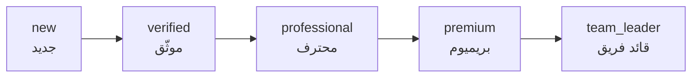
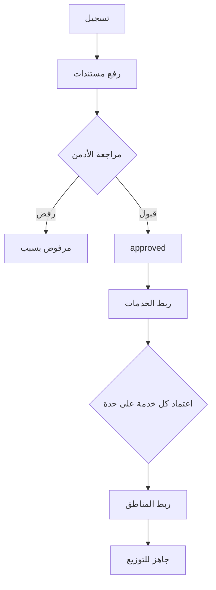

# 09 — إدارة الفنيين (Technician Management)

> **مصدر هذا المستند**: `apps/api/src/modules/technicians/` + `technician-progression/` +
> جدولا `technician_level_config` و`technician_progression_rules` **الحيّان** في `baytak_main`.
>
> مستندات مرتبطة: [04 — محرك المطابقة](./04-MATCHING-ENGINE.md) ·
> [05 — الجدولة والإتاحة](./05-SCHEDULING-AVAILABILITY.md) ·
> [11 — الـKPI](./11-KPI-ANALYTICS.md) · [10 — تدفّق الأموال](./10-FINANCE-MONEY-FLOW.md)

---

## 1. أنواع مقدّمي الخدمة — تمييز جوهري

| النوع | الدور | الفرق التشغيلي |
|-------|-------|-----------------|
| **فني** (`technician`) | بيقود الطلب | بيظهر في السوق، العميل يقدر يختاره |
| **مساعد** (`assistant`) | عضو طاقم **دايمًا** | **مستبعَد من السوق عمدًا** — العميل مايختارهوش |
| **شركة/فريق** | كيان بيقود بطاقم | مضاعف سعر خاص، وأولوية للشغلانات الكبيرة |

> ⚠️ **الفخّ الأخطر في النظام كله** (بلاغ مالك حقيقي): المساعد بطبيعته **دايمًا** عضو طاقم
> (`order_team_members`) مش قائد (`orders.technician_id`). أي استعلام حمل أو تعارض بيبص على
> `orders.technician_id` وحده **بيعتبر المساعد فاضي دايمًا**.
>
> البلاغ الأصلي: «مساعد اتضاف في نفس اليوم لتلات شغلانات كبار، والسيستم ماجابش إنه مشغول».
>
> **الحل**: `technicianCommittedOrdersSource()` — `UNION` بين المصدرين (ADR-0057). أي استعلام
> جديد بيسأل «الشخص ده مشغول؟» **لازم** يستخدمها، مش `orders.technician_id`.

المساعد كمان **مؤهّل لكل الخدمات افتراضيًا**، والأدمن بيستثني يدويًا — عكس الفني اللي بيتربط
بخدمات صراحةً.

---

## 2. المستويات الخمسة — القيم الحيّة

من `technician_level_config` مباشرة:

| المستوى | وزن الأولوية | مضاعف السعر | فرق العمولة | حدّ القرار | يقود فريق؟ |
|---------|---------------|--------------|--------------|-------------|-------------|
| `new` (جديد) | 0 | ×1.00 | 0% | 200 ج | ❌ |
| `verified` (موثّق) | 10 | ×1.10 | −1% | 500 ج | ❌ |
| `professional` (محترف) | 20 | ×1.25 | −2% | 1,500 ج | ✅ |
| `premium` (بريميوم) | 30 | ×1.45 | −3% | بلا حد | ✅ |
| `team_leader` (قائد فريق) | 40 | ×1.60 | −3% | بلا حد | ✅ |

### إزاي المستوى بيأثّر فعليًا

| البُعد | الآلية |
|--------|--------|
| **الترتيب في المطابقة** | `order_priority_weight` أهم عامل في `rank_score` — الأوزان التانية (مسافة/عدالة/موثوقية) **صفر حاليًا** |
| **السعر للعميل** | `level_price_multiplier` بيتضرب في السعر — فني `team_leader` أغلى بـ60% من `new` |
| **العمولة** | `commission_adjustment_percentage` بيقلّل عمولة المنصّة — الفني الأعلى بياخد نسبة أكبر |
| **حصّة الطاقم** | `crew_share_weight` — توزيع الأرباح داخل الطاقم بوزن المستوى |
| **حدّ القرار** | `decision_limit_cents` — أقصى مبلغ يقرّره بلا رجوع للإدارة |

---

## 3. الترقية — قواعد صريحة من `technician_progression_rules`

مقاييس الترقية **طول العمر (all-time)** مش شهرية — المسار الوظيفي عن السجل التراكمي، مش أداء
شهر واحد. (عكس الـKPI تمامًا.)

| من ⇒ إلى | طلبات مكتملة | إيراد للمنصّة | متوسط التقييم | أقصى إلغاء | أقصى شكاوى مثبتة | أقل أيام نشاط |
|-----------|---------------|----------------|----------------|-------------|-------------------|----------------|
| `new` ⇒ `verified` | 10 | 500 ج | 3.50 | 20% | 2 | 14 |
| `verified` ⇒ `professional` | 40 | 3,000 ج | 4.00 | 15% | 1 | 60 |
| `professional` ⇒ `premium` | 100 | 10,000 ج | 4.30 | 10% | 1 | 180 |
| `premium` ⇒ `team_leader` | 200 | 25,000 ج | 4.50 | 5% | 0 | 365 |

### تفصيلتان مهمّتان

**`auto_promote = false` في كل الصفوف.** النظام بيحسب الأهلية ويعرضها، لكن **الترقية قرار
بشري**. الفني بيشوف تقدّمه ومتبقّي إيه بالظبط (`unmetRequirements` + `progress`).

**«إيراد المنصّة» محسوب بالصافي**: `platform_commission_cents` **ناقص** أي عكوسات استرداد
(`refund_settlement_reversals`)، وموزّع على حصّة الشخص من الطلب لو كان في طاقم. يعني طلب اترد
**مابيعدّش** كإنجاز.

### مراجعة التنزيل

`enable_demotion_review` + ثلاثة حدود منفصلة (`demotion_review_max_cancellation_rate`,
`_min_avg_rating`, `_max_upheld_complaints`). زي الترقية — **بيرفع للمراجعة، مش بينزّل
تلقائيًا**.

---

## 4. الاعتماد والتحقّق

### شرطان بيمنعا التوزيع بصمت

| الشرط | لو ناقص |
|-------|---------|
| `technician_profiles.verification_status = 'approved'` | الفني مش موجود في أي نتيجة |
| `technician_services.verification_status = 'approved'` | الفني مش مؤهّل **للخدمة دي تحديدًا** |

> ⚠️ الشرط التاني هو **أشيع سبب** لسؤال «الفني موجود ومعتمد وبرضه مش ظاهر». ربط الخدمة بلا
> اعتماد = مش مؤهّل. اتلقط أثناء التدقيق لما اختبار كامل كان بينجح **بالباطل** بسببه.

### الهوية

`technicians.require_national_id_for_approval` = `true` — لازم رقم قومي مسجَّل قبل الاعتماد.
إقفاله بيسمح باعتماد فني بلا هوية دائمة (**للاستثناءات فقط**).

---

## 5. الإتاحة والقدرة

ملخّص — التفصيل الكامل في [05](./05-SCHEDULING-AVAILABILITY.md):

| الطبقة | المصدر | مين بيحدّدها |
|--------|--------|--------------|
| الالتزامات الفعلية | `orders` + `order_team_members` | النظام |
| السقف اليومي (12 ساعة) | `matching.daily_capacity_minutes` | الأدمن |
| الاستثناء الذاتي | `technician_schedule_slots` (`blocked`) | **الفني بنفسه** |

**الافتراضي «متاح»** — غياب أي صف معناه متاح، مش العكس.

### تصنيف القدرة

`LIGHT` (تأكيد تلقائي) · `MEANINGFUL` (محتاج قبول) · `HEAVY` (مستبعَد) · `BLOCKED` (إجازة).

---

## 6. الشؤون المالية للفني

| البند | القاعدة |
|-------|---------|
| **كاش** | الفني ماسك الفلوس ⇒ **مديون للمنصّة** بالعمولة (رصيد سالب طبيعي) |
| **إلكتروني** | المنصّة ماسكة ⇒ تحويل للفني |
| **طاقم** | الكاش بيمسكه القائد؛ المقاصّة على حصّته هو بس، والأعضاء بياخدوا تحويلًا مباشرًا |
| **الصرف** | فني رصيده سالب **مايقدرش** يطلب صرف |
| **الرؤية** | عضو الطاقم يشوف **حصّته بس** — القائد وحده يشوف المبلغ المطلوب تحصيله |

📄 [10](./10-FINANCE-MONEY-FLOW.md)

---

## 7. تطبيق الفني

`apps/technician-app` — 119 ملف Dart. المسارات التشغيلية: الجدولة، الفرص المفتوحة، تنفيذ
الطلب، الأرباح والصرف، الشات والتتبّع، رفع الصور، الطاقم.

سطح الفني في الـAPI **94 مسارًا** — أوسع من سطح العميل (32 لـ`/orders`).

> ⚠️ التطبيق فيه فحص أمان (`CompromisedDeviceScreen`) **بيمنع التشغيل عمدًا** في بيئة زي
> بيئة التطوير دي.

---

## 8. مراجع الكود

| الموضوع | الملف |
|---------|-------|
| الملفات والاعتماد | `apps/api/src/modules/technicians/technicians.service.ts` |
| الأهلية (المصدر الوحيد) | `apps/api/src/modules/technicians/technician-eligibility.sql.ts` |
| السقف اليومي | `apps/api/src/modules/technicians/technician-day-capacity.sql.ts` |
| الجدولة | `apps/api/src/modules/technicians/technician-schedule.service.ts` |
| حارس التعيين | `apps/api/src/modules/technicians/technician-assignment-guard.service.ts` |
| الترقية | `apps/api/src/modules/technician-progression/` |
| الـKPI | `apps/api/src/modules/technician-kpi/` |
| المساعدون | `apps/api/src/modules/assistant-matching/` |

**قرارات معمارية**: ADR-0017/0018 (الأهلية) · ADR-0040 (توزيع الطاقم) ·
ADR-0057 (عضو الطاقم مرئي) · ADR-0059/0061 (السقف اليومي).
