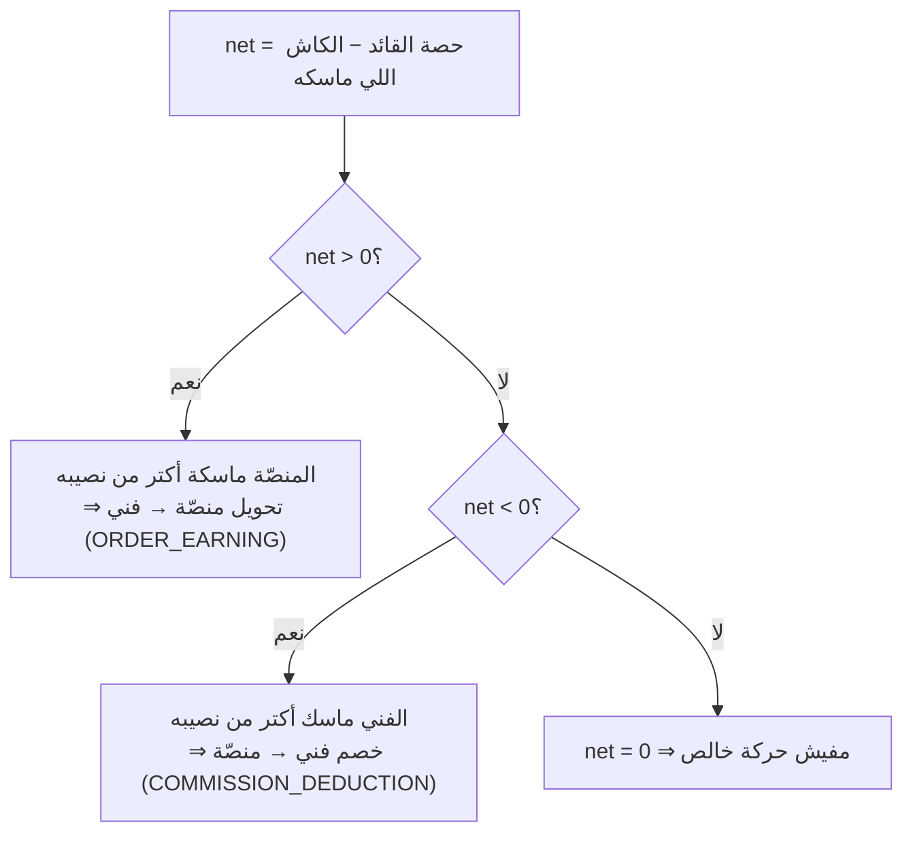
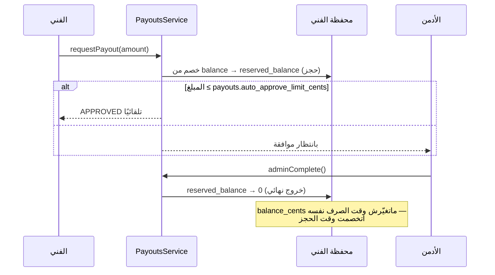

# 10 — تدفّق الأموال (Finance & Money Flow)

> **مصدر هذا المستند**: `apps/api/src/modules/payments/`, `pricing/commission-base.ts`,
> وفحوص نزاهة حيّة نُفّذت مباشرة على `baytak_main`. تحقّق: 240 اختبار في 37 suite
> (`payments/` + `payouts/` + `installments/`) كلها ناجحة.
>
> مستندات مرتبطة: [03 — محرك التسعير](./03-PRICING-ENGINE.md) ·
> [02 — دورة حياة الطلب](./02-ORDER-LIFECYCLE.md)

---

## 1. المبدأ الحاكم: قيد مزدوج مقفول

كل حركة مالية في المنصّة **قيد مزدوج** — مفيش «إضافة» بلا «خصم» مقابل. كل حركة بتتسجّل في
`wallet_transactions` بـ`balance_before_cents` و`balance_after_cents`، فالدفتر نفسه بيحمل
دليل صحّته.

### الثوابت المحفوظة جبريًا

```
technicianEarningCents + platformCommissionCents === totalAmountCents      (دايمًا)
balance_after === balance_before ± amount                                  (لكل صف)
Σ(حركات الطلب: credit − debit) === 0                                       (لكل طلب)
```

الثابت الأول هو الأهم: **أي قرش بره وعاء العمولة بيروح للشركة تلقائيًا بلا كود إضافي**. كل
المحاسبة تحته (حركة المحفظة، الاسترداد النسبي، تجميع الصرف) بتعتمد عليه.

### فحوص نزاهة حيّة (نُفّذت على قاعدة البيانات الفعلية)

| الفحص | النتيجة على 1166 حركة |
|-------|------------------------|
| صفوف حسابها الداخلي غلط (`before ± amount ≠ after`) | **0** ✅ |
| مبالغ سالبة أو صفرية | **0** ✅ |
| حركات يتيمة (محفظتها مش موجودة) | **0** ✅ |
| القيد المزدوج للطلب بيقفل على صفر | ✅ (`financial-reconciliation.e2e.spec.ts`) |

> **انحراف واحد معروف وموثّق**: محفظة المنصّة في قاعدة بيانات التطوير رصيدها المخزّن أعلى من
> مجموع حركاتها الباقية. السبب **مش بَقّة**: هي المحفظة الوحيدة اللي بتنجو من تنظيف
> الاختبارات، فحركاتها بتتمسح مع بيانات كل تشغيل بينما رصيدها بيفضل متراكم. عشان كده
> `financial-reconciliation.e2e.spec.ts` بيقيس **الفرق (delta)** لمحفظة المنصّة، والمطابقة
> المطلقة للمحافظ المنشأة داخل الاختبار نفسه. أي محفظة عمرها كامل داخل تشغيل واحد بتطابق
> دفترها بالظبط.

---

## 2. اتجاه التسوية — أخطر بَقّة مالية اتصلحت

### البَقّة

`settleAndComplete()` كانت **دايمًا** بتحوّل `technicianEarningCents` من محفظة المنصّة لمحفظة
الفني، بغض النظر عن طريقة الدفع — كأن المنصّة هي اللي ماسكة الفلوس دايمًا.

ده صح للطرق الإلكترونية، و**غلط تمامًا للكاش**: الفني بياخد المبلغ الكامل من العميل يدًا بيد.

**النتيجة العملية**: طلب كاش ١٠٠٠ ج (عمولة ٢٠٠ / أرباح ٨٠٠) كان بيخلّي رصيد محفظة الفني
**+٨٠٠** كأن المنصّة مدينة له — فيقدر يطلب صرف ٨٠٠ ج **فوق** الـ١٠٠٠ اللي ماسكها بالفعل.
**فلوس مضاعفة حقيقية.**

### الحل — عام لأي مزيج دفع

مش مجرد فحص `paymentMethod` الحالي (بند إضافي بعد دفع مسبق ممكن يتحصّل جزء كاش وجزء كارت
لنفس الطلب). الحساب بيجمع **كل** دفعات الكاش الناجحة للطلب ويقارنها بحصّة القائد:

```
net = leaderShareCents − cashHeldByTechnicianCents
```



`COMMISSION_DEDUCTION` كانت موجودة في الـenum من زمان بلا أي استخدام — أول استهلاك حقيقي
ليها هنا.

`allowNegativeBalance: true` في الحالتين، لسببين مختلفين:
- محفظة المنصّة: تمثيل محاسبي مش رصيد حقيقي محدود.
- محفظة الفني: **دَين مشروع** هيتسوّى في الصرف الجاي، مش سحب فوق رصيد حقيقي.

---

## 3. وعاء العمولة (Commission Base)

### الفصل المعماري

`commission-base.ts` **دوال خالصة بلا أي I/O** عمدًا — الحساب اللي بيقرر نصيب الفني لازم يكون
قابل للاختبار بالورقة والقلم. تحميل السياسة في `CommissionBaseService`، والتطبيق في
`PaymentsService`.

### تفكيك الإجمالي — بالطرح مش بالضرب

```
withLevel      = min(round(base × levelMultiplier), estimatedTotal)
workPrice      = min(base, withLevel)
levelPremium   = withLevel − workPrice
zoneSurge      = estimatedTotal − withLevel
```

**ليه بالطرح**: مسار `formula` بيقصّ الناتج على `min/max` **بعد** المضاعف، فـ
`base × level × surge` مش دايمًا بيساوي `estimatedTotal`. الطرح بيضمن إن مجموع التلات أجزاء
= الإجمالي **دايمًا** — الثابت اللي بيمنع قرش ضايع أو مضاعف.

### السياسة (القيم الحيّة من `settings`)

| المفتاح | القيمة | داخل الوعاء؟ |
|---------|--------|--------------|
| `commission_base.include_level_premium` | `true` | ✅ |
| `commission_base.include_inspection_fee` | `true` | ✅ |
| `commission_base.include_addons` | `true` | ✅ |
| `commission_base.include_additional_items` | `true` | ✅ |
| `commission_base.include_zone_surge` | `false` | ❌ |
| `commission_base.include_emergency_surcharge` | `false` | ❌ |
| `commission_base.include_warranty` | `false` | ❌ |
| `commission_base.include_installment_interest` | `false` | ❌ |
| `commission_base.discount_reduces_technician_share` | `false` | — |

المستبعَد بيروح للمنصّة بالكامل (بحكم الثابت الجبري في §1).

### الخصم لا يمسّ نصيب الفني (ADR-0038)

طلب مالك صريح: **«العميل يستفيد من الخصم، المنصة تتحمل تكلفته، والفني ياخد مستحقه كامل»**.

خدمة بـ١٠٠٠ وكوبون ٥٠٪ ⇒ العميل يدفع ٥٠٠، والفني بياخد نصيبه من **١٠٠٠**.

ده بيصحّح نسخة ADR-0037 اللي كانت بتقصّ الوعاء عند `totalAmountCents` — القصّ ده كان معناه
عمليًا إن **الفني بيموّل حملة تسويق المنصّة من جيبه**.

> ⚠️ **نتيجة مقصودة**: لو خصم كبير خلّى نصيب الفني أكبر من اللي العميل دفعه،
> `platformCommissionCents` **بيطلع سالب**. ده مش خطأ بيانات — دي خسارة المنصّة على الطلب،
> وهي اللي مموّلة الخصم.

### مراجعة كل مستهلك للعمود ده (تمّت)

التدقيق راجع **كل** مكان بيقرا `platform_commission_cents`، ولقى مستهلكًا واحدًا كان بيكسر:

| المستهلك | السؤال اللي بيجاوبه | القرار |
|----------|----------------------|--------|
| `admin-reports.service.ts` | «المنصّة كسبت كام؟» | ✅ الجمع بالإشارة **صحيح** — ده تقرير مالي، والخسارة جزء من الحقيقة |
| `technician-kpi` (`platformRevenueCents`) | «المنصّة كسبت كام من الفني ده؟» | ✅ الجمع بالإشارة **صحيح** — رقم تقريري معروض، ومابيدخلش في أي درجة |
| `technician-progression` (بوابة `min_platform_revenue_cents`) | «الفني استحقّ إيه؟» | 🔴 **كان بيكسر — اتصلح** |

### 🔴 البَقّة: الخصم كان بيرجّع الفني لورا في مساره الوظيفي

بوابة الترقية كانت بتجمع القيم **بإشارتها**، فطلب خسران كان **بيخصم** من عدّاد ترقية الفني.

**مثبت بفحص حي**: فني عمل طلبين — واحد جاب للمنصّة ٢٠٠٠، وواحد كلّفها ١٠٠٠ بسبب كوبون
**المنصّة** موّلته. عدّاد ترقيته قرا **١٠٠٠ بدل ٢٠٠٠**: **نُص تقدّمه اتمسح** بسبب حملة تسويق
مش قراره.

ده **نفس خطأ** «الفني بيموّل حملة المنصة من جيبه» اللي ADR-0038 قفله في مسار الفلوس — لكنه
فضل مفتوح في مسار الترقية.

**الإصلاح**: `GREATEST(…, 0)` **لكل طلب على حدة**، مش على المجموع:

| | قبل | بعد |
|---|---|---|
| طلب رابح (+2000) لوحده | 2000 | 2000 |
| رابح (+2000) + خسران (−1000) | 🔴 **1000** | ✅ **2000** |
| خسران (−1000) لوحده | 🔴 **−1000** | ✅ **0** |
| خسرانان (−1000, −1500) + رابح (+2000) | 🔴 **−500** | ✅ **2000** |

القصّ عند صفر بيحفظ **المبدأين مع بعض**: المنصّة مابتحسبش إيرادًا ما استلمتهوش (الطلب بصفر)،
والفني مابيترجّعش لورا. و**القصّ لكل طلب مقصود** — القصّ على المجموع كان هيسمح لطلب خسران إنه
يبلع ربح طلب تاني.

**الحارس**: `progression-revenue-discount.spec.ts` (٤ حالات). اتأكد إن ليه أسنان: إرجاع البَقّة
بيفشّل ٣ منهم.

### نسب العمولة الحيّة

| المفتاح | القيمة |
|---------|--------|
| `pricing.default_commission_percent` | `15` |
| `commission.domestic_worker_percentage` | `15` |
| `commission.emergency_adjustment_percentage` | `5` |
| `commission.individual_adjustment_percentage` | `0` |
| `commission.team_adjustment_percentage` | `0` |

---

## 4. توزيع الطاقم (ADR-0040)

قبل ADR-0040، `technicianEarningCents` كان بيتحوّل **بالكامل** للقائد وأعضاء
`order_team_members` بياخدوا صفر — فجوة مالية موثّقة صراحة.

**اللي ما اتغيّرش**: العمولة، وإجمالي اللي بيخرج من محفظة المنصّة.
**اللي اتغيّر**: التوزيع الداخلي بس — بوزن المستوى، ومتسجّل في `order_earning_shares`.

**قاعدة الكاش مع الطاقم**: الكاش بيمسكه القائد (هو اللي بيستلم من العميل)، فالمقاصّة مع
الكاش بتتم **على حصّته هو بس**؛ الأعضاء بياخدوا تحويلًا مباشرًا من المنصّة لأنهم مش ماسكين
حاجة.

### قاعدة رؤية مالية صارمة (بلاغ مالك، docs/08 §108-B)

| مين | بيشوف |
|-----|-------|
| القائد (أو الفني الوحيد) | المبلغ المطلوب تحصيله من العميل + حصّته |
| أي عضو طاقم آخر | **حصّته بس**، مهما كانت طريقة الدفع |

إظهار إجمالي الطلب لعضو مش هيحصّل حاجة كان بيسرّب صورة عن قيمة الطلب بلا داعٍ فعلي.

**تمييز دقيق في العرض**: «الكاش المحصَّل» بيخرج كحقيقة مستقلة عن «المتبقي» — صفر متبقٍّ بعد
تحصيل باقي طلب مختلط **لا يعني** إن الطلب اتدفع أونلاين بالكامل بأثر رجعي.

---

## 5. طرق الدفع

### المفعَّل حاليًا (من `settings` الحيّة)

| الطريقة | الحالة | ملاحظة |
|---------|--------|--------|
| نقدي (`cash`) | ✅ | مسار المقاصّة العكسي §2 |
| محفظة (`wallet`) | ✅ | داخلي |
| كارت (`card`) | ✅ | Paymob — **المفاتيح فاضية في هذه البيئة** |
| InstaPay | ✅ | تأكيد يدوي، نافذة ٢٤ ساعة |
| تقسيط | ✅ | `installments/` |
| Fawry | ❌ | معطّل |

> بوابة Paymob مفعّلة كإعداد لكن `api_key` / `secret_key` / `hmac_secret` **فاضية** في
> `baytak_main`. الكود جاهز؛ راجع `docs/03-external-integrations.md` لتعبئتها.

### الدفع قبل التوزيع (ADR-0013)

طلب بدفع إلكتروني **مايتوزّعش على فني قبل ما الدفع يتم**. عشان كده إلغاء `pending_payment`
التلقائي **مالوش استرداد** — مفيش فلوس اتاخدت أصلاً (`paymentStatus` لسه `UNPAID`).

### سياسة الإيداع (ADR-0027)

لو الطلب عنده `depositAmountCents` (لقطة وقت الإنشاء)، أول دفعة بتحصّل **الإيداع بس**؛
الباقي بيتحصّل تلقائيًا كدلتا لما `paymentStatus` يوصل `PAID`.

### رسم التقييم بالصور

اللي بيتدفع هو **رسم التقييم**، مش سعر شغل. **مفيش حاجة تتوزّع على فني** — الطلب بيروح لفرز
الإدارة (`awaiting_admin_quote`). توزيعه كان هيبعت فنيًا لشغل لسه مالوش سعر أصلاً.

### حماية البوابة

| الخطر | الضمان |
|-------|--------|
| إرسال مزدوج | `payment-double-submit-protection.spec.ts` |
| webhook ضايع | استرداد بمحاولات: `webhook_recovery_max_attempts=5`, `base_delay=30s`, `batch=25` |
| webhook عالق | `webhook_processing_stale_minutes=5` |
| صرف مزدوج | `payout-double-release.spec.ts` |
| استرداد غير آمن | `refund-transaction-safety.spec.ts` |

---

## 6. الاسترداد

**قاعدة أساسية**: `refundOrder()` بيطبّق عكس الأرباح **متناسبًا مع إجمالي الطلب**، مش مع
الدفعة المختارة وحدها. ده ضروري للدفعات الإضافية الصغيرة عشان العكس يفضل متسقًا مع التسوية
المركّبة في §2.

**مثال متحقَّق منه حيًا** (من `financial-reconciliation.e2e.spec.ts`):

| الخطوة | محفظة الفني | محفظة العميل | دلتا المنصّة |
|--------|--------------|---------------|---------------|
| تحصيل كاش ١٠٠٠ ج، عمولة ٢٠٪ | `-20000` (مديون) | — | — |
| استرداد جزئي ٣٠٠ ج (٣٠٪) | `-44000` | `+30000` | `24000 − 30000 = −6000` |
| صرف ٥٠٠ ج | الرصيد `-50000`، المحجوز `0` | — | `+50000` |

عكس أرباح الفني متناسب: `80000 × 30000/100000 = 24000` ✓

كاش مالوش بوابة يسترد منها، فالاسترداد بيتم كـ`WALLET_CREDIT` لمحفظة العميل.

---

## 7. الصرف (Payouts)



| المفتاح | القيمة |
|---------|--------|
| `payouts.min_amount_cents` | `20000` (٢٠٠ ج) |
| `payouts.auto_approve_limit_cents` | `100000` (١٠٠٠ ج) |

**الفصل المهم**: `balance_cents` بيتخصم وقت **الحجز** (`requestPayout`)، و
`reserved_balance_cents` بيتصفّر وقت **الإتمام**. ده اللي بيمنع صرفًا مزدوجًا لنفس الرصيد.

فني مديون (رصيد سالب) **مايقدرش** يطلب صرف — الدَّين من مقاصّة الكاش بيتسوّى من الأرباح
الجاية قبل أي صرف.

---

## 8. جداول قاعدة البيانات المالية

| الجدول | الدور |
|--------|-------|
| `wallets` | الرصيد + المحجوز + المعلّق + الإجماليات |
| `wallet_transactions` | **الدفتر** — كل حركة بـ`before`/`after` |
| `wallet_adjustments` | تعديلات إدارية |
| `payments` | دفعات البوابة/الكاش لكل طلب |
| `payouts` + `payout_order_items` | الصرف وتجميعه |
| `order_earning_shares` | توزيع الطاقم (ADR-0040) |
| `order_earning_adjustments` · `technician_earning_adjustments` | تسويات |
| `earnings_skill_policy` · `service_earnings_level_overrides` · `service_earnings_skill_overrides` | سياسات الأرباح |
| `earnings_shadow_comparisons` | مقارنة الحساب القديم بالجديد قبل التحويل |
| `payment_policies` · `payment_policy_versions` · `payment_policy_acceptances` | سياسات الدفع وموافقات المستخدمين |
| `loyalty_transactions` | نقاط الولاء |

---

## 9. مراجع الكود

| الموضوع | الملف |
|---------|-------|
| التسوية والاسترداد | `apps/api/src/modules/payments/payments.service.ts` |
| وعاء العمولة (دوال خالصة) | `apps/api/src/modules/pricing/commission-base.ts` |
| توزيع الطاقم | `apps/api/src/modules/payments/crew-earnings.service.ts` + `crew-earning-split.ts` |
| توزيع الاسترداد على الطاقم | `apps/api/src/modules/payments/crew-refund-allocation.ts` |
| حاسبة الأرباح | `apps/api/src/modules/payments/earnings-calculator.ts` |
| الصرف | `apps/api/src/modules/payments/payouts.service.ts` |
| التقسيط | `apps/api/src/modules/payments/installment-collection.service.ts` |
| القيد المزدوج | `apps/api/src/modules/.../wallets.service.ts` (`doubleEntry`) |
| **اختبار التسوية الشامل** | `apps/api/src/modules/payments/financial-reconciliation.e2e.spec.ts` |

**قرارات معمارية**: ADR-0013 (الدفع قبل التوزيع) · ADR-0015 (البنود الإضافية) ·
ADR-0027 (سياسة الإيداع) · ADR-0037/0038 (وعاء العمولة والخصم) · ADR-0040 (توزيع الطاقم).

---

## 10. خلاصة التدقيق المالي

| السؤال | الإجابة |
|--------|---------|
| فيه فلوس بتتخلق أو بتختفي؟ | ❌ لأ — القيد المزدوج بيقفل على صفر لكل طلب |
| الفني ممكن يصرف فلوس ماسكها بالفعل؟ | ❌ لأ — مقاصّة الكاش §2 |
| الفني ممكن يصرف نفس الرصيد مرتين؟ | ❌ لأ — فصل `balance` عن `reserved` |
| عضو الطاقم بياخد نصيبه؟ | ✅ — `order_earning_shares` |
| الخصم بياكل من نصيب الفني؟ | ❌ لأ — المنصّة بتتحمله (ADR-0038) |
| الدفتر متسق مع الأرصدة؟ | ✅ — صفر انحراف في الفحوص الحيّة |

**الأشياء اللي محتاجة قرار تشغيلي (مش بَقّات)**:
1. مفاتيح Paymob فاضية — الكارت مش هيشتغل فعليًا لحد ما تتعبّى.
2. `platformCommissionCents` ممكن يبقى سالب بتصميم — أي تقرير أو dashboard بيفترض العكس محتاج
   مراجعة.
