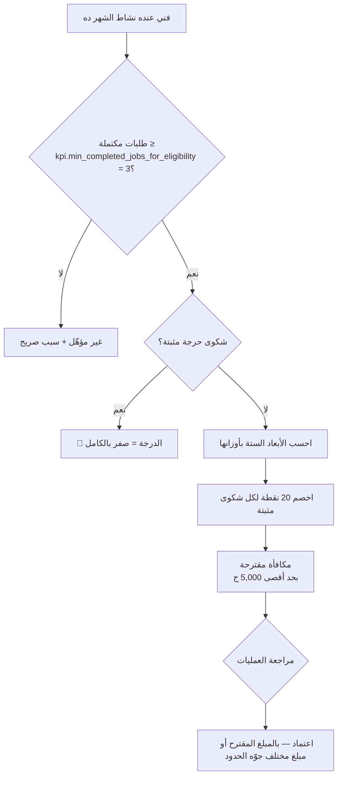

# 11 — مؤشّرات الأداء والتحليلات (KPI & Analytics)

> **مصدر هذا المستند**: `apps/api/src/modules/technician-kpi/` + إعدادات `kpi.*` **الحيّة**
> في `baytak_main`.
>
> مستندات مرتبطة: [09 — إدارة الفنيين](./09-TECHNICIAN-MANAGEMENT.md) ·
> [12 — كتالوج الإعدادات](./12-SETTINGS-CATALOG.md)

---

## 1. المبدأ الحاكم: صفر بيانات مخترعة

محرك الـKPI **مابيخترعش أي مقياس**. كل رقم بيتحسب من جداول موجودة أصلًا:

`orders` · `ratings` · `complaints` · `technician_order_cancellations` ·
`order_assignments` · `wallet_transactions`

كل استعلام في المحرك موثّق في README الموديول **ليه اختار الفلتر ده بالظبط** — طلب مالك صريح.

### KPI ≠ ترقية

| | KPI | الترقية |
|---|-----|---------|
| **الفترة** | شهرية | طول العمر (all-time) |
| **الهدف** | مكافأة الأداء | المسار الوظيفي |
| **المصدر** | `technician_kpi_snapshots` | `technician_progression_rules` |

خلطهم شائع. أداء شهر ممتاز **مايرقّيش**، وسجل تراكمي قوي **مايدّيش** مكافأة الشهر ده.

---

## 2. الأبعاد الستة وأوزانها

من `settings` الحيّة — المجموع **100**:

| البُعد | المفتاح | الوزن | الاتجاه |
|--------|---------|-------|---------|
| متوسط التقييم | `kpi.weight_rating` | **30** | إيجابي |
| معدّل القبول | `kpi.weight_acceptance` | 15 | إيجابي |
| معدّل الإتمام | `kpi.weight_completion` | 15 | إيجابي |
| معدّل الإلغاء من الفني | `kpi.weight_cancellation` | 15 | **سلبي** |
| الشكاوى المثبتة | `kpi.weight_complaints` | 15 | **سلبي** |
| الإيراد النسبي | `kpi.weight_revenue` | 10 | إيجابي |

**التقييم لوحده 30%** — ضِعف أي بُعد تانٍ. رسالة واضحة: رضا العميل هو المقياس الأول.

**الإيراد 10% فقط** — أقل بُعد، ومحسوب **نسبةً لمتوسط الفنيين الشهر ده** مش رقمًا مطلقًا،
عشان فني في منطقة أقل نشاطًا مايتعاقبش على ظرف مش في إيده.

---

## 3. الأهلية والمكافأة

| الإعداد | القيمة | المعنى |
|---------|--------|--------|
| `kpi.enabled` | `true` | المحرك كله |
| `kpi.min_completed_jobs_for_eligibility` | **3** | أقل عدد طلبات مكتملة للأهلية |
| `kpi.monthly_max_bonus_cents` | **500000** (5,000 ج) | سقف الأدمن العادي مايتخطاهوش |
| `kpi.negative_rating_threshold` | **2** | التقييم ≤ 2 من 5 = «سلبي» |
| `kpi.penalty_points_per_upheld_complaint` | **20** | خصم لكل شكوى مثبتة |
| `kpi.serious_complaint_zero_score` | `true` | 🔴 شكوى حرجة **بتصفّر الشهر بالكامل** |
| `kpi.ops_can_override_suggested_amount` | `true` | العمليات مش ملزَمة بالرقم المقترح |
| `kpi.expose_approval_notes_to_technician` | `false` | ملاحظات الأدمن الداخلية **مخفية** عن الفني |

> ⚠️ **`serious_complaint_zero_score` هو أشدّ إجراء في النظام**: شكوى حرجة واحدة مثبتة بتصفّر
> شهر الفني بالكامل — مهما كان أداؤه في الأبعاد الستة. الأدمن اللي بيثبّت شكوى «حرجة» لازم
> يعرف ده.

---

## 4. من عدم الأهلية للشفافية

المحرك بيرجّع `ineligibilityReason` **صريحًا** مش مجرد `isEligible: false`. الفني بيشوف
**السبب** — نفس فلسفة `unmetRequirements` في الترقية.

**القاعدة**: أي رفض في النظام لازم يقول سببه. «غير مؤهّل» بلا سبب مش قرار، ده حائط.

---

## 5. مصادر التحليلات الأخرى

| الشاشة | المصدر |
|--------|--------|
| `reports` (الأدمن) | `admin-reports.service.ts` — تجميعات على الطلبات والمال والشكاوى |
| `operations` | مركز العمليات — تتبّع لحظي + جولات المطابقة |
| `technician-productivity` | إنتاجية فعلية مقارنة بالمعياري |
| `customer-stats` | إحصاءات العميل (طابور مستقل) |
| `earnings_shadow_comparisons` | مقارنة حساب الأرباح القديم بالجديد **قبل** التحويل |

> **`earnings_shadow_comparisons` نمط يستحق التقليد**: بدل تبديل حساب مالي دفعة واحدة،
> الحسابان بيشتغلوا **بالتوازي** والفروق بتتسجّل — فالتحويل بيتم على بيانات مش على ثقة.

### تكرار موثّق واتصلح

`admin-reports.service.ts` كان عامل **نسخته الخاصة** من `OPEN_COMPLAINT_STATUSES` بدل المصدر
الموحّد. أي حالة جديدة تتضاف للأصل وماتتضافش هنا كانت هتخلّي عدّاد «الشكاوى المفتوحة»
**ينقص في صمت** — رقم غلط بلا أي خطأ ظاهر.

📄 `BROKEN_FLOWS_FIXED.md` §11

---

## 6. حدود موثّقة

| الحد | التفصيل |
|------|---------|
| **الحساب شهري بحدود UTC** | `monthBounds()` بيستخدم UTC مش توقيت القاهرة. طلب اتكمل ١١:٣٠ مساءً آخر يوم في الشهر بتوقيت مصر بيتحسب على **الشهر التالي** |
| **الأهلية بـ«نشاط» واسع** | طلب مكتمل **أو** عرض إسناد — فني اتعرض عليه ورفض بيدخل الحساب |
| **الإيراد نسبي بالشهر** | شهر ضعيف عامة بيرفع درجة الكل، وشهر قوي بيخفّضها. المقارنة داخل الشهر مش عبر الشهور |

الحدود دي **مش بَقّات** — قرارات لها مبرر، بس لازم أي حد بيقرا الأرقام يعرفها.

---

## 7. مراجع الكود

| الموضوع | الملف |
|---------|-------|
| محرك حساب الـKPI | `apps/api/src/modules/technician-kpi/technician-kpi-calculation.service.ts` |
| خدمة الـKPI والاعتماد | `apps/api/src/modules/technician-kpi/technician-kpi.service.ts` |
| محرك الترقية | `apps/api/src/modules/technician-progression/technician-progression-calculation.service.ts` |
| الإنتاجية | `apps/api/src/modules/technician-productivity/` |
| تقارير الأدمن | `apps/api/src/modules/admin/admin-reports.service.ts` |
| اللقطات | جدول `technician_kpi_snapshots` |
