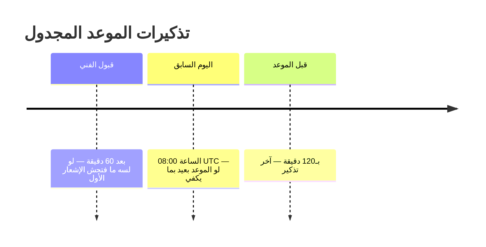

# 13 — الإشعارات والتتبّع اللحظي (Notifications & Real-time)

> **مصدر هذا المستند**: `apps/api/src/modules/notifications/` + `chat/` + `orders/` (بوّابة
> التتبّع) + إعدادات `notification_engine.*` **الحيّة**.
>
> مستندات مرتبطة: [19 — المهام الخلفية والأحداث](./19-BACKGROUND-JOBS-EVENTS.md) ·
> [14 — الدعم والشكاوى](./14-SUPPORT-CHAT-COMPLAINTS.md)

---

## 1. القنوات الخمس

| القناة | الاستخدام | الحالة |
|--------|-----------|--------|
| `in_app` | داخل التطبيق | ✅ شغّالة |
| `push` | FCM | الكود جاهز — محتاج مفاتيح |
| `sms` | Twilio | الكود جاهز — محتاج مفاتيح |
| `email` | SMTP | الكود جاهز — محتاج مفاتيح |
| `whatsapp` | — | معرَّفة في الـenum |

حالات التسليم: `queued` → `sent` → … متتبَّعة لكل إشعار على حدة.

📄 `docs/03-external-integrations.md` لتفعيل أي قناة خارجية.

---

## 2. ساعات الهدوء (ADR-0012)

| الإعداد | القيمة |
|---------|--------|
| `notification_engine.quiet_hours_start` | `22:00` UTC |
| `notification_engine.quiet_hours_end` | `08:00` UTC |

النطاق **بيعدّي منتصف الليل** والكود بيتعامل مع ده صراحةً — `22:00 → 08:00` يعني
`minutes >= start || minutes < end`، مش `&&`. الخطأ الشائع ده كان هيخلّي ساعات الهدوء
**مفعّلة أبدًا**.

`nextTimeOutsideQuietHours()` بترجّع أقرب لحظة صالحة — ولو نهاية الهدوء فاتت النهاردة،
بتاخد بكرة.

### الاستثناء

`notification_engine.critical_offer_bypasses_quiet_hours` = `true` — عروض الطوارئ بتتخطّى
الهدوء. **لكن الوصف في القاعدة بيقول «لسه غير مفعّل الاستخدام في Phase 1»** — الإعداد موجود
والسلوك لسه.

---

## 3. أنماط التذكير الثلاثة

### أ) `action_required` — محتاج تصرّف

| الإعداد | القيمة |
|---------|--------|
| `action_required_reminder_interval_minutes` | **60** |
| `action_required_max_reminders` | **24** |

بيفضل يذكّر كل ساعة لحد ما يتحلّ، بحد **24 تذكيرًا** — بعدها **بيسكت** لكنه **مش
`resolved`**. تمييز مهم: السكوت مش حلًّا، والبند بيفضل مفتوحًا للمتابعة.

### ب) `critical_offer` — عرض طوارئ

`critical_offer_reminder_ratios` = `[0.5, 0.85]` — التذكيرات **نِسَب من نافذة الصلاحية**
نفسها، مش أوقات ثابتة. مهلة ١٠ دقايق ⇒ تذكير عند ٥ دقايق وعند ٨.٥.

> **قابلة للتعديل بالكامل — صفر قيم دائمة في الكود.**

### ج) `scheduled_job` — تذكير بموعد

---

## 4. توجيه الإشعارات

| الشاشة | الدور |
|--------|-------|
| `notification-routing` | مين بياخد إشعار إيه |
| `notification-type-configs` | إعداد كل نوع على حدة |

بجانبها: `notification_workflows` (سير عمل بتذكيرات) و
`project-notification-outbox.processor.ts` (نمط outbox لإشعارات المشاريع).

---

## 5. التتبّع اللحظي — بوّابتا Socket.IO

| البوّابة | الـnamespace | الوظيفة |
|----------|--------------|---------|
| `ChatGateway` | `chat` | المحادثات (`chat:join`, `chat:send`) |
| `OrderTrackingGateway` | — | بثّ موقع الفني وحالة الطلب |

كلاهما بـ`websocketCorsOriginHandler` (قائمة مصادر مسموحة، مش `*`).

### سباق حقيقي اتصلح

`client.join()` كانت بتتنادى **من غير `await`** في مكانين ⇒ بنعلن «اتوصلت» **قبل** ما
الانضمام للغرفة يتم عبر Redis adapter ⇒ **أول حدث ممكن يضيع**.

اتكشف بتفعيل lint type-aware على `apps/api` (قاعدة `no-floating-promises`).

📄 `BROKEN_FLOWS_FIXED.md` §9

### أي فني «نشط» بيبثّ موقعه؟

`ACTIVE_TECHNICIAN_ORDER_STATUSES` + فلتر إضافي على `scheduled_at` — عشان الفني ممكن يكون
عنده طلب تنفيذ حالي **و**طلب مجدول مستقبلي `accepted` في نفس الوقت. الافتراض القديم («طلب
نشط واحد بس») بقى **غير صحيح** بعد ADR-0017.

📄 [02 §8](./02-ORDER-LIFECYCLE.md)

---

## 6. حماية المحادثة — كاشف بيانات التواصل

`contact-info-detector.ts` بيكشف محاولات تبادل أرقام موبايل داخل الشات — **أكبر تسريب
للفنيين خارج المنصّة**.

**قرار تصميم صريح**: الكشف بيرفع **علمًا** (`is_flagged`) للمراجعة البشرية، **مش رفضًا
تلقائيًا للرسالة**.

> السبب مكتوب في الكود: الرفض التلقائي كان هيضرّ رسائل شرعية فيها أرقام (عناوين، مواعيد،
> مقاسات). الكشف النصّي **عملي مش رياضي مضمون**، فالتعامل معاه كإشارة مش كحُكم.

نمطان: تسلسل ٧+ أرقام بفواصل، وبادئة موبايل مصري (`+20`/`0` + `1[0125]`).

---

## 7. متانة المحادثات

| الخطر | الضمان |
|-------|--------|
| إنشاء محادثة الطلب فشل | `order-chat-recovery.service.ts` — مسح دوري |
| محادثة مفتوحة بعد اكتمال الطلب | `order-completed-chat-close.listener.ts` |
| رسالة ضاعت وقت انقطاع | التخزين في `chat_messages` قبل البثّ |

---

## 8. الدعم — الإعدادات المعلنة

| الإعداد | القيمة الحالية |
|---------|-----------------|
| `support.enabled` | **`false`** |
| `support.phone_number` · `whatsapp_number` · `email` · `help_url` | **كلها فاضية** |

> ⚠️ قسم «تواصل معنا» **مخفي في التطبيقات دلوقتي**، والوصف في القاعدة بيقول السبب صراحةً:
> «false لحد ما الأرقام تتملى». ده **قرار مقصود مش سهو** — إظهار قسم دعم بأرقام فاضية أسوأ
> من إخفائه.

---

## 9. مراجع الكود

| الموضوع | الملف |
|---------|-------|
| خدمة الإشعارات | `apps/api/src/modules/notifications/notifications.service.ts` |
| ساعات الهدوء | `apps/api/src/modules/notifications/quiet-hours.util.ts` |
| نقاط تذكير العرض الحرج | `apps/api/src/modules/notifications/critical-offer-checkpoints.util.ts` |
| نقاط تذكير الموعد | `apps/api/src/modules/notifications/scheduled-job-checkpoints.util.ts` |
| سير العمل | `apps/api/src/modules/notifications/notification-workflow.service.ts` |
| بوّابة المحادثة | `apps/api/src/modules/chat/chat.gateway.ts` |
| كاشف بيانات التواصل | `apps/api/src/modules/chat/contact-info-detector.ts` |
| بوّابة التتبّع | `apps/api/src/modules/orders/order-tracking.gateway.ts` |

**قرارات معمارية**: ADR-0012 (ساعات الهدوء) · ADR-0017 (تعدّد الطلبات النشطة).
