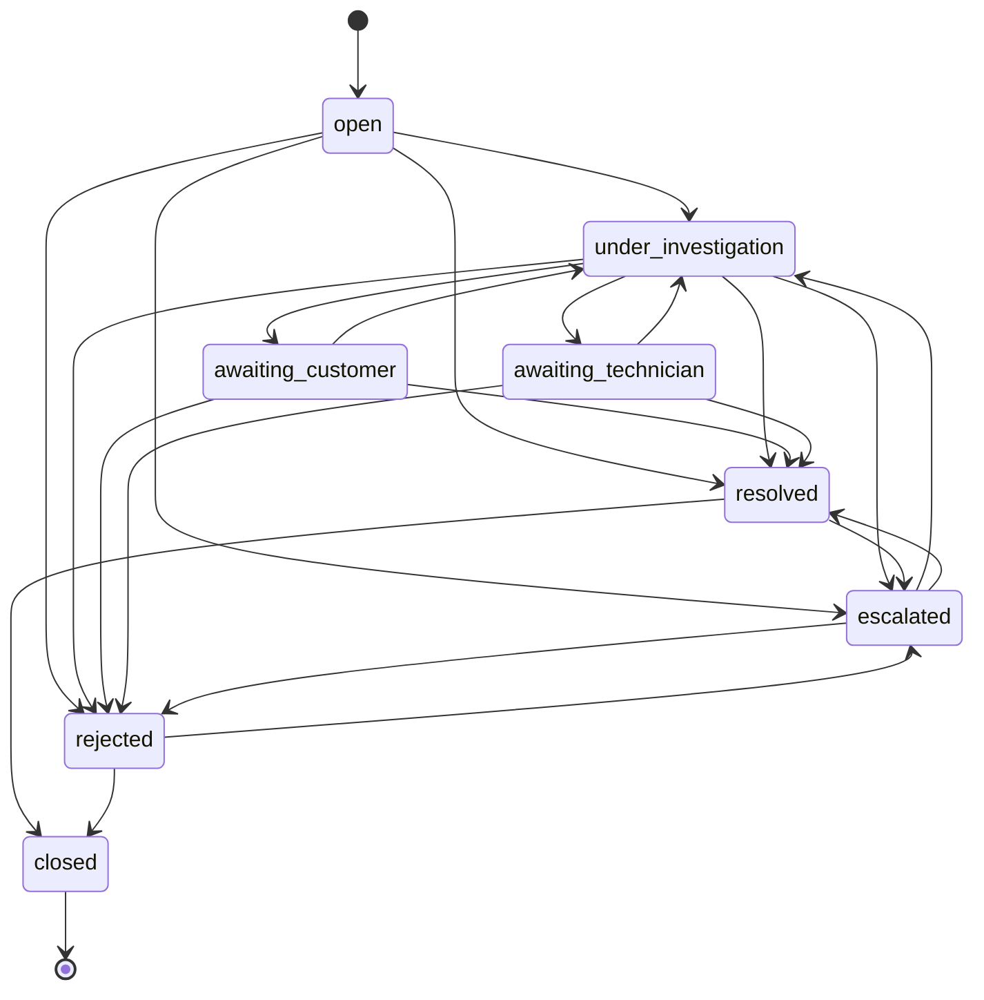
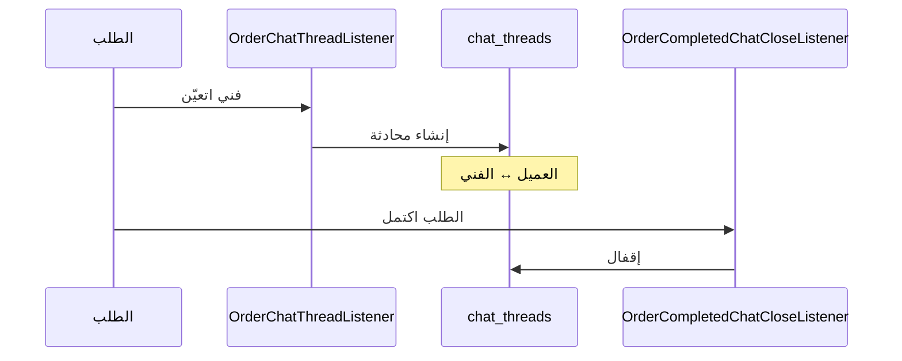

# 14 — الدعم والمحادثات والشكاوى (Support, Chat & Complaints)

> **مصدر هذا المستند**: `apps/api/src/modules/support/` + `chat/` + `internal-chat/`.
>
> مستندات مرتبطة: [13 — الإشعارات والتتبّع](./13-NOTIFICATIONS-REALTIME.md) ·
> [11 — الـKPI](./11-KPI-ANALYTICS.md)

---

## 1. أربع قنوات مختلفة — والخلط بينها شائع

| القناة | بين مين | الغرض |
|--------|---------|-------|
| **محادثة الطلب** (`chat`) | العميل ↔ الفني | تنسيق تنفيذ الشغل |
| **شكوى** (`complaints`) | العميل/الفني → الإدارة | نزاع له **حالات وقرار** وأثر على KPI |
| **تذكرة دعم** (`support-tickets`) | أي مستخدم → الإدارة | استفسار عام |
| **محادثة داخلية** (`internal-chat`) | موظف ↔ موظف | تنسيق داخلي |

**الفرق الجوهري**: الشكوى **قرار** له أثر مالي وأثر على تقييم الفني. التذكرة **استفسار**.
تحويل استفسار لشكوى بيحمّل الفني عقوبة ما يستحقهاش.

---

## 2. آلة حالات الشكوى

نفس فلسفة `order-state-machine.ts` — **مصدر حقيقة واحد مقفول**، بدل ما التحقق يتشتّت في كل
method.

### تفصيلتان

**`resolved` و`rejected` مش نهائيتين** — الاتنان بيقدروا يروحوا `escalated`. يعني قرار الدعم
قابل للطعن، وده مقصود.

**`closed` وحدها نهائية.**

### `OPEN_COMPLAINT_STATUSES`

`open` · `under_investigation` · `awaiting_customer` · `awaiting_technician` · `escalated`

> ⚠️ المجموعة دي **مصدر حقيقة واحد**. `admin-reports.service.ts` كان عامل **نسخته الخاصة**
> منها ⇒ أي حالة جديدة تتضاف للأصل وماتتضافش هنا كانت هتخلّي **عدّاد الشكاوى المفتوحة ينقص
> في صمت**. اتصلح.

---

## 3. أثر الشكوى على الفني

| الحدث | الأثر |
|-------|-------|
| شكوى **مثبتة** (upheld) | خصم **20 نقطة** من بُعد الشكاوى في KPI الشهر |
| شكوى **حرجة (critical) مثبتة** | 🔴 **تصفير KPI الشهر بالكامل** |
| شكاوى مثبتة تراكميًا | شرط في قواعد الترقية (0–2 حسب المستوى) |

> **الأدمن اللي بيثبّت شكوى «حرجة» لازم يعرف إنه بيصفّر شهر الفني بالكامل** — مهما كان أداؤه
> في الأبعاد الخمسة التانية.

📄 [11 §3](./11-KPI-ANALYTICS.md)

---

## 4. أحداث الشكوى

`COMPLAINT_FILED_EVENT` · `COMPLAINT_MESSAGE_ADDED_EVENT` · `COMPLAINT_STATUS_CHANGED_EVENT`

بجانبها `LOW_RATING_SUBMITTED_EVENT` — تقييم منخفض بيولّد إشارة **قبل** ما العميل يقدّم شكوى
رسمية.

**رد الأدمن على الشكوى بيوصل العميل كإشعار** — البند ده كان فجوة موثّقة واتقفل.

---

## 5. محادثة الطلب

### دورة الحياة

**التعويض**: `order-chat-recovery.service.ts` — مسح دوري بيعيد إنشاء أي محادثة فشل إنشاؤها،
لأن الحدث الداخلي ممكن يضيع.

### حماية التسريب

كاشف بيانات التواصل بيرفع **علمًا للمراجعة**، مش رفضًا تلقائيًا.

📄 [13 §6](./13-NOTIFICATIONS-REALTIME.md)

### سطر توضيحي فوق المحادثة

طلب مالك: العميل لازم يعرف **إن المحادثة دي للطلب ده تحديدًا**، مش قناة دعم عامة. اتنفّذ.

---

## 6. شاشات الأدمن

| الشاشة | الدور |
|--------|-------|
| `support` / `support/[id]` | الشكاوى — القرار والحالة |
| `support-tickets` / `support-tickets/[id]` | التذاكر |
| `support-chat` / `support-chat/[id]` | محادثة الدعم المباشرة |
| `internal-chat` / `internal-chat/[id]` | التنسيق الداخلي |
| `warranty-claims` | مطالبات الضمان (مسار منفصل عن الشكاوى) |

**صلاحية `support_agent` = 3 صلاحيات بس** — ضيّقة عمدًا، لأن الدور بيتعامل مع بيانات عملاء
حسّاسة يوميًا.

---

## 7. حالة الدعم الخارجي

| الإعداد | القيمة |
|---------|--------|
| `support.enabled` | **`false`** |
| `support.phone_number` · `whatsapp_number` · `email` · `help_url` | **كلها فاضية** |

قسم «تواصل معنا» **مخفي في التطبيقات دلوقتي** — قرار مقصود («false لحد ما الأرقام تتملى»)،
مش سهو. إظهار قسم دعم بأرقام فاضية أسوأ من إخفائه.

**القنوات الداخلية شغّالة بالكامل**: الشكاوى والتذاكر ومحادثة الطلب كلها مستقلة عن الإعدادات
دي.

---

## 8. مراجع الكود

| الموضوع | الملف |
|---------|-------|
| آلة حالات الشكوى | `apps/api/src/modules/support/complaint-state-machine.ts` |
| خدمة الشكاوى | `apps/api/src/modules/support/support.service.ts` |
| التذاكر | `apps/api/src/modules/support/support-tickets.service.ts` |
| محادثة الطلب | `apps/api/src/modules/chat/chat.service.ts` + `chat.gateway.ts` |
| إنشاء المحادثة | `apps/api/src/modules/chat/order-chat-thread.listener.ts` |
| إقفال المحادثة | `apps/api/src/modules/chat/order-completed-chat-close.listener.ts` |
| التعويض | `apps/api/src/modules/chat/order-chat-recovery.service.ts` |
| المحادثة الداخلية | `apps/api/src/modules/internal-chat/` |
