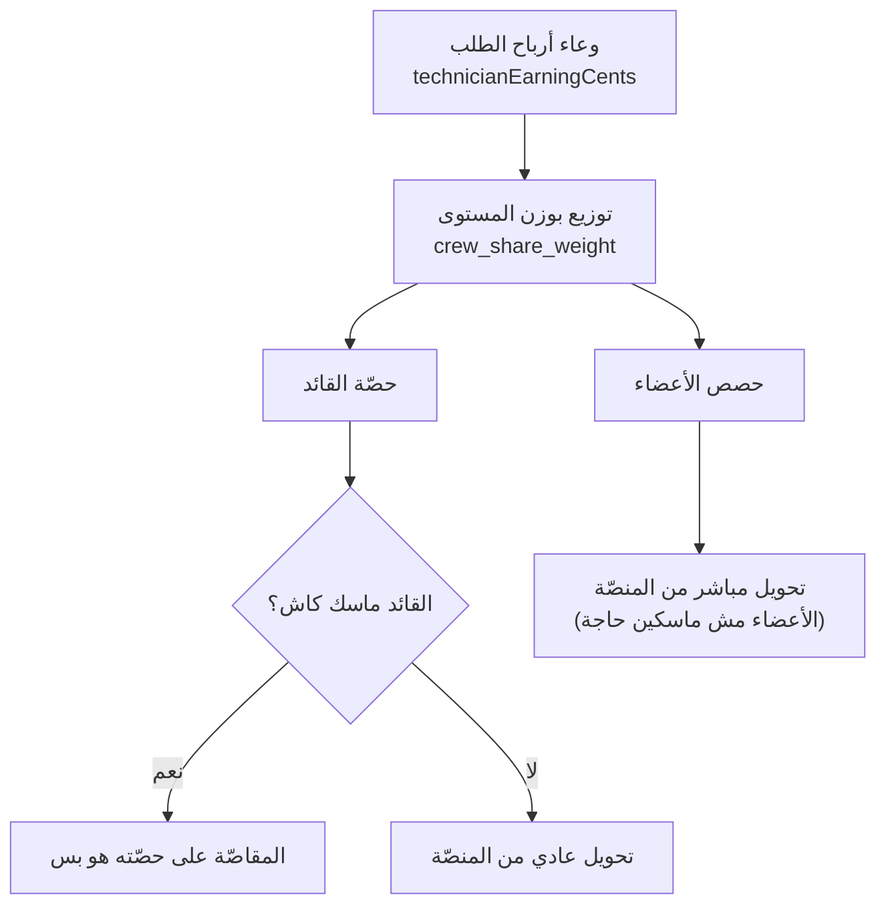

# 15 — الشركات والفرق والمساعدون والمشاريع

> **مصدر هذا المستند**: `apps/api/src/modules/technicians/` + `assistant-matching/` +
> `projects/` + الجداول والإعدادات **الحيّة** في `baytak_main`.
>
> مستندات مرتبطة: [09 — إدارة الفنيين](./09-TECHNICIAN-MANAGEMENT.md) ·
> [10 — تدفّق الأموال](./10-FINANCE-MONEY-FLOW.md) ·
> [07 — المتكررة والمشاريع](./07-RECURRING-ORDERS.md)

---

## 1. أربعة مفاهيم متشابهة الاسم مختلفة تمامًا

| المفهوم | الجدول | إيه هو |
|---------|--------|--------|
| **شركة فنيين** | `technician_companies` | كيان بمالك وسجل تجاري ومضاعف سعر |
| **طاقم الطلب** | `order_team_members` | مين اشتغل على **طلب بعينه** |
| **الطاقم المفضّل** | `technician_preferred_crew_members` | ناس الفني بيحب يشتغل معاهم **عادةً** |
| **مشروع** | `projects` | شغل كبير على مراحل بعرض سعر |

> **الخلط بينها مصدر أخطاء متكرر.** «فريق» في سياق الطلب ≠ «فريق» في سياق الشركة ≠ «فريق»
> في تفضيلات الفني.

---

## 2. شركة الفنيين

| العمود | الدور |
|--------|-------|
| `owner_user_id` | المالك |
| `commercial_registration_number` | السجل التجاري |
| `is_trust_verified` + `trust_verified_at/by/note` | **توثيق ثقة منفصل عن الاعتماد العادي** |
| `price_multiplier` | مضاعف السعر — **بيحلّ محلّ مضاعف مستوى الفني** |
| `is_active` | مفتاح تشغيل |

### مضاعف سعر الشركة يغلب مستوى الفني

في `CatalogService.estimate()`:

```
levelMultiplier = companyPriceMultiplier ?? resolveLevelPriceMultiplier(...)
```

يعني لو الطلب لشركة، مضاعف **الشركة** هو اللي بيتطبّق — مش مضاعف مستوى الفني اللي هينفّذ.
منطقي: العميل بيتعاقد مع الشركة، مش مع الفرد.

### أفضلية الشغلانات الكبيرة

| الإعداد | القيمة | المعنى |
|---------|--------|--------|
| `matching.company_large_job_min_crew` | **4** | من كام فردًا يبقى «شغل كبير» |
| `matching.company_large_job_boost` | **3** | إضافة على `rank_score` |
| `matching.preferred_crew_max_size` | **10** | أقصى حجم طاقم مفضَّل |

الشركة بتاخد أفضلية في الشغلانات اللي محتاجة **4 أفراد أو أكتر** — لأنها قادرة على تجميع
طاقم فعلًا، والفرد لأ.

📄 [04](./04-MATCHING-ENGINE.md) لصيغة `rank_score` الكاملة

### الفروع

`technician_company_branches` — الشركة ممكن تغطّي مناطق كتير بفروع.

---

## 3. طاقم الطلب — `order_team_members`

| العمود | الدور |
|--------|-------|
| `order_id` + `technician_id` | مين على أنهي طلب |
| `member_type` | نوع العضوية |
| `role_label` | وصف الدور |
| `added_by_technician_id` / `added_by_admin_user_id` | **مين ضمّه** — الفني ولا الأدمن |

### ⚠️ أهم قاعدة في المستند ده

`orders.technician_id` = **القائد فقط**. أي شخص تانٍ على الطلب موجود في `order_team_members`
**وبس**.

**النتيجة**: أي استعلام بيسأل «الشخص ده مشغول؟» ويبص على `orders.technician_id` وحده
**بيعتبر كل عضو طاقم فاضي دايمًا**.

بلاغ المالك اللي كشف ده: «مساعد اتضاف في نفس اليوم لتلات شغلانات كبار، والسيستم ماجابش إنه
مشغول».

**الحل** (ADR-0057) — `technicianCommittedOrdersSource()`:

```sql
(
  SELECT o.* FROM orders o WHERE o.technician_id = <T>
  UNION
  SELECT o.* FROM orders o
  JOIN order_team_members otm ON otm.order_id = o.id
  WHERE otm.technician_id = <T>
) o
```

`UNION` مش `UNION ALL` — لو ظهر نفس الطلب من المصدرين، صف واحد بس فالتأثير مايتضاعفش.

> **قاعدة للمطوّرين**: أي استعلام حمل/تعارض/قدرة جديد **لازم** يستخدم الدالة دي، مش
> `orders.technician_id`.

---

## 4. الطاقم المفضّل

`technician_preferred_crew_members` بحالات: `invited` → `accepted` / `declined` / `removed`.

**الفرق عن طاقم الطلب**: ده تفضيل **دائم** («بحب أشتغل مع فلان»)، مش تسجيل شغل فعلي. لما
الفني ياخد شغلًا محتاج طاقم، النظام بيقترح المفضّلين الأول.

`matching.preferred_crew_max_size` = **10**.

---

## 5. المساعدون — نوع مستقل

`technician_kind` enum: `technician` | `assistant`.

| البُعد | الفني | المساعد |
|--------|-------|---------|
| يظهر في السوق؟ | ✅ العميل يختاره | ❌ **مستبعَد عمدًا** |
| يقود طلبًا؟ | ✅ | ❌ **دايمًا عضو طاقم** |
| الخدمات | يتربط بخدمات صراحةً | **مؤهّل للكل افتراضيًا**، والأدمن يستثني |
| المطابقة | جولات المطابقة العادية | `assistant-matching` مستقل |

### مطابقة المساعدين

| الإعداد | القيمة |
|---------|--------|
| `assistant_matching.pool_matching_enabled` | `true` — مفتاح إيقاف عام |
| `assistant_matching.batch_size` | **10** |
| `assistant_matching.response_timeout_seconds` | **120** |

**المهلة 120 ثانية** أقصر بكتير من جولات المطابقة العادية (`5,15,30` دقيقة) — لأن طلب المساعد
بييجي عادةً **بعد** ما الفني قبل الشغل، فالوقت ضيّق فعلًا.

**تعويض**: `assistant-matching-recovery.service.ts` بيمسك أي مطابقة عالقة.
**تصعيد**: `ASSISTANT_MATCHING_ESCALATED_EVENT` لما البثّ يفشل.
**إسناد يدوي**: `ASSISTANT_PERSONAL_ASSIGNED_EVENT` — الفني/الأدمن يحدّد مساعدًا بعينه.

---

## 6. المال في الطاقم



**اللي ما اتغيّرش بعد ADR-0040**: العمولة، وإجمالي اللي بيخرج من محفظة المنصّة.
**اللي اتغيّر**: التوزيع الداخلي بس، ومتسجَّل في `order_earning_shares`.

قبل ADR-0040 كان الوعاء بيتحوّل **بالكامل** للقائد والأعضاء بياخدوا صفر — فجوة مالية موثّقة.

### قاعدة الرؤية

| مين | بيشوف |
|-----|-------|
| القائد (أو الفني الوحيد) | المبلغ المطلوب تحصيله + حصّته |
| أي عضو تانٍ | **حصّته بس**، مهما كانت طريقة الدفع |

إظهار إجمالي الطلب لعضو مش هيحصّل حاجة كان بيسرّب صورة عن قيمة الطلب بلا داعٍ.

📄 [10 §4](./10-FINANCE-MONEY-FLOW.md)

### نقص الطاقم

`orders.crew_shortage_escalation_hours_before` = **24** — لو الطاقم ناقص قبل الموعد بـ24 ساعة،
`ORDER_CREW_SHORTAGE_ESCALATED_EVENT` بيتصعّد.

---

## 7. المشاريع

نموذج مختلف تمامًا: عرض سعر ⇒ مراحل ⇒ دفع لكل مرحلة **باحتجاز ضمان**.

| الإعداد | القيمة |
|---------|--------|
| `projects.quote_expiry_days` | **14** |
| `projects.milestone_auto_approve_hours` | **72** |
| `projects.warranty_holdback_percentage` | **5** |

**الاحتجاز**: 5٪ من كل دفعة مرحلة بتتحجز لحد ما فترة الضمان تعدّي — معيار مقاولات.

**الموافقة التلقائية بعد 72 ساعة** بتمنع تعليق المشروع بلا نهاية لو العميل مش متجاوب.

الجداول: `projects` · `project_quotes` · `project_milestones` · `project_attachments` ·
`project_comments` · `project_notification_outbox`.

📄 [07 §6](./07-RECURRING-ORDERS.md)

---

## 8. الحسابات المؤسسية — الجانب الآخر

`technician_companies` = **مقدّم** الخدمة. `corporate_accounts` = **عميل** مؤسسي.

| | شركة فنيين | حساب مؤسسي |
|---|-----------|-------------|
| الدور | بتنفّذ | بيطلب |
| الجداول | `technician_companies` + `_branches` | `corporate_accounts` + `_users` + `_properties` + `_invoices` |
| المال | بتاخد أرباحًا | **بياخد فاتورة مجمّعة** |

---

## 9. مراجع الكود

| الموضوع | الملف |
|---------|-------|
| مصدر الالتزامات الموحّد | `apps/api/src/modules/technicians/technician-eligibility.sql.ts` |
| توزيع الطاقم | `apps/api/src/modules/payments/crew-earnings.service.ts` + `crew-earning-split.ts` |
| توزيع الاسترداد | `apps/api/src/modules/payments/crew-refund-allocation.ts` |
| مطابقة المساعدين | `apps/api/src/modules/assistant-matching/` |
| نقص الطاقم | `apps/api/src/modules/orders/crew-shortage-escalation.service.ts` |
| المشاريع | `apps/api/src/modules/projects/` |
| شاشات الأدمن | `technician-companies` · `projects` |

**قرارات معمارية**: ADR-0040 (توزيع الطاقم) · ADR-0057 (عضو الطاقم مرئي للجدولة).
