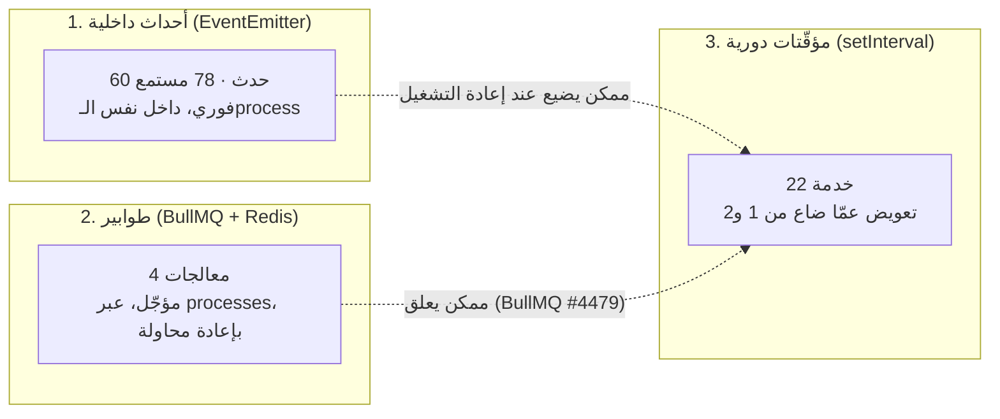

# 19 — المهام الخلفية والأحداث (Background Jobs & Events)

> **مصدر هذا المستند**: جرد فعلي من `apps/api/src/modules/` — 4 معالجات طابور،
> 22 خدمة بمؤقّت دوري، 60 حدثًا داخليًا، و78 مستمعًا في 71 ملف.

---

## 1. ثلاث طبقات، وأسبابها

المنصّة بتشغّل عمل خلفي على تلات طبقات مختلفة — والاختيار بينها **مش عشوائي**:



| الطبقة | تُستخدم لـ | الخطر |
|--------|-----------|-------|
| الأحداث | ردّ فعل فوري داخل نفس العملية | بتضيع عند إعادة التشغيل أو التعطّل |
| الطوابير | عمل مؤجّل/ثقيل، أو مؤقّت لجولة | ممكن الـWorker يعلق بعد انقطاع Redis |
| المؤقّتات | **إعادة بناء الحالة من البيانات الدائمة** | بطيئة بطبعها |

**القاعدة الحاكمة**: أي مسار حرج **لازم** يكون له تعويض دوري. الحدث سرعة، والمؤقّت ضمان.

---

## 2. الطوابير (BullMQ)

| الطابور | المعالج | الوظيفة |
|---------|---------|---------|
| `matching-rounds` | `matching-round-expiry.processor.ts` | انتهاء مهلة جولة العرض ⇒ الجولة التالية |
| `customer-stats` | `customer-stats.processor.ts` | إعادة حساب إحصاءات العميل |
| `technician-stats` | `technician-stats.processor.ts` | إعادة حساب إحصاءات الفني |
| `assistant-offers` | `assistant-offer-expiry.processor.ts` | انتهاء مهلة عرض المساعد |

### قاعدة الأمان المكلفة

> `queue.add()` **لازم** يكون داخل `try/catch`. الدرس: كانت بتعلّق طلبًا حقيقيًا (تقييم/دفع)
> **لدقايق** وقت انقطاع Redis قبل ما يتكتشف. فشل الطابور **أبدًا** مايوقفش العملية الحقيقية
> للمستخدم — يتسجّل تحذير ويكمل، والمؤقّت الدوري يعوّض.

---

## 3. حارس الطوابير — `QueueWatchdogService`

فجوة موثّقة في BullMQ نفسه (issue **#4479**): بعد انقطاع Redis طويل، الـWorker **مابيرجعش**
يسحب وظائف جديدة. تلات محاولات إصلاح من جوّه كود التطبيق فشلت — السبب في المكتبة نفسها.

**القرار**: بدل محاولة رابعة، الحارس **بيكتشف الحالة بس** ويعمل `process.exit(1)` نظيف،
والاستعادة منقولة لـsupervisor خارجي (`systemd`، `Restart=always`).

### توقيع الكشف — دقيق عمدًا

```
وظيفة واقفة في الطابور فترة طويلة   AND   Redis نفسه متاح ومتجاوب (PING → PONG)
```

الشرط التاني ضروري: لو Redis نفسه واقع، **ده مش نفس البَقّة** — انقطاع عادي والـWorker
هيرجع لوحده. إعادة تشغيل هنا هتبقى ضررًا بلا سبب.

| الإعداد | الافتراضي |
|---------|-----------|
| `ops.queue_watchdog_enabled` | `true` |
| `ops.queue_watchdog_check_interval_minutes` | `2` |

نفس مبدأ «مايكسرش العملية الحقيقية»، لكن مطبّقًا على مستوى العملية كلها مش طلب واحد.

---

## 4. المؤقّتات الدورية (22 خدمة)

### أ) خدمات التعويض (recovery) — إعادة بناء ما ضاع

| الخدمة | بتعوّض عن |
|--------|-----------|
| `payments/webhook-recovery.service.ts` | webhook دفع ضاع أو فشل |
| `technicians/schedule-slot-release.listener.ts` | حدث تحرير سلوت ضاع |
| `assistant-matching/assistant-matching-recovery.service.ts` | مطابقة مساعد عالقة |
| `chat/order-chat-recovery.service.ts` | إنشاء محادثة طلب فشل |
| `referrals/referral-recovery.service.ts` | مكافأة إحالة عميل |
| `technician-referrals/technician-referral-recovery.service.ts` | مكافأة إحالة فني |

**النمط المشترك**: استعلام محدود الحجم (batch) على **الحالة الدائمة** (`orders`, `payments`)
مش على طابور أو ذاكرة، مع كون العملية `idempotent` — استدعاؤها لصف مش محتاج حاجة no-op آمن.

مثال ملموس (`reconcileReleasedSlots`): بيدوّر على سلوتات `booked` لطلبات ملغية أو متحوّلة لفني
تاني ويحرّرها — بحد ٢٥ صف كل دورة، **مش scan غير محدود**.

### ب) خدمات المهل (expiry / auto-cancel)

| الخدمة | الوظيفة | الإعداد |
|--------|---------|---------|
| `orders/order-auto-cancel.service.ts` | إلغاء `pending_payment` القديم | `orders.payment_timeout_minutes = 15` |
| `orders/quote-expiry.service.ts` | انتهاء صلاحية عرض السعر | — |
| `orders/crew-shortage-escalation.service.ts` | تصعيد نقص الطاقم | `orders.crew_shortage_escalation_hours_before = 24` |
| `projects/milestone-auto-approve.service.ts` | موافقة تلقائية على مرحلة مشروع | — |
| `campaigns/campaign-sweep.service.ts` | إنهاء الحملات المنتهية | — |

> ⚠️ راجع [02 §6](./02-ORDER-LIFECYCLE.md): طلب `searching_technician` **مابيتلغيش تلقائيًا
> خالص** — قرار مالك صريح. الإعداد الميت `orders.auto_cancel_after_minutes` **اتحذف نهائيًا**
> من `settings` (migration 0262) عشان مايوهمش الأدمن بسلوك مش موجود.

### ج) خدمات التوليد الدوري

| الخدمة | الوظيفة |
|--------|---------|
| `orders/recurring-orders.service.ts` | توليد الطلبات المتكررة من قوالبها |
| `payments/installment-collection.service.ts` | تحصيل أقساط مستحقة |
| `payments/prepaid-order-settlement.listener.ts` | تسوية الطلبات المدفوعة مسبقًا |
| `notifications/notification-workflow-reminder.service.ts` | تذكيرات سير العمل |
| `notifications/project-notification-outbox.processor.ts` | إخراج إشعارات المشاريع |
| `technician-progression/technician-progression.service.ts` | تقييم ترقية الفنيين |
| `catalog/productivity-learning.service.ts` | تعلّم الإنتاجية من الطلبات المنجزة |

### د) الحارس

`ops/queue-watchdog.service.ts` — §3.

### النمط الموحّد

كل مؤقّت في المستودع بيتبع نفس الشكل بالحرف:

```ts
onModuleInit()  { this.timer = setInterval(...); this.timer.unref?.(); }
onModuleDestroy() { if (this.timer) clearInterval(this.timer); }
```

`unref()` **مش تفصيلة** — من غيرها المؤقّت بيمنع الـprocess من الخروج النظيف، والاختبارات
بتعلّق. و`clearInterval` في `onModuleDestroy` بيمنع تسريب مؤقّتات بين اختبارات.

كل استدعاء ملفوف في `.catch()` بيسجّل ولا يرمي — فشل دورة واحدة مابيوقّفش المؤقّت.

---

## 5. الأحداث الداخلية (60 حدثًا)

كلها معرَّفة في `apps/api/src/common/events/` بثوابت مصدَّرة — **مفيش نصوص حرفية متناثرة**.

### التجميعات الرئيسية

| البادئة | أمثلة |
|---------|-------|
| `order.*` | `created` · `accepted` · `reassigned` · `crew_changed` · `rematch_requested` · `locked_provider_lost` |
| `order.quote.*` | `expired` · `above_range_submitted` · `above_range_decided` |
| `order.assessment.*` | `info_requested` |
| `matching.*` | `order_offer_created` · `order_offer_resolved` · `order_no_technician_found` · `order_emergency_dispatch_struggling` |
| `payment.*` | `cash_collected` · `additional_work_resolved` |
| `installment(s).*` | `application_submitted` · `application_reviewed` · `payment_succeeded` · `payment_failed` · `plan_completed` |
| `complaint.*` | `filed` · `message_added` · `status_changed` |
| `assistant_matching.*` | `opportunity_offered` · `personal_assigned` · `escalated` |
| `rating.*` | `low_rating_submitted` |

### الحدث المحوري: `ORDER_STATUS_CHANGED_EVENT`

المستمع المركزي هو اللي بيمنع تكرار النداء اليدوي في كل مكان بيغيّر حالة. مثال:
`ScheduleSlotReleaseListener` بيستمع مرة واحدة بدل ما نضيف نداء في **4 أماكن** مختلفة بتلغي
طلبًا (`cancel` / `technicianCancel` / أدمن / إلغاء تلقائي).

### النطاق: in-process — وده **قرار** مش سقف

`EventEmitter2` كله داخل نفس الـprocess. الفرز الكامل للمستمعين (ADR-0075):

| الفئة | in-process = ؟ |
|-------|-----------------|
| كتابة في القاعدة · إشعار · إضافة لطابور | ✅ **صح ومقصود** — التنفيذ مرة واحدة هو الضمانة. جسر عام كان هيعمل إشعارات ومكافآت **مكررة** |
| بث لحظي من gateway | ✅ اتحل في **ADR-0073** — الحدث بيتنفّذ على نسخة واحدة، والبث بيوصل لكل النسخ عبر Socket.IO Redis adapter |
| **خدمة ماسكة قيمة الإعداد في ذاكرتها** (بوابتا الدفع) | 🔴 كان **مكسور** — اتقفل في **ADR-0075** |

الحالة المكسورة كانت: الأدمن يغيّر مفاتيح البوابة على نسخة ⇒ باقي النسخ تفضل تحصّل بالمفاتيح
القديمة للأبد، **بلا أي خطأ في اللوج**. الحل: `SETTING_RELOAD_REQUIRED_EVENT` بينتقل بين النسخ
عبر Postgres `LISTEN/NOTIFY` (`SettingsCrossInstanceBridge`) — **مقصور على الفئة دي بس**.

> القاعدة اللي بتحكم الاشتراك في الحدث ده: **اشترك لو معالجك idempotent وأثره في ذاكرة النسخة
> دي بس.** أي معالج بيكتب أو بيبعت أو بيبثّ — مايشتركش.

### ⚠️ فخّ موثّق: `emitAsync` بينتظر المستمعين

`SettingsService.update()` بتستخدم `emitAsync`، اللي **بينتظر القيم المرجَعة** من المستمعين.

يعني تحويل مستمع لـ«أطلق وانسَ» (`void`) **بيكسر** أي سلوك بيعتمد على اكتمال المستمع قبل
الرجوع. اتلقط حيًا: لفّ مستمع إعدادات بوابة الدفع في `void` خلّى الاختبار يقرا `isConfigured`
قبل ما المستمع يخلّص.

> القاعدة: قبل ما تلفّ أي `@OnEvent` في `void` أو تشيل `await`، اتأكد إن الباعث بيستخدم
> `emit` مش `emitAsync`.

---

## 6. ضمانات التشغيل

| الخطر | الضمان |
|-------|--------|
| حدث ضاع | مؤقّت تعويض على الحالة الدائمة (§4-أ) |
| الـWorker علق | حارس + `systemd Restart=always` (§3) |
| Redis واقع | `try/catch` حوالين `queue.add()`، والمسار الحقيقي بيكمل |
| مسح غير محدود | كل دورة بحد `batch` صريح (٢٥ عادةً) |
| تنفيذ مزدوج | كل عملية تعويض `idempotent` بالتصميم |
| مؤقّت بيمنع الخروج | `unref()` + `clearInterval` في `onModuleDestroy` |
| فشل دورة يوقف المؤقّت | كل نداء ملفوف في `.catch()` بيسجّل ولا يرمي |

---

## 7. مراجع الكود

| الموضوع | الملف |
|---------|-------|
| ثوابت الأحداث | `apps/api/src/common/events/` |
| طابور المطابقة | `apps/api/src/modules/matching/matching-rounds.queue.ts` |
| حارس الطوابير | `apps/api/src/modules/ops/queue-watchdog.service.ts` |
| نموذج مثالي لمستمع + تعويض | `apps/api/src/modules/technicians/schedule-slot-release.listener.ts` |
| استعادة webhooks | `apps/api/src/modules/payments/webhook-recovery.service.ts` |
| وحدة systemd | `infra/systemd/baytak-api.service` |
| توثيق فجوة BullMQ | `apps/api/src/modules/technicians/README.md` |
| جسر الإعدادات بين النسخ | `apps/api/src/common/events/settings-cross-instance.bridge.ts` · [ADR-0075](../adr/0075-settings-cross-instance-reload.md) |
