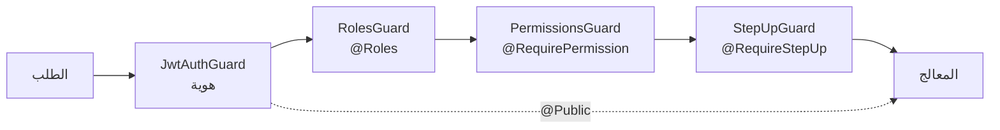
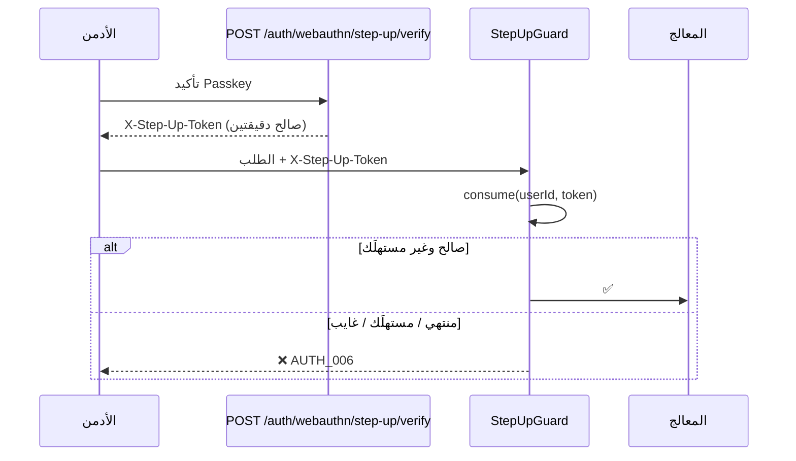

# 20 — الأمان والصلاحيات (Security & Permissions)

> **مصدر هذا المستند**: `apps/api/src/common/guards/`, `modules/auth/`, `modules/security/`،
> وجدولا `permissions` / `role_permissions` الحيّان في `baytak_main`.

---

## 1. أربع بوابات متتالية

كل طلب بيعدّي على أربع بوابات مسجَّلة **عالميًا**. الثلاثة الأخيرة **no-op** لو الـendpoint
مالوش الديكوريتور المناسب — وده اللي خلّى إضافتها ممكنة بلا كسر أي مسار قائم.

| البوابة | الديكوريتور | مرات الاستخدام | بتجاوب بـ |
|---------|-------------|-----------------|------------|
| `JwtAuthGuard` | `@Public()` للتخطّي | 45 مسار عام | 401 |
| `RolesGuard` | `@Roles(...)` | 98 | 403 |
| `PermissionsGuard` | `@RequirePermission('...')` | **253** | `AUTH_001` / 403 |
| `StepUpGuard` | `@RequireStepUp()` | **51** | `AUTH_006` / 403 |

**فلسفة التدرّج**: مسارات `@Roles(ADMIN)` العادية فضلت شغالة زي ما هي، والصلاحية الدقيقة
بتتفعّل بس على الأفعال الحساسة (فلوس، قرارات نهائية).

---

## 2. نموذج الصلاحيات

### الشكل

`permissions(name, resource, action)` ← `role_permissions` → `roles` ← المستخدم.

**101 صف** في قاعدة بيانات التطوير، منهم **26 صف `test.*`** من مخلّفات الاختبارات
(راجع §7) — الصلاحيات الحقيقية **75**.

### التوزيع حسب المجال

| المجال | العدد |
|--------|-------|
| `orders.*` | 12 |
| `technicians.*` · `employees.*` · `technician_kpi.*` · `security.*` · `installments.*` · `technician_progression.*` · `warranty.*` | 3 لكلٍّ |
| `earnings_policy` · `platform_commission` · `reports` · `technician_earning_adjustment` · `wallets` · `roles` · `projects` · `payouts` · `refunds` | 2 لكلٍّ |
| مجالات مفردة | `catalog` · `feature_flags` · `settlement_override` · `customers` · `notifications` · `loyalty` · `audit` · `academy` · `branding` · `technician_productivity` · `buildings` · `promotions` |

### الأدوار المعرَّفة

| الدور | عدد الصلاحيات |
|-------|----------------|
| `super_admin` | 60 |
| `ops_manager` | 34 |
| `finance` | 27 |
| `support_agent` | 3 |
| `recruiter` | 2 |

**التدرّج مقصود**: `support_agent` و`recruiter` أدوار ضيقة جدًا بالتصميم — لمس أقل قدر من
البيانات الحسّاسة.

---

## 3. المصادقة متعدّدة العوامل (MFA)

`MFA_REQUIRED_PERMISSIONS` — أي موظف عنده **أي** صلاحية من القائمة دي **مُلزَم** بتفعيل MFA:

| الصلاحية | السبب المكتوب في الكود |
|----------|-------------------------|
| `refunds.issue` | تحكّم مباشر في فلوس |
| `payouts.approve` | تحكّم مباشر في فلوس |
| `wallets.adjust` | تحويل فلوس بقرار أدمن **بلا أي نظام تلقائي يتحقق منه** |
| `payments.confirm_manual` | تأكيد InstaPay يدويًا — بيسوّي الدفعة `SUCCEEDED` ويبدأ التوزيع |
| `orders.adjust_price` | تعديل مبلغ يتحصّل |
| `orders.approve_price_increase` | اعتماد زيادة على العميل |
| `orders.waive_fees` | إسقاط رسم اتحسب عليه |
| `roles.manage` · `roles.grant_unrestricted` | تصعيد امتيازات |
| `settings.manage` | تغيير سلوك المنصّة كلها |
| `branding.manage` | تغيير الهوية العامة لكل المستخدمين |

> **تفصيلة مهمة (ADR-0068)**: سلطتا السعر المفصولتان (`approve_price_increase` و
> `waive_fees`) **داخل** القائمة عمدًا. لو فضلوا برّه، الفصل — اللي الهدف منه زيادة
> الحماية — كان هيقلّلها بدل ما يزوّدها.

---

## 4. التأكيد المرتفع (Step-Up) — ADR-0011 §4

الأفعال الأشدّ حساسية محتاجة **تأكيد Passkey حديث** فوق تسجيل الدخول:

خاصيتان حاسمتان: **صالح دقيقتين** و**يُستهلَك مرة واحدة**. يعني توكن مسروق قيمته شبه معدومة،
وإعادة تشغيل الطلب (replay) مستحيلة.

---

## 5. رصد الأحداث الأمنية

كل رفض بيتسجّل في `SecurityEventsService` — **best-effort**، بـ`void` صراحةً: صفر تأثير على
الـ403 اللي هيترمي فورًا بعده.

### كشف مقصود لأنماط بعينها

| النمط | الاختبار الحارس |
|-------|------------------|
| تصعيد امتيازات (`roles.manage` / `grant_unrestricted`) | `security-events-privilege-escalation.spec.ts` |
| رفض متكرر (تخمين/فحص) | `security-events-repeated-denial.spec.ts` |
| سباق على تعديل الصلاحيات | `security-concurrency.spec.ts` |

الحارس بيميّز صراحةً بين **تعديل RBAC** و**استهداف الذات** — محاولة موظف يرفّع نفسه ليها وزن
مختلف عن رفض عادي.

بجانب ده: `workforce-activity.service.ts` (نشاط الموظفين) و`audit_logs` (سجل التدقيق العام).

---

## 6. طبقات أمان أخرى موثّقة

| الطبقة | الموضع | المستند |
|--------|--------|---------|
| منع تنفيذ كود عبر معادلات التسعير | whitelist صريح، لا `eval` | [03 §2](./03-PRICING-ENGINE.md) |
| رفض `call_center` من ترويسة العميل | `client-channel.ts` | — |
| القيد المزدوج المقفول | `wallet_transactions` | [10 §1](./10-FINANCE-MONEY-FLOW.md) |
| حماية الإرسال المزدوج للدفع | `payment-double-submit-protection.spec.ts` | [10 §5](./10-FINANCE-MONEY-FLOW.md) |
| منع الصرف المزدوج | فصل `balance` عن `reserved` | [10 §7](./10-FINANCE-MONEY-FLOW.md) |
| رؤية مالية مقيَّدة لعضو الطاقم | `order-financial-summary` | [10 §4](./10-FINANCE-MONEY-FLOW.md) |
| فحص جهاز مخترَق | `CompromisedDeviceScreen` (تطبيق الفني) | — |

---

## 7. ملاحظة على نظافة بيانات التطوير

قاعدة بيانات التطوير فيها **26 صف `test.*`** في `permissions` — مخلّفات من اختبارات ما نضّفتش
وراها. نفس فئة المشكلة الموثّقة في `service_categories`.

**مش خطر أمني** (البيئة تطويرية والصفوف غير مربوطة بأدوار حقيقية)، لكنه **بيشوّه أي عدّ**
يتعمل على القاعدة دي مباشرة — بالظبط زي ما حصل في أول قراءة لهذا المستند (101 بدل 75).

**الحل الصحيح**: كل spec ينضّف وراه، مش تنظيفة يدوية دورية.

---

## 8. مراجع الكود

| الموضوع | الملف |
|---------|-------|
| بوابة الصلاحيات | `apps/api/src/common/guards/permissions.guard.ts` |
| بوابة التأكيد المرتفع | `apps/api/src/common/guards/step-up.guard.ts` |
| بوابة الأدوار | `apps/api/src/common/guards/roles.guard.ts` |
| بوابة الهوية | `apps/api/src/common/guards/jwt-auth.guard.ts` |
| سياسة MFA | `apps/api/src/modules/auth/mfa-policy.service.ts` |
| خدمة التأكيد المرتفع | `apps/api/src/modules/auth/step-up.service.ts` |
| الأحداث الأمنية | `apps/api/src/modules/security/security-events.service.ts` |
| خدمة الصلاحيات | `apps/api/src/modules/admin/permissions.service.ts` |
| اختبارات البوابات | `apps/api/src/common/guards/auth-guards.spec.ts` |

**قرارات معمارية**: ADR-0011 (WebAuthn والتأكيد المرتفع) · ADR-0068 (فصل سلطتَي السعر).
