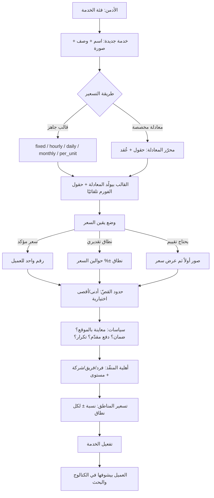
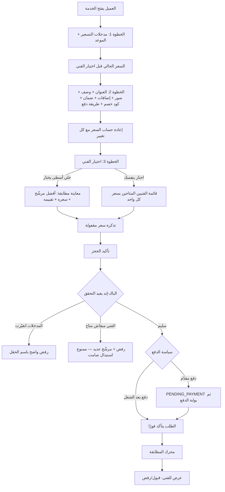
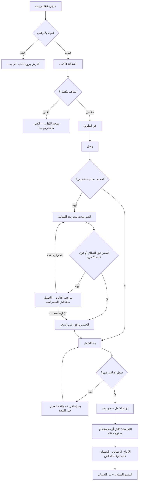
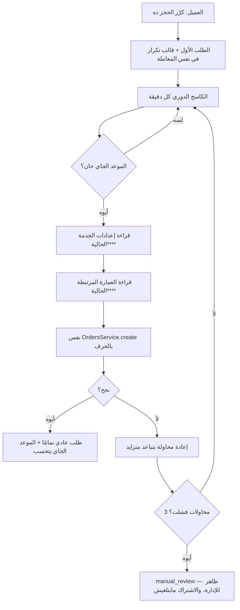
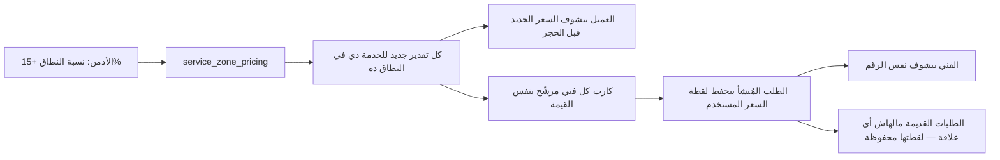

# مرجع النظام من البداية للنهاية (System Flow Reference)

> **الغرض**: ورقة واحدة يفتحها المالك أو موظف الإدارة أو مطوّر جديد ويفهم منها **إزاي المنصة
> شغالة فعلاً** — مين بيعمل إيه، وإيه اللي بيحصل ورا كل ضغطة، وأي تغيير من الأدمن بيوصل لمين.
>
> **الوثيقة دي وصفية مش تخطيطية**: كل اللي مكتوب هنا موجود في الكود فعلاً وقت كتابتها
> (2026-09-03). الحاجات اللي لسه مخططة مكانها `docs/08-pricing-engine-and-platform-vision.md`.
>
> **لو الوثيقة اختلفت عن الكود، الكود هو الصح** — وابعتها للتحديث فورًا.

---

## 1. خريطة الأنظمة

| النظام | التقنية | مين بيستخدمه |
|---|---|---|
| `apps/api` | NestJS + PostgreSQL/PostGIS + Redis | الكل — **مصدر الحقيقة الوحيد** لكل قاعدة عمل |
| `apps/admin` | Next.js | الإدارة وخدمة العملاء والعمليات |
| `apps/customer-web` | Next.js | العميل من المتصفح |
| `apps/customer-app` | Flutter (Android + iOS) | العميل من الموبايل |
| `apps/technician-app` | Flutter (Android + iOS) | الفني والمساعد |

**قاعدة حاكمة**: أي منطق عمل (تسعير، أهلية، خصم، عمولة، حالات) بيتحسب في `apps/api` **وبس**.
الواجهات بتعرض اللي جاي — مابتحسبش. أي رقم بيتحسب في الواجهة = بَقّة مستقبلية مؤكدة، لأن
واجهتين هيختلفوا يوم ما القاعدة تتغير.

---

## 2. إنشاء خدمة (الأدمن) — من الفكرة لحد ظهورها للعميل

**نقطة مهمة**: القوالب الخمسة **مش خمس محركات**. كلها بتولّد **معادلة** في نفس محرك التسعير
الواحد (ADR-0060). القالب اختصار لواجهة الأدمن، مش مسار حساب منفصل.

---

## 3. حجز العميل — من فتح الخدمة لحد وصول الطلب للفني

**قاعدة السعر الواحد** (بند 11-12): الرقم على كارت الفني = الرقم على زرار التأكيد = الرقم
المسجّل على الطلب. كلهم من **نفس** استدعاء الباك-إند، والتذكرة بتضمن إن حاجة ما اتغيرتش
بينهم. لو أي مدخل مؤثر اتغيّر، الطلب **بيترفض بالاسم** بدل ما السعر يتغير في صمت.

---

## 4. دورة الفني — من العرض لحد الأرباح

**القاعدة المنتجية الحاكمة**: «لا يدخل أي مبلغ جديد على العميل بدون أن يعرفه ويوافق عليه قبل
تنفيذ العمل المرتبط به». كل زيادة سعر ليها مسار موافقة موثّق — مفيش زيادة شفهية.

---

## 5. الحجز المتكرر

**ليه ده مهم**: كل نوبة بتتسعّر **بأسعار وقتها**، مش بسعر مجمّد من يوم الاشتراك. ولو الإدارة
غيّرت نسبة خصم العمارة من 10% لـ15%، النوبة الجاية بتاخد 15% — لأن القالب بيخزّن **رابط**
العمارة مش نسختها (§122). وكود الخصم (البرومو) **مابيتكررش** — استخدام لمرة واحدة بالتصميم.

---

## 6. تغيير من الأدمن → أثره في كل مكان

الجدول ده بيجاوب السؤال اللي بيتكرر: «لو غيّرت الحاجة دي، مين هيحس بيها؟»

### مثال مفصّل: الأدمن يغيّر نسبة منطقة من +10% لـ+15%

### باقي التغييرات

| تغيير الأدمن | الأثر في الباك-إند | العميل | الفني |
|---|---|---|---|
| نسبة منطقة | مضاعف على التقدير | سعر جديد قبل الحجز | نفس الرقم على الطلب الجديد |
| مضاعف مستوى الفني | مضاعف حسب مستوى المنفّذ | فرق السعر ظاهر على كارت الفني | أرباح أعلى للمستوى الأعلى |
| نسبة خصم عمارة | خصم على الإجمالي | خصم أكبر/أقل فورًا وفي كل نوبة متكررة جاية | لا أثر (الخصم على العميل مش على نصيب الفني) |
| كوبون جديد | خصم بشروطه | متاح لمن ينطبق عليه | لا أثر |
| رسم الطوارئ | بند منفصل في اللقطة | **مش ظاهر كبند** — داخل الإجمالي | ظاهر في الأدمن واللقطة |
| سياسة أساس العمولة | تحديد الوعاء الخاضع | لا أثر | نصيبه بيتغير |
| تفعيل التكرار للخدمة | بوابة إنشاء القالب | «كرّر الحجز» بيظهر/يختفي | لا أثر مباشر |
| حجب فني عن خدمة | استبعاده من الأهلية | مش هيظهر في القائمة | مش هيوصله عرض |
| قواعد الترقية | معايير الأهلية | لا أثر | شاشة التقدّم بتتغير، والترقية بموافقة الإدارة |
| إعدادات الإشعارات | القنوات والأولوية | يستقبل/ما يستقبلش | نفس الشيء |

---

## 7. دليل الأدمن العملي — «عايز أعمل كذا، أروح فين؟»

| عايز… | الطريق | النتيجة عند العميل | النتيجة عند الفني |
|---|---|---|---|
| أضيف خدمة جديدة | `/catalog` → فئة → خدمة جديدة | تظهر في الكتالوج بعد التفعيل | تدخل في أهليته لو من تخصصه |
| تسعير **بالساعة** | الخدمة → التسعير → قالب `hourly` → سعر الساعة | حقل «عدد الساعات» في الفورم (1–24) | مدة الشغل متوقعة من نفس المعادلة |
| تسعير **باليوم** | قالب `daily` → سعر اليوم | حقل «عدد الأيام» (1–365) | الحمل بيتحجز على كل الأيام |
| تسعير **بالشهر** | قالب `monthly` → سعر الشهر | حقلا تاريخ (من/إلى) — الفترة الحقيقية هي المصدر | التزام ممتد |
| تسعير **بالقطعة** | قالب `per_unit` → سعر الوحدة | حقل «الكمية» (1–1000) | — |
| **معادلة معقدة** | محرّر المعادلة: حقول + عُقد (شرط/جدول/ثابت/مسافة/فرق تواريخ) | فورم مبني من الحقول | — |
| خدمة **معاينة ثم سعر** | وضع اليقين = «يحتاج تقييم» + سياسة المعاينة | يرفع صور، والسعر بعدين | يعاين ثم يسعّر |
| **نطاق تقديري** | وضع اليقين = «نطاق» + نسبتي ±  | يشوف نطاق مش رقم | السعر النهائي بعد التشخيص |
| **معامل منطقة** | الخدمة → تسعير المناطق → نسبة ± | سعر مختلف حسب عنوانه | — |
| **خصم عمارة** | `/buildings` → عمارة + كود + نسبة | يدخل الكود ويتخصم | — |
| **كوبون** | `/promotions` → كوبون بشروطه | يدخل الكود | — |
| أفعّل **التكرار** | الخدمة → «يسمح بالحجز المتكرر» | «كرّر الحجز ده» يظهر | طلبات دورية |
| خدمة **فريق** | الخدمة → يسمح بفريق + عدد العمالة | يختار شركة/فريق | توزيع على طاقم |
| **سياسة الدفع** | الخدمة → دفع مقدّم/بعد الشغل + شروط | يدفع قبل أو بعد | التوزيع بعد الدفع لو مطلوب |
| **ضمان** | خطط الضمان + مدة الضمان | يشتري خطة أو ضمان مشمول | إعادة الزيارة ترجعله |
| أراجع **عرض سعر** | `/assessment-queue` → فوق النطاق | ماشافش العرض لسه | مستني قرار الإدارة |
| أراجع **مستحقات** | `/payouts` + `/earnings-policy` | — | يشوف أرباحه وصرفه |
| أراجع **KPI** | `/technician-kpi` → احسب الشهر → اعتماد → صرف | — | يشوف درجته بعد الحساب |
| أرقّي فني | `/technician-progression` → اعتماد أو استثناء | سعر أعلى للمستوى الأعلى | مستواه ومضاعفه بيتغيّروا |

---

## 8. خريطة ملكية الميزات

«لو غيّرت الميزة دي، لازم أعدّل فين؟»

| الميزة | Backend | Admin | Customer App | Customer Web | Technician App | مصدر الحقيقة |
|---|---|---|---|---|---|---|
| التسعير (كل القوالب) | ✅ | ✅ إعداد | ✅ عرض | ✅ عرض | — | `pricing-engine.service.ts` |
| وضع يقين السعر | ✅ | ✅ | ✅ | ✅ | — | `services.price_certainty_mode` |
| معاينة/عرض سعر | ✅ | ✅ فرز | ✅ | ✅ | ✅ يسعّر | `inspection-quote.service.ts` |
| مراجعة تجاوز النطاق | ✅ | ✅ قرار | — | — | ✅ ينتظر | `assessment-triage.service.ts` |
| المطابقة | ✅ | ✅ رصد | — | — | ✅ يستقبل | `matching.service.ts` |
| الجدولة والتوافر | ✅ | ✅ | ✅ يختار | ✅ يختار | ✅ يدير | `technician-schedule.service.ts` |
| الدفع والمحفظة | ✅ | ✅ | ✅ | ✅ | ✅ تحصيل | `payments.service.ts` + `wallets` |
| العمولة والأرباح | ✅ | ✅ سياسة | — | — | ✅ يشوف | `splitOrderRevenue` (ADR-0037) |
| التكرار | ✅ | ✅ عرض | ✅ | ✅ عرض/إلغاء | — | `recurring-orders.service.ts` |
| العمارات | ✅ | ✅ | ✅ كود | ❌ **فجوة** | — | `buildings.service.ts` |
| الكوبونات | ✅ | ✅ | ✅ | ✅ | — | `promotions` |
| التقييم | ✅ | ✅ عرض | ✅ | ✅ | ✅ يقيّم العميل | `ratings.service.ts` |
| الضمان وإعادة الزيارة | ✅ | ✅ | ✅ | ✅ | ✅ ينفّذ | ADR-0051 |
| الشات | ✅ | ✅ | ✅ | ✅ | ✅ | `chat.service.ts` |
| التتبع اللحظي | ✅ | ✅ | ✅ | ❌ **قرار منتج** | ✅ يبث | `order-tracking.gateway.ts` |
| الإشعارات | ✅ | ✅ إعداد | ✅ | ✅ | ✅ actionable | `notifications` + FCM |
| KPI وتقدّم الفني | ✅ | ✅ | — | — | ✅ يشوف | `technician-kpi` + `technician-progression` |
| الأكاديمية | ✅ | ✅ محتوى | — | — | ✅ | `academy` |
| المشاريع | ✅ | ✅ | ✅ | ✅ | ✅ | `projects` |
| الصلاحيات والتدقيق | ✅ | ✅ | — | — | — | `roles` + `audit` |

**الرموز**: ✅ مطبّق ومربوط · ❌ فجوة موثّقة (تفاصيلها في `docs/08` §123/§125) · — مش منطبق
على الطرف ده بالتصميم.

---

## 9. الحاجات اللي **مقصود** إنها مختلفة بين الواجهات

مش كل اختلاف بَقّة. دول اختلافات مقصودة وموثّقة:

| الاختلاف | السبب |
|---|---|
| الأدمن بيشوف رسم الطوارئ كبند، والعميل لأ | قرار منتج (بند 5) — العميل يشوف إجمالي واحد |
| الأدمن بيشوف UUID والحالات التقنية، العميل يشوف كلام بسيط | مصطلحات كل جمهور |
| أسماء أزرار الإشعار قابلة للتخصيص على أندرويد وثابتة على iOS | قيد منصة — iOS بيسجّل الفئات وقت الإقلاع (§124) |
| قائمة الخطط المتكررة في تطبيق العميل مبسّطة | مفيش احتياج عرض للتفاصيل هناك (§122) |
| الصوت المخصص للإشعارات مش مفعّل | مفيش ملفات صوت متبنّية أصلاً في التطبيقين (§124) |

---

## 10. الحاجات اللي محتاجة قرار من المالك

| البند | السؤال |
|---|---|
| التتبع اللحظي على الويب | عميل بيحجز من لابتوب محتاج خريطة حية؟ |
| كود العمارة على الويب | نطبّق نمط الحقل الموحّد (§77-B4) على customer-web؟ |
| حساب KPI الشهري | يفضل يدوي (مربوط بالصرف) ولا يتحسب تلقائي كمسوّدة؟ |
| إشعارات Time Sensitive على iOS | نطلب الصلاحية عشان عروض الطوارئ تخترق وضع التركيز؟ |
| رسم التقييم بعد زيارة فعلية | يرجع كامل ولا يتحجز؟ (الافتراضي دلوقتي: كامل) |

---

## 11. فهرس التوثيق

| عايز | الملف |
|---|---|
| الخطة والرؤية والـbacklog الحي | `docs/08-pricing-engine-and-platform-vision.md` |
| قاموس البيانات وعقد الـAPI | `docs/02-data-dictionary.md` |
| تفعيل الخدمات الخارجية | `docs/03-external-integrations.md` |
| القرارات المعمارية | `docs/adr/` |
| بوابة التحقيق قبل أي تعديل | `docs/26-agent-investigation-and-delivery-method.md` |
| تفاصيل كل موديول | `apps/api/src/modules/*/README.md` |
